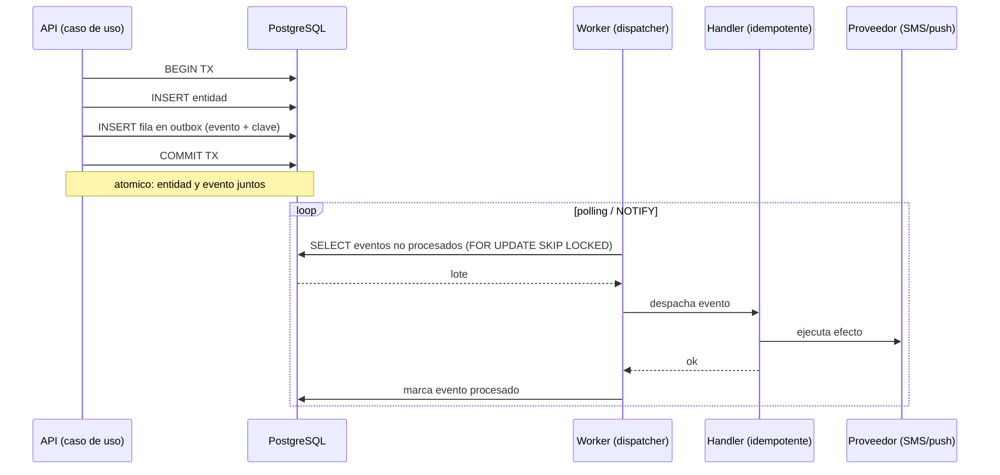

# ADR 0004 — Eventos asíncronos vía outbox pattern (sin broker)

- **Estado:** Aceptada
- **Fecha:** 2026-06-24
- **Decisores:** Equipo de arquitectura

## Contexto y problema

El dominio de FleetSpecial genera **efectos secundarios desacoplados** del flujo principal: cuando un documento queda *por vencer* hay que **enviar una alerta**; cuando se *asigna un servicio* hay que **notificar al conductor**; cuando se registra combustible podría dispararse un recálculo de costo por kilómetro. Estos efectos no deben bloquear ni hacer fallar la operación principal (registrar el documento debe funcionar aunque el proveedor de SMS esté caído), y deben ser **fiables** (una alerta de vencimiento que se pierde rompe el corazón del producto).

El problema: ¿cómo emitimos y procesamos **eventos de dominio de forma fiable** sin introducir un broker de mensajería (Kafka, RabbitMQ) que sería costoso de operar y **sobreingeniería** para nuestro volumen?

El riesgo técnico clásico a evitar es el **dual-write**: si escribimos la entidad en la DB y *luego* publicamos el evento al broker en dos pasos separados, una caída entre ambos deja datos sin evento (o evento sin datos) — inconsistencia silenciosa.

## Drivers de decisión

- **Fiabilidad**: ningún evento de dominio importante puede perderse (en especial las alertas de vencimiento).
- **Atomicidad**: el evento y el cambio de datos deben ser **todo o nada**.
- **No sobreingeniería / bootstrapping**: evitar operar un broker en el MVP.
- **Una sola base de datos** ([ADR-0003](0003-postgresql-unica-base-de-datos.md)): aprovecharla para la durabilidad de eventos.
- **Evolución sin reescritura**: poder migrar a un broker real más adelante cambiando lo mínimo.
- **Desacople**: el productor no debe conocer a los consumidores.

## Opciones consideradas

1. **Outbox pattern + worker (sin broker) — elegida.** La entidad y el evento se escriben en la **misma transacción** en una tabla `outbox`; un worker lee la tabla y despacha los eventos a handlers in-process.
2. **Broker de mensajería (Kafka / RabbitMQ / NATS) desde el día 1.** Publicar eventos a un broker dedicado.
3. **Dual-write directo** (guardar entidad y publicar evento en dos pasos, sin transacción común).
4. **Llamadas síncronas in-process** (el caso de uso invoca directamente el efecto secundario dentro de la misma petición).

## Decisión

Adoptamos el **outbox pattern con un worker, sin broker**, para todo el MVP.

Mecánica:

- En la **misma transacción de Postgres**, el caso de uso escribe la entidad **y** una fila en la tabla `outbox` (con el tipo de evento, su payload y una clave única).
- Un **worker** (proceso hermano del backend, ver [ADR-0001](0001-monolito-modular-vs-microservicios.md)) lee periódicamente (polling, o `LISTEN/NOTIFY`) las filas no procesadas, **despacha** cada evento a sus **handlers in-process**, y al terminar marca la fila como procesada.
- Los **handlers son idempotentes**: como la entrega es *at-least-once*, un mismo evento puede llegar más de una vez (p. ej. si el worker cae tras ejecutar el efecto pero antes de marcar la fila). La idempotencia se garantiza con la **clave de evento** y una tabla de "ya procesado", o con efectos naturalmente idempotentes.

Flujo:

El bloqueo `FOR UPDATE SKIP LOCKED` permite, si algún día se corre más de una instancia del worker, que no procesen la misma fila dos veces.

## Consecuencias (positivas y negativas)

**Positivas:**

- **Atomicidad real sin broker**: imposible tener entidad sin evento o evento sin entidad (resuelve el dual-write) usando solo Postgres.
- **Costo cero de infraestructura adicional**: no hay broker que pagar, operar, asegurar ni monitorear (bootstrapping).
- **Fiabilidad de las alertas**: el evento queda **durable** en la DB hasta procesarse; si el proveedor de SMS está caído, se reintenta.
- **Desacople**: el productor solo escribe en `outbox`; no conoce a los consumidores.
- **Observabilidad fácil**: la profundidad de la cola `outbox` es una métrica directa (alertable, ver Fase 5 §11).
- **Evolución limpia**: migrar a un broker real es **cambiar solo el dispatcher** (de "despachar in-process" a "publicar a NATS/RabbitMQ"); productores y semántica de idempotencia no cambian.

**Negativas (honestas):**

- **At-least-once, no exactly-once**: los handlers **deben** ser idempotentes; es responsabilidad del desarrollador y una fuente de bugs si se descuida. *Mitigación:* utilidad común de idempotencia y revisión en specs.
- **Latencia de polling**: con polling hay un pequeño retardo entre commit y despacho. *Mitigación:* `LISTEN/NOTIFY` para reaccionar casi en tiempo real; para alertas de vencimiento (que son por días) la latencia es irrelevante.
- **Carga extra en la DB**: el worker consulta `outbox` constantemente. *Mitigación:* índice sobre estado, `SKIP LOCKED`, lotes; despreciable a nuestra escala.
- **No es un bus distribuido**: el outbox da durabilidad y orden, **no** distribución entre servicios. *Aceptable:* en un monolito modular no la necesitamos hoy.
- **Limpieza/retención**: la tabla `outbox` crece; requiere purga de eventos viejos procesados. *Mitigación:* job de limpieza programado.

## Alternativas descartadas y por qué

- **Broker (Kafka/RabbitMQ/NATS) desde el día 1 — descartada.** Resuelve distribución y throughput masivo que **no tenemos**; añade un componente más que operar, asegurar y costear — **sobreingeniería** para 1–30 vehículos por tenant. Se reconsiderará (probablemente **NATS** o **RabbitMQ**, no Kafka) solo si aparece la necesidad real, y la migración será barata porque solo cambia el dispatcher.
- **Dual-write directo — descartada.** Es el **antipatrón** que el outbox existe para evitar: sin transacción común, una caída entre el guardado y la publicación produce inconsistencia silenciosa — inaceptable para alertas de cumplimiento.
- **Llamadas síncronas in-process — descartada como mecanismo general.** Acopla el caso de uso al efecto secundario y lo hace **fallar o bloquear** si el proveedor externo está caído (registrar un documento no debe fallar porque el SMS no salió). Útil solo para efectos triviales e internos; los efectos con dependencias externas van por outbox.

> **Principio que respeta:** *No sobreingeniería* y *Cloud Native*. Obtenemos mensajería fiable y desacoplada con la infraestructura que ya tenemos (Postgres), sin un broker prematuro, y con una ruta de evolución que no exige reescribir — exactamente lo que pide el blueprint ("tabla outbox + worker, evolucionar a un broker solo si hace falta").
