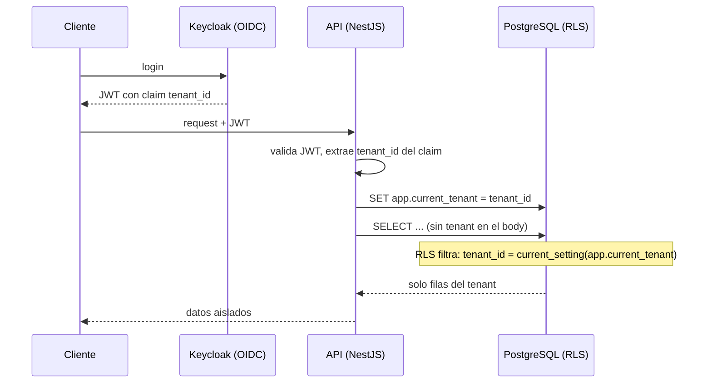

# ADR 0008 — Multi-tenant: shared database + tenant_id + Row Level Security

- **Estado:** Aceptada
- **Fecha:** 2026-06-24
- **Decisores:** Equipo de arquitectura

## Contexto y problema

FleetSpecial es un **SaaS multiempresa (multi-tenant)**: muchas empresas de transporte (tenants) usan la misma plataforma, y los datos de una empresa **jamás** pueden ser visibles para otra. El aislamiento entre tenants no es solo una feature: es un requisito de **seguridad y de cumplimiento (Habeas Data)**, porque los datos incluyen información personal de conductores y clientes.

La Fase 1 establece el multi-tenant como **cimiento desde el día 1** ("barato si se hace temprano, carísimo si se retrofitea"), incluso cuando el primer tenant es el propio fundador con una Duster. El problema a decidir: ¿qué **estrategia de aislamiento de datos** adoptamos, que sea **segura**, **barata de operar** (bootstrapping) y que **escale** de un tenant a cientos sin reescribir?

> Este ADR fija la **decisión**; el detalle (modelo de roles, planes, onboarding, índices, pruebas de aislamiento, fugas comunes) vive en **[Fase 7 — SaaS Multi-tenant](../docs/07-saas-multitenant.md)**.

## Drivers de decisión

- **Aislamiento fuerte** entre tenants (seguridad + Habeas Data).
- **Bootstrapping**: costo y operación mínimos (una sola DB, [ADR-0003](0003-postgresql-unica-base-de-datos.md)).
- **Defensa en profundidad**: que un bug en el código **no** baste para filtrar datos entre tenants.
- **Escalabilidad de 1 a cientos de tenants pequeños** sin multiplicar infraestructura.
- **Ruta de evolución**: poder aislar más a un tenant grande sin reescribir el dominio.
- **Simplicidad para el equipo pequeño**: menos esquemas/bases que migrar y respaldar.

## Opciones consideradas

1. **Shared database, shared schema + `tenant_id` por fila + Row Level Security (RLS) — elegida.** Todas las empresas comparten DB y tablas; cada fila lleva `tenant_id`; las políticas RLS de Postgres filtran automáticamente por el tenant del usuario autenticado.
2. **Shared database, schema por tenant.** Una sola DB pero un esquema (namespace) por empresa.
3. **Database por tenant.** Una base de datos independiente por empresa.
4. **Solo filtrado por `tenant_id` en el código** (sin RLS), confiando en que cada consulta incluya el filtro.

## Decisión

Adoptamos **shared database + shared schema, con `tenant_id` en cada tabla y Row Level Security (RLS) de PostgreSQL**.

Mecánica (alto nivel; detalle en [Fase 7](../docs/07-saas-multitenant.md)):

- **`tenant_id` en cada tabla** de datos de negocio.
- El **`tenant_id` proviene del claim del JWT** emitido por el IdP (Keycloak); **el cliente nunca lo elige por parámetro** (ver Fase 5 §7).
- En cada request, el backend **fija una variable de sesión de Postgres** (p. ej. `SET app.current_tenant = <claim>`).
- Las **políticas RLS** de cada tabla restringen toda fila a `tenant_id = current_setting('app.current_tenant')`. Así, **aunque una consulta olvide el filtro o el código tenga un bug**, la base **no** devuelve filas de otro tenant.
- **Defensa en profundidad**: filtro por `tenant_id` en la capa de aplicación **y** RLS en la base; dos cerrojos, no uno.
- **Índices por `tenant_id`** para que el filtrado sea eficiente.

## Consecuencias (positivas y negativas)

**Positivas:**

- **Costo y operación mínimos**: una sola DB que respaldar, migrar y monitorear, sin importar cuántos tenants haya — ideal para bootstrapping con cientos de tenants pequeños.
- **Aislamiento reforzado en la base**: RLS protege aunque el código falle (defensa en profundidad) — clave para Habeas Data.
- **Onboarding instantáneo de un tenant**: crear una empresa es insertar filas, no aprovisionar una base/esquema.
- **Migraciones únicas**: un cambio de esquema se aplica una vez, no N veces.
- **Consultas cross-tenant para operación interna** (métricas agregadas del SaaS) son posibles con un rol administrativo controlado.
- **Coherente con una sola DB** ([ADR-0003](0003-postgresql-unica-base-de-datos.md)) y con el monolito modular ([ADR-0001](0001-monolito-modular-vs-microservicios.md)).

**Negativas (honestas):**

- **"Vecino ruidoso"**: un tenant muy activo puede afectar el rendimiento de los demás al compartir recursos. *Mitigación:* índices por `tenant_id`, límites por plan, y la **ruta de evolución** de mover un tenant grande a su propio esquema/DB sin reescribir el dominio.
- **Riesgo catastrófico si RLS está mal configurado**: una política ausente o errónea podría exponer datos entre tenants. *Mitigación:* RLS **por defecto denegar**, pruebas automáticas de aislamiento (Fase 7), y revisión obligatoria de cualquier tabla nueva.
- **Disciplina de `tenant_id` en cada tabla y en la variable de sesión**: olvidarla rompe el modelo. *Mitigación:* convención obligatoria, plantilla de tabla, y la doble barrera (código + RLS).
- **Backups con granularidad de toda la DB**: restaurar los datos de un solo tenant es más laborioso que con DB por tenant. *Mitigación:* procedimientos de exportación por tenant (también útiles para los derechos ARCO de Habeas Data).

## Alternativas descartadas y por qué

- **Database por tenant — descartada para el MVP y la fase temprana.** Da el **mejor aislamiento** y facilita backups/restore por tenant, pero **multiplica el costo y la operación** (N bases que aprovisionar, migrar, monitorear) — insostenible con cientos de tenants pequeños y un equipo de 1–3 personas. Es **sobreingeniería** ahora; se reserva como opción para un tenant *enterprise* puntual más adelante (modelo híbrido), sin reescribir el dominio.
- **Schema por tenant — descartada.** Punto intermedio: mejor aislamiento que shared schema, pero **migraciones y operación se multiplican por tenant** y el onboarding deja de ser instantáneo. La relación costo/beneficio no supera a shared schema + RLS para nuestro perfil de muchos tenants pequeños.
- **Solo filtrado en el código (sin RLS) — descartada.** Es **frágil y peligroso**: una sola consulta que olvide el `WHERE tenant_id = ...` filtra datos entre empresas — inaceptable bajo Habeas Data. RLS aporta la **segunda barrera** que convierte un bug de código en un no-evento.

> **Principio que respeta:** *Bootstrapping* y *Cumplimiento*. Shared DB + `tenant_id` + RLS da aislamiento fuerte (defensa en profundidad para Habeas Data) con costo y operación casi nulos, y deja abierta la evolución a aislamiento mayor sin reescribir. El detalle vive en la [Fase 7](../docs/07-saas-multitenant.md).
