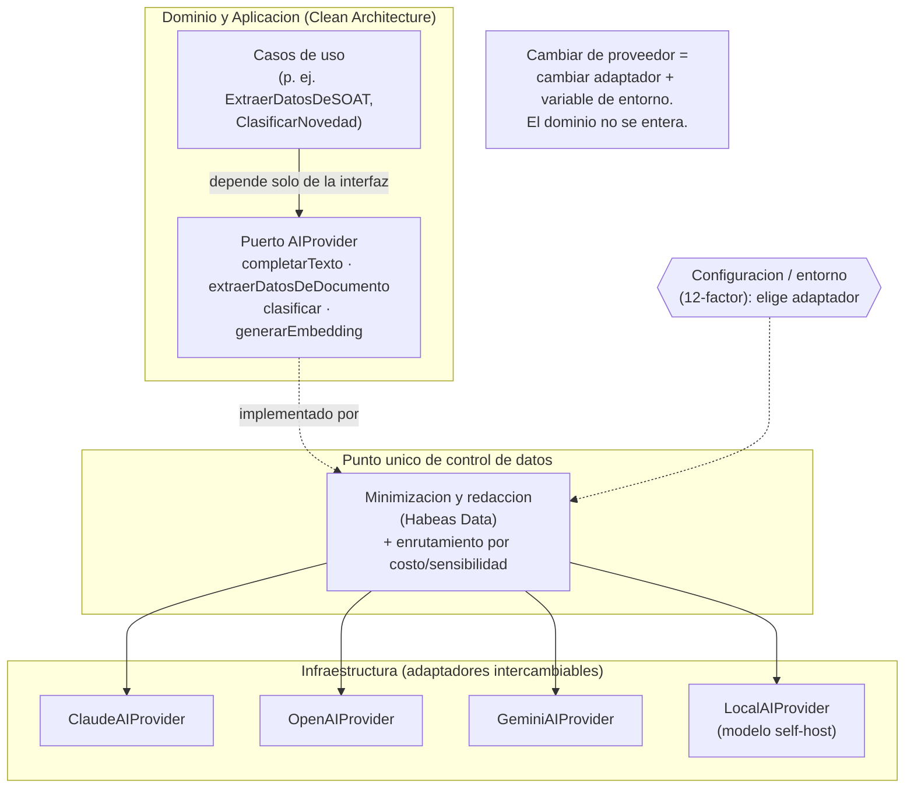
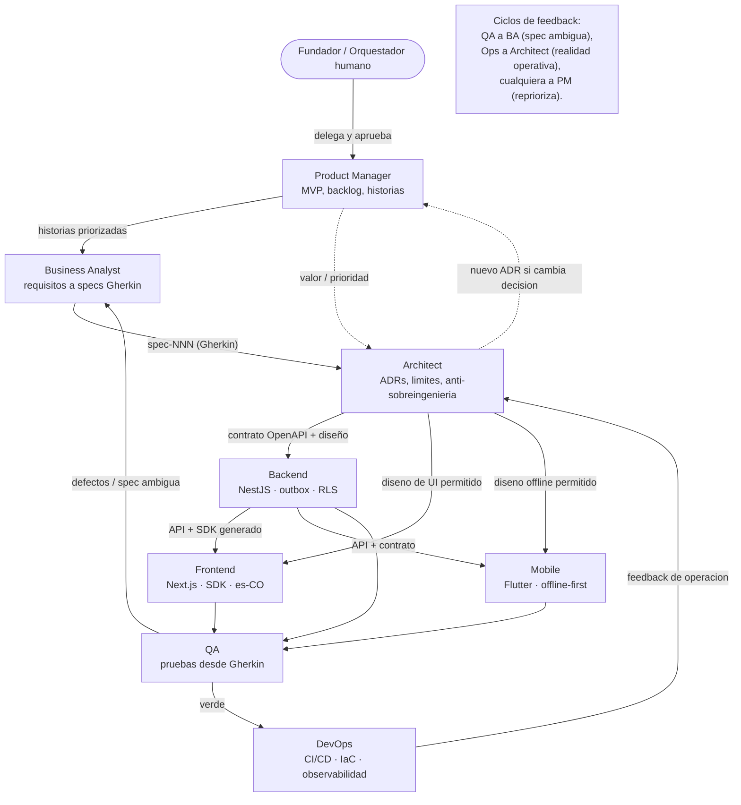

# Fase 8 — AI Agent Layer

> **Capa de agentes de IA de FleetSpecial.** Convierte el blueprint (negocio, dominio, specs, ADRs, arquitectura) en una **fuerza de trabajo de agentes especializados** que un fundador casi solo puede orquestar para construir, probar y operar el producto. Todos los artefactos de esta carpeta son **prompts en Markdown plano, agnósticos al proveedor**: se pegan tal cual en ChatGPT, Claude, Gemini, Cursor, Windsurf, Cline, Roo Code, Gravity, OpenAI Agents o cualquier herramienta futura.

---

## Objetivo de la fase

FleetSpecial nace en **bootstrapping**: el fundador opera una sola Renault Duster afiliada y construye la herramienta usándola él mismo (ver [`../README.md`](../README.md) y [`../docs/01-analisis-negocio.md`](../docs/01-analisis-negocio.md)). No hay equipo. **Por eso los agentes de IA no son un adorno: son el equipo.** Multiplican la capacidad de una persona para cubrir roles que normalmente exigirían un Product Manager, un Business Analyst, un Arquitecto, tres desarrolladores, un QA y un DevOps.

Esta fase define:

1. **Ocho agentes especializados** (uno por rol), cada uno con responsabilidades, entradas, salidas, límites y un **prompt base portable** listo para pegar.
2. **Las convenciones compartidas** que hacen que todos los agentes hablen el mismo idioma, respeten la arquitectura y no sobreingenieren.
3. **El patrón de colaboración**: cómo el fundador, actuando de **orquestador humano**, delega a los agentes y encadena su trabajo a través de las specs y los ADRs.

El objetivo no es "usar IA": es que **cualquier agente, hoy o en cinco años, pueda tomar este repositorio y producir trabajo correcto** porque el repositorio fue diseñado para ser leído por máquinas y humanos por igual.

---

## Filosofía: AI Agent Friendly Development

Un repositorio es *AI Agent Friendly* cuando un agente que nunca lo ha visto puede **orientarse, entender el porqué y producir trabajo correcto** con mínima ayuda humana. FleetSpecial se diseñó para eso desde la Fase 1. Lo que lo hace amigable para agentes:

- **Specs como fuente de verdad legible por máquina.** El comportamiento esperado vive en [`../specs/`](../specs/) como escenarios **Gherkin** (`Dado / Cuando / Entonces`). Un agente no adivina el negocio: lo lee. Cada spec tiene un identificador estable `spec-NNN` que se puede citar desde el código, las pruebas y los commits.
- **Contratos OpenAPI como interfaz dura.** La API se diseña **antes** que el código (API First). El contrato OpenAPI 3.1 vive en [`../backend/contracts/`](../backend/) y de él se generan el SDK del web, los mocks y la validación. Un agente de frontend **no inventa tipos**: los deriva del contrato.
- **Lenguaje ubicuo documentado.** El glosario de [`../docs/02-domain-driven-design.md`](../docs/02-domain-driven-design.md) §1 fija el vocabulario del transportador especial colombiano (Vencimiento, Semáforo, Planilla, Tanqueo, Afiliación, Asignación...). Si un término aparece ahí, aparece **igual** en el código, las pruebas y la UI. Los agentes no traducen ni reinventan términos.
- **ADRs que explican el "por qué".** Las decisiones transversales viven en [`../adr/`](../adr/) con su contexto, alternativas y consecuencias. Cuando un agente se pregunta "¿por qué un monolito y no microservicios?" o "¿por qué no acoplar el SDK de OpenAI?", la respuesta está ahí ([0001](../adr/0001-monolito-modular-vs-microservicios.md), [0007](../adr/0007-independencia-de-proveedor-ia-capa-abstraccion.md)). Esto evita que un agente "mejore" algo que fue una decisión consciente.
- **Estructura predecible de carpetas.** Cada bounded context es un módulo con las mismas capas (`domain/`, `application/`, `adapters/`, `infrastructure/`). Un agente que entendió un módulo entiende todos. La estructura del monorepo está documentada en [`../docs/09-estructura-repositorio.md`](../docs/).
- **Convenciones explícitas.** Nombres de eventos en pasado (`DocumentoVencido`), `tenant_id` en cada tabla, `Idempotency-Key` en escrituras reintentables, `es-CO` por defecto. Lo implícito es enemigo de los agentes; aquí casi nada es implícito.

> **Regla de oro AI-friendly:** un módulo aislado, con capas explícitas y una spec que lo describe, es la **unidad perfecta** para que un agente lea la spec, genere el caso de uso y sus pruebas **sin tener que entender todo el sistema**. El blueprint optimiza para esa unidad.

---

## Independencia de proveedor de IA

La independencia de proveedor de IA opera en **dos niveles** que no deben confundirse:

### Nivel A — Los agentes de DESARROLLO (estos archivos `.md`)

Los ocho agentes de esta carpeta son **prompts portables**. No usan ninguna sintaxis propietaria (nada exclusivo de Cursor, ni de Claude Projects, ni de GPTs, ni de Gemini Gems). Son **Markdown plano** con:

- Un bloque de **prompt base** que define rol, contexto y reglas — se copia y se pega en la caja de chat de **cualquier** herramienta.
- Instrucciones para que el agente **lea los artefactos del repo** (specs, ADRs, contratos) como contexto.
- Un **formato de salida** explícito, para que el resultado sea homogéneo sin importar qué modelo lo produjo.

Resultado: cambiar de ChatGPT a Claude, a Gemini, a Cursor o a un agente que aún no existe es **cambiar la caja donde se pega el prompt**, no reescribir nada. El fundador no queda atado a una sola herramienta de desarrollo.

### Nivel B — La IA EN PRODUCTO (features con IA dentro de FleetSpecial)

Cuando FleetSpecial incorpore funciones con IA — extraer datos de un SOAT o una tarjeta de operación por OCR, clasificar Novedades, resumir el estado de cumplimiento de una flota, asistir al operador — esa IA **nunca** se acopla directamente al SDK de un proveedor. Va detrás de un **puerto `AIProvider`** (interfaz en la capa de aplicación), con **adaptadores intercambiables** en infraestructura. Esto está decidido y justificado en **[ADR-0007](../adr/0007-independencia-de-proveedor-ia-capa-abstraccion.md)**.

El puerto expone **capacidades del dominio, no del proveedor**:

- `completarTexto(prompt, opciones)`
- `extraerDatosDeDocumento(archivo, esquema)` — p. ej. leer un SOAT y devolver vencimiento y placa
- `clasificar(texto, categorias)` — p. ej. tipo de Novedad
- `generarEmbedding(texto)`

Los adaptadores (`ClaudeAIProvider`, `OpenAIProvider`, `GeminiAIProvider`, `LocalAIProvider`) se seleccionan por **configuración/entorno** (12-factor). El dominio jamás importa un SDK de IA. La capa de abstracción es además el **punto único** donde se aplican **minimización y redacción** de datos personales antes de enviarlos a un proveedor externo (Habeas Data, Ley 1581/2012), y donde se puede **enrutar lo sensible a un modelo local**.

> **En una frase:** los **prompts de desarrollo** son portables (cualquier herramienta los ejecuta) y la **IA del producto** es portable (cualquier proveedor la sirve detrás del mismo puerto). Doble independencia, coherente con los principios no negociables del blueprint.

---

## Cómo usar estos agentes

El fundador es el **orquestador humano**: no escribe todo el código, **delega tareas acotadas** a agentes especializados y **ensambla** sus salidas. Cada agente recibe una tarea pequeña, lee los artefactos que necesita como contexto (specs, ADRs, contratos), produce un entregable en el formato esperado, y el fundador lo revisa, lo integra y dispara el siguiente.

| # | Agente | Rol resumido | Cuándo invocarlo |
|---|---|---|---|
| 1 | [Product Manager](agent-product-manager.md) | Define MVP, prioriza backlog, escribe historias, conecta negocio con specs. | Al inicio de cada incremento: decidir **qué** se construye y **por qué** ahora. |
| 2 | [Business Analyst](agent-business-analyst.md) | Elicita requisitos, escribe specs en Gherkin, mantiene el lenguaje ubicuo, valida supuestos. | Cuando una historia necesita convertirse en **spec verificable** (`spec-NNN`). |
| 3 | [Architect](agent-architect.md) | Mantiene ADRs, vela por Clean Architecture/DDD e independencias, revisa diseño, detecta sobreingeniería. | Ante una **decisión técnica transversal** o para revisar que un diseño no rompa los límites. |
| 4 | [Backend](agent-backend.md) | Implementa contextos en NestJS desde specs y contratos OpenAPI, outbox de eventos, multi-tenant con RLS. | Cuando hay un `spec-NNN` + contrato listos y toca **construir el caso de uso** y su API. |
| 5 | [Frontend](agent-frontend.md) | Portal web Next.js/React; consume la API por SDK, i18n `es-CO`, accesibilidad. | Cuando una capacidad necesita **pantalla de administración** en el portal. |
| 6 | [Mobile](agent-mobile.md) | App Flutter **offline-first**, Drift/SQLite, cola de sync, UX simple para conductores. | Cuando una capacidad la usa el **conductor en carretera** (combustible, novedades, servicio del día). |
| 7 | [QA](agent-qa.md) | Deriva pruebas de los criterios Gherkin, prueba la sync offline, automatiza, cubre casos de error. | Después de (o en paralelo con) la implementación, para **verificar contra la spec**. |
| 8 | [DevOps](agent-devops.md) | CI/CD, Docker, Terraform, ambientes dev/QA/prod, observabilidad, backups, independencia de nube. | Para **construir el camino** del código a producción y mantener la operación. |

### Patrón de colaboración entre agentes

El flujo natural va de **negocio → dominio → implementación → verificación → operación**, con ciclos de retroalimentación. Ningún agente trabaja "a ciegas": todos parten de los mismos artefactos (specs, ADRs, contratos) y devuelven trabajo que alimenta al siguiente. El fundador es quien aprueba cada paso y decide cuándo retroceder.

**Lectura del flujo:** el fundador delega al **Product Manager** qué construir; el **Business Analyst** lo vuelve specs Gherkin; el **Architect** fija el contrato y revisa límites; los tres equipos (**Backend, Frontend, Mobile**) implementan a partir del mismo contrato; **QA** verifica contra los criterios de la spec; **DevOps** lleva lo verde a producción. Los **ciclos de feedback** (QA a BA cuando una spec es ambigua, Ops a Architect cuando la realidad operativa contradice un supuesto, cualquiera a PM para repriorizar) mantienen el sistema honesto.

---

## Convenciones compartidas para todos los agentes

Estas reglas aplican a los **ocho** agentes sin excepción. Cada prompt base las reitera, pero aquí está la fuente única.

1. **Leer antes de escribir.** Antes de producir nada, el agente **consulta los artefactos existentes**: la(s) spec(s) `spec-NNN` relevantes en [`../specs/`](../specs/), los ADRs en [`../adr/`](../adr/), el glosario y el modelo de [`../docs/02-domain-driven-design.md`](../docs/02-domain-driven-design.md), y el contrato en [`../backend/contracts/`](../backend/). Si la información necesaria no existe, **lo dice y pregunta** en vez de inventar.

2. **Cómo citar specs.** Toda afirmación de comportamiento se ancla a una spec por su identificador estable **`spec-NNN`** (p. ej. *"según `spec-014`, escenario 'Asignación rechazada por incumplimiento'"*). Los criterios de aceptación se expresan en **Gherkin** (`Dado / Cuando / Entonces`, en español). Las pruebas y los commits referencian el mismo `spec-NNN`. Si un agente detecta que falta una spec para lo que se le pide, deriva el trabajo al Business Analyst.

3. **Respetar Clean Architecture y los bounded contexts.** Las dependencias apuntan **hacia adentro**: el dominio no importa NestJS, ni el ORM, ni Flutter, ni Drift, ni ningún SDK. Lo externo se consume **detrás de un puerto** (interfaz) definido en la capa de aplicación. Cada uno de los **8 bounded contexts** (Identity & Access, Fleet, Driver, **Compliance & Documents** [CORE], **Service Scheduling** [CORE], Fuel, Maintenance, Billing) es un **módulo** con sus capas `domain/ application/ adapters/ infrastructure/`. **No se cruzan límites** alcanzando la tabla o el dominio de otro módulo: la comunicación es por **eventos de dominio (outbox)** o por la **interfaz pública** del otro módulo. La regla de oro del negocio — *no asignar un servicio a un recurso que no esté al día documentalmente* — cruza Scheduling y Compliance vía una **Anti-Corruption Layer**, nunca importando el modelo de Vencimientos.

4. **No sobreingenierizar (YAGNI).** El blueprint es deliberadamente austero: **monolito modular** antes que microservicios, **un PostgreSQL** antes que cinco bases, **outbox in-process** antes que un broker, **TanStack Query** antes que Redux. Un agente **no añade** colas distribuidas, GraphQL, microservicios, dashboards de BI ni abstracciones especulativas salvo que una spec o un ADR lo exija. Ante la duda, elige lo más simple que cumpla la spec y lo señala. Si cree que hace falta más, lo **propone**, no lo impone.

5. **Mantener las independencias (framework / nube / IA).**
   - *Framework:* el dominio es portable; el framework es un detalle de la capa externa.
   - *Nube:* nada que ate a un proveedor único; contenedores + IaC portable ([ADR-0006](../adr/0006-independencia-de-nube-contenedores-iac.md)).
   - *IA:* toda integración de IA del producto pasa por el puerto **`AIProvider`** ([ADR-0007](../adr/0007-independencia-de-proveedor-ia-capa-abstraccion.md)); jamás se acopla un SDK de proveedor al dominio.

6. **Multi-tenant y cumplimiento siempre presentes.** Todo dato de negocio lleva **`tenant_id`**; el aislamiento se refuerza con **RLS** de PostgreSQL ([ADR-0008](../adr/0008-multi-tenant-shared-db-rls.md)). El `tenant_id` proviene del **claim del JWT**, nunca de un parámetro del cliente. Los datos personales de conductores y clientes se tratan bajo **Habeas Data (Ley 1581/2012)**; nunca se registran en logs en claro.

7. **Formato de salida esperado.** Cada entregable debe:
   - empezar con un **resumen de una o dos frases** de qué se hizo;
   - **citar** las specs/ADRs/contratos consultados (`spec-NNN`, `ADR-NNNN`);
   - entregar el **artefacto concreto** (código, spec, ADR, plan, prueba) en bloques claramente delimitados, con rutas de archivo **explícitas** acordes a la estructura del repo;
   - listar **supuestos** asumidos y **preguntas abiertas** si las hay;
   - terminar con una **Definición de Hecho** verificada (ver cada agente).

8. **Idioma y localización.** Todo en **español (Colombia)**. Terminología local intacta ("tarjeta de operación", "RTM", "SOAT", "planilla", "tanqueo"). Moneda **COP**, fechas y formatos `es-CO`.

---

### Mapa de artefactos que todo agente puede consultar

| Artefacto | Ruta | Para qué sirve |
|---|---|---|
| Visión y principios | [`../README.md`](../README.md) | El "por qué" del producto y los principios no negociables. |
| Análisis de negocio | [`../docs/01-analisis-negocio.md`](../docs/) | Problema, mercado, MVP, riesgos, supuestos legales. |
| Dominio (DDD) | [`../docs/02-domain-driven-design.md`](../docs/02-domain-driven-design.md) | Lenguaje ubicuo, bounded contexts, eventos, sagas, políticas. |
| Specs (Gherkin) | [`../specs/`](../specs/) | Comportamiento exacto, criterios de aceptación `spec-NNN`. |
| Arquitectura técnica | [`../docs/05-arquitectura-tecnica.md`](../docs/05-arquitectura-tecnica.md) | Capas, stack, multi-tenancy, infra, seguridad. |
| Decisiones (ADR) | [`../adr/`](../adr/) | El porqué de cada decisión transversal. |
| Contratos | [`../backend/contracts/`](../backend/) | OpenAPI 3.1 + AsyncAPI; fuente de DTOs y mocks. |

> **Si lo que necesitas no está en estos artefactos, no lo inventes: dilo y pregunta.** Esa es la diferencia entre un agente que ayuda y uno que introduce deuda.
