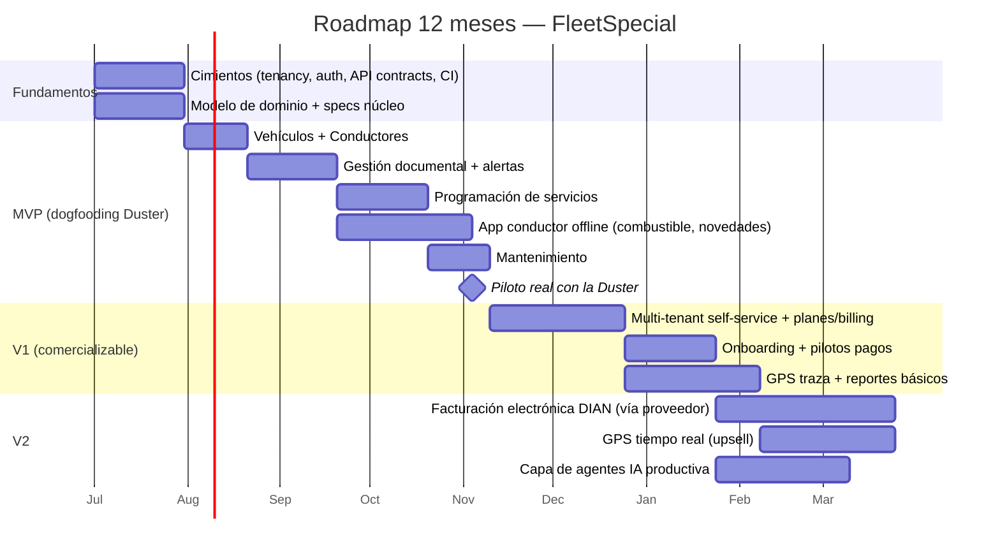

# Fase 1 — Análisis de Negocio

> **Objetivo de la fase:** decidir si el negocio vale la pena y, si sí, cuál es el MVP más pequeño que valida la hipótesis central sin quemar capital. Priorizamos análisis sobre construcción.

---

## 0. Restricciones del proyecto (confirmadas con el fundador)

Estas restricciones acotan **todas** las decisiones de producto y arquitectura de este blueprint. Reemplazan el campo `{{RESTRICCIONES}}` del encargo original.

| # | Restricción | Implicación de diseño |
|---|---|---|
| 1 | **Presupuesto ajustado (bootstrapping).** Mínimo y autofinanciado. | Open-source y planes gratuitos; bajo costo operativo; anti-sobreingeniería. |
| 2 | **Cumplimiento normativo Colombia.** Habeas Data (Ley 1581/2012), facturación electrónica DIAN, transporte especial (Decreto 1079/2015 y planilla). | Consentimiento desde el onboarding; catálogo de documentos configurable; DIAN diferida a V1. *Ver §8 — confirmar con abogado.* |
| 3 | **Time-to-market agresivo.** | MVP usable en 8–12 semanas operando la Duster; alcance pequeño y enfocado. |
| 4 | **Equipo pequeño (1–3 devs).** Posiblemente un único fundador apoyado por agentes IA. | Stacks productivos, un solo lenguaje donde se pueda, monolito modular; los agentes IA (Fase 8) multiplican el throughput. |
| 5 | **Dependencia de la empresa afiliadora.** La Duster opera afiliada a una transportadora; planilla y parte de la documentación dependen de ella, **sin integración formal aún**. | La herramienta debe aportar valor por **gestión propia** aunque no haya integración; se deja la costura para integrar a la afiliadora después (ver R7 y `docs/07`). |

> Estas restricciones se reflejan de forma transversal: la #1, #3 y #4 sustentan el **monolito modular** y la pila recomendada (`adr/0001`, `adr/0002`); la #2 atraviesa el contexto **Compliance** y el modelo SaaS (`docs/07`); la #5 moldea el modelo de tenant y el alcance del MVP.

---

## 1. Problema principal

Las **empresas de transporte especial y las flotas pequeñas en Colombia** (desde un propietario con un vehículo afiliado hasta operadores con 5–30 unidades) gestionan una operación **intensiva en documentos, plazos y cumplimiento**, casi siempre con **WhatsApp, Excel y papel**. El dolor no es un solo problema, sino la **fragmentación**:

- **Vencimientos invisibles.** SOAT, revisión técnico-mecánica, tarjeta de operación, licencias de conducción, exámenes médicos, pólizas contractual y extracontractual. Un documento vencido = vehículo varado, multa, o servicio rechazado. Hoy nadie avisa con anticipación; se descubre cuando ya es tarde.
- **Planilla y afiliación.** El propietario afiliado depende de la empresa transportadora para la planilla electrónica de viaje (extracto de contrato / planilla de transporte especial). El ida y vuelta es manual, lento y propenso a error.
- **Programación de servicios artesanal.** Asignar conductor + vehículo a un servicio, evitar choques de horario, y dejar registro, se hace "de memoria" o en un grupo de chat.
- **Combustible y mantenimiento sin trazabilidad.** No se sabe el costo real por kilómetro ni cuándo toca el próximo mantenimiento; se reacciona a la falla.
- **El conductor opera sin señal.** En carretera y zonas rurales no hay datos. Cualquier herramienta que **exija conexión permanente es inservible** para quien está al volante.
- **Cero memoria operativa.** Cuando algo sale mal (un siniestro, una multa, una queja del cliente) no hay un registro consultable de qué pasó, quién conducía, con qué documentos.

**Síntesis del problema:** *no existe una herramienta asequible que centralice documentos, vencimientos, servicios y operación de un transportador especial colombiano, que funcione sin conexión para el conductor y que escale de un vehículo a una flota sin cambiar de herramienta.*

---

## 2. Oportunidad de mercado

### Por qué ahora y por qué este nicho

- **Nicho desatendido por arriba y por abajo.** Los TMS (Transport Management Systems) globales y los grandes proveedores de telemetría apuntan a flotas medianas/grandes y cobran en dólares; quedan caros y sobredimensionados para 1–30 vehículos. Las apps de "GPS barato" resuelven solo rastreo, no cumplimiento ni operación. **El medio —cumplimiento + operación + offline, en pesos y en español colombiano— está vacío.**
- **Presión regulatoria creciente.** La digitalización obligatoria (facturación electrónica DIAN, planilla electrónica, controles de tránsito) empuja a los pequeños operadores hacia herramientas digitales, quieran o no.
- **Penetración móvil alta, conectividad irregular.** El smartphone es universal entre conductores; la conexión no. Eso hace de **offline-first un diferenciador defendible**, no un lujo.
- **Efecto de afiliación.** Una empresa transportadora afilia a decenas de propietarios. Si la herramienta enamora a un propietario, la empresa transportadora es un canal natural de distribución B2B2C.

### Tamaño (orden de magnitud, a validar)

Colombia tiene decenas de miles de vehículos de servicio especial y miles de pequeñas empresas y propietarios afiliados. No se requiere una cuota grande: **capturar unos cientos de vehículos pagando una suscripción mensual modesta** ya constituye un negocio sostenible para un fundador. *La cifra exacta de mercado es un supuesto a validar (ver §8); la tesis no depende de un TAM enorme sino de un dolor agudo y recurrente con baja competencia directa.*

### Modelo de captura de valor

Suscripción **por vehículo activo / mes** (SaaS), con plan gratuito de 1 vehículo (el propio fundador y la viralidad entre propietarios), planes por tramos de flota, y upsells (GPS en tiempo real, reportes avanzados, marketplace). Detalle en [`docs/07-saas-multitenant.md`](07-saas-multitenant.md).

---

## 3. Usuarios

| Usuario | Rol y contexto | Necesidad central | Dispositivo principal |
|---|---|---|---|
| **Conductor** | Al volante, frecuentemente sin señal. Puede no ser experto digital. | Ver su servicio del día, registrar combustible/novedades, tener sus documentos a mano. **Todo debe funcionar offline.** | App móvil (Flutter) |
| **Dueño de vehículo** (propietario afiliado) | El caso del fundador. Posee 1–pocos vehículos afiliados a una transportadora. | Saber que sus documentos están al día, cuánto gasta, cuándo toca mantenimiento. | Web + móvil |
| **Administrador / operador** | Coordina la flota día a día en la empresa pequeña. | Programar servicios, asignar conductor+vehículo, ver alertas de vencimiento. | Portal web |
| **Gestor de planilla** | Tramita planillas/extractos de viaje y afiliaciones con la transportadora. | Generar y controlar planillas, mantener documentación de afiliación. | Portal web |
| **Representante legal** | Responde legalmente por la empresa. | Visión de cumplimiento, reportes, control de quién hace qué. | Portal web (lectura/aprobación) |
| **Usuario / cliente del servicio** *(horizonte futuro)* | Quien contrata el transporte. | Confirmar y seguir su servicio. | Web/móvil (post-MVP) |

> **Implicación de diseño:** dos superficies muy distintas. La **app del conductor** optimiza para offline, simplicidad y un solo flujo a la vez. El **portal web** optimiza para visión de conjunto, listas y control. Comparten dominio y API, no UI.

---

## 4. Casos de uso

Agrupados por capacidad. Los marcados con ⭐ entran al MVP.

**Gestión documental y cumplimiento**
- ⭐ Registrar un documento (SOAT, RTM, tarjeta de operación, licencia, póliza) con fecha de vencimiento y archivo adjunto.
- ⭐ Recibir alerta anticipada de vencimiento (p. ej. 30/15/3 días antes).
- ⭐ Consultar el estado de cumplimiento de un vehículo o conductor de un vistazo (semáforo).
- Renovar un documento y conservar el histórico de versiones.

**Gestión de vehículos y conductores**
- ⭐ Dar de alta un vehículo con sus datos básicos.
- ⭐ Dar de alta un conductor y asociar su licencia/documentos.
- Asociar propietario ↔ vehículo ↔ empresa afiliadora.

**Programación de servicios**
- ⭐ Crear un servicio (origen, destino, fecha/hora, cliente) y asignar vehículo + conductor.
- ⭐ Ver la agenda del día/semana y detectar choques de asignación.
- ⭐ El conductor ve su servicio asignado **offline** y lo marca iniciado/finalizado.
- Adjuntar planilla/extracto de viaje al servicio.

**Combustible y mantenimiento**
- ⭐ Registrar una carga de combustible (litros, valor, odómetro) — **offline desde la app**.
- ⭐ Registrar/Programar un mantenimiento (preventivo por km/fecha, correctivo).
- Ver costo por kilómetro y próximos mantenimientos.

**Operación del conductor (móvil, offline-first)**
- ⭐ Ver "mi día": servicios, documentos del vehículo, pendientes.
- ⭐ Registrar novedades (incidente, retraso) con foto, que sincronizan al recuperar señal.
- Ver ubicación / dejar traza GPS (captura offline; envío al reconectar).

**Administración SaaS / multiempresa**
- ⭐ Operar bajo una empresa (tenant) con sus propios vehículos, usuarios y datos aislados.
- ⭐ Invitar usuarios y asignar roles.
- Gestionar suscripción y plan (post-MVP temprano).

---

## 5. MVP recomendado

### Hipótesis que el MVP debe validar

> *"Un transportador pequeño pagará una suscripción mensual por una herramienta que le evite vencimientos sorpresa y le ordene servicios, combustible y mantenimiento, y que su conductor pueda usar sin señal."*

### Alcance del MVP (lo que SÍ entra)

El MVP es **deliberadamente pequeño** y centrado en el caso del fundador (1 Duster afiliada), pero construido sobre los cimientos correctos (multi-tenant, offline, API-first) para no tener que reescribir al escalar.

1. **Multi-tenant base** — una empresa, aislamiento de datos por tenant desde el día 1 (es un cimiento, no una feature; barato si se hace temprano, carísimo si se retrofitea). *Ver `docs/07`.*
2. **Gestión de vehículos y conductores** — alta y datos básicos.
3. **Gestión documental con alertas de vencimiento** — **el corazón del valor.** Documentos + fechas + semáforo + notificaciones anticipadas.
4. **Programación de servicios** — crear, asignar conductor+vehículo, agenda, detección de choques.
5. **Control de combustible** — registro con odómetro, costo básico.
6. **Control de mantenimiento** — registro y programación preventiva simple.
7. **App Flutter del conductor, offline-first** — "mi día", ver servicio y documentos sin señal, registrar combustible y novedades offline, sincronizar al reconectar. *Ver `docs/06`.*
8. **Portal web administrativo** — para los roles de oficina.

### Lo que NO entra al MVP (y por qué) — antídoto contra la sobreingeniería

| Diferido | Por qué esperar |
|---|---|
| **GPS en tiempo real / telemetría live** | Caro (hardware, ingestión de streams) y no es el dolor #1. El MVP captura traza offline y la envía al reconectar; el live es upsell V1/V2. |
| **Facturación electrónica DIAN integrada** | Alta complejidad regulatoria. El MVP registra el dato; la integración con proveedor tecnológico/DIAN llega en V1 cuando haya ingresos que la justifiquen. |
| **Marketplace / módulo de clientes** | Solo tiene sentido con masa crítica de operadores. Horizonte tardío. |
| **App nativa para el cliente final** | El cliente final no es el comprador en la fase de validación. |
| **Microservicios, multi-DB, event sourcing completo** | Sobreingeniería para 1–30 vehículos. Monolito modular + Postgres + outbox de eventos. *Ver `adr/0001`, `adr/0004`.* |
| **Reportería avanzada / BI** | Un par de vistas resumen bastan. BI es upsell. |

### Criterio de éxito del MVP

- El fundador opera **su Duster real** durante ≥ 8 semanas usando solo la herramienta (dogfooding).
- Cero vencimientos sorpresa en ese periodo.
- 3–5 operadores piloto adicionales registran datos reales semanalmente.
- Señal de disposición a pagar: al menos algunos pilotos aceptan un plan de pago al terminar la prueba.

---

## 6. Roadmap 12 meses

> Detalle por horizontes de producto (MVP→Enterprise) en [`docs/10-roadmap.md`](10-roadmap.md). Aquí la vista temporal de los primeros 12 meses.

**Hitos clave**
- **Mes 2–3:** MVP operando la Duster (dogfooding).
- **Mes 4–5:** primeros pilotos externos con datos reales.
- **Mes 6–7:** V1 comercializable con self-service y cobro.
- **Mes 9–12:** V2 con DIAN, GPS live y agentes IA.

---

## 7. Riesgos

| # | Riesgo | Prob. | Impacto | Mitigación |
|---|---|---|---|---|
| R1 | **Baja disposición a pagar** del segmento (acostumbrado a Excel/WhatsApp gratis). | Alta | Alto | Dogfooding + pilotos con métrica de valor (vencimientos evitados). Precio bajo de entrada. Plan gratis de 1 vehículo como gancho. |
| R2 | **Offline-first subestimado.** La sincronización con conflictos es el problema técnico más difícil. | Alta | Alto | Diseñar sync desde el día 1 con reglas de conflicto claras (`docs/06`). Empezar con datos "append-only" (combustible, novedades) que casi no generan conflictos. |
| R3 | **Complejidad regulatoria** (planilla, DIAN, transporte especial) mayor a lo previsto. | Media | Alto | Sacar DIAN del MVP. Validar requisitos de planilla con la transportadora afiliadora real. Asesoría legal puntual (§8). |
| R4 | **Sobreingeniería** que quema el presupuesto y el tiempo. | Media | Alto | Reglas anti-sobreingeniería explícitas (monolito modular, 1 DB). Revisión de ADRs antes de añadir complejidad. |
| R5 | **Fundador como único recurso** (tiempo, foco, burnout). | Alta | Medio | Blueprint + agentes IA para multiplicar throughput. Roadmap por horizontes cortos y entregables. |
| R6 | **Adopción del conductor** (resistencia a apps, baja alfabetización digital). | Media | Medio | UX ultra simple "un flujo a la vez", funciona offline, sin fricción de login constante. |
| R7 | **Dependencia de la empresa afiliadora** para planilla/datos. | Media | Medio | Diseñar para que la herramienta aporte valor aun sin integración con la afiliadora (gestión propia). |
| R8 | **Competidor con más capital** copia el nicho. | Baja | Medio | Ventaja de foco, lenguaje local y offline real; construir relación con operadores temprano. |
| R9 | **Lock-in accidental** de nube/IA/framework contra el principio de independencia. | Media | Medio | Capas de abstracción (IA `adr/0007`, nube `adr/0006`, dominio limpio). |

---

## 8. Supuestos a validar

> Cada supuesto tiene un **experimento barato** asociado. La fase de validación con la Duster existe para resolver estos, no para construir features.

**De mercado y negocio**
1. **El dolor de vencimientos es el #1.** → *Experimento:* entrevistar 8–10 propietarios/operadores; ¿qué les ha costado dinero en el último año?
2. **Pagarían una suscripción mensual modesta.** → *Experimento:* carta de intención / preventa con pilotos.
3. **El tamaño de mercado alcanzable sostiene el negocio.** → *Experimento:* estimar # de propietarios afiliados vía la(s) transportadora(s) conocidas.
4. **La empresa afiliadora puede ser canal de distribución.** → *Experimento:* conversación con la transportadora del fundador.

**De producto**
5. **El conductor adoptará una app offline simple.** → *Experimento:* el propio conductor de la Duster la usa 8 semanas.
6. **El semáforo de cumplimiento es suficiente** (vs. integraciones complejas) para aportar valor. → *Experimento:* feedback de pilotos.

**Legales / regulatorios — confirmar con abogado/contador**
7. **Habeas Data (Ley 1581 de 2012 y decretos reglamentarios):** se requiere política de tratamiento de datos, autorización de titulares (conductores, clientes), y eventual registro ante la SIC según volumen. → *Acción:* asesoría legal puntual; incluir consentimiento en el onboarding desde el MVP.
8. **Planilla / extracto de viaje de transporte especial (marco del Decreto 1079 de 2015 y reglamentación vigente):** confirmar el formato y flujo exactos exigidos hoy y si deben reportarse a algún sistema (p. ej. RNDC u otro). → *Acción:* validar con la transportadora afiliadora y normativa vigente del Ministerio de Transporte.
9. **Facturación electrónica DIAN:** obligatoriedad y vía de cumplimiento (proveedor tecnológico autorizado vs. servicio gratuito DIAN). → *Acción:* diferida a V1; confirmar con contador.
10. **Documentos obligatorios y sus vigencias** (SOAT, RTM, tarjeta de operación, exámenes médicos del conductor, pólizas contractual/extracontractual): confirmar lista y periodicidad vigentes. → *Acción:* validar con normativa de tránsito y la afiliadora; el catálogo de documentos del sistema debe ser **configurable** para absorber cambios normativos sin redeploy.

> ⚠️ **Nota legal:** los artefactos de este blueprint asumen el marco normativo colombiano conocido y estable (Ley 1581/2012, Decreto 1079/2015, facturación electrónica DIAN). No constituyen asesoría legal. Antes de operar comercialmente, confirmar con un profesional la reglamentación **vigente a la fecha**, ya que la normativa de transporte y tributaria se actualiza con frecuencia.

---

## Trazabilidad

Este análisis alimenta directamente:
- Los **bounded contexts** de la Fase 2 (cada capacidad → un contexto).
- Las **specs** de la Fase 3 (cada caso de uso ⭐ → una o más specs).
- El **EDT** de la Fase 4 (el MVP define los primeros epics).
- El **roadmap** de la Fase 10 (MVP/V1/V2).
