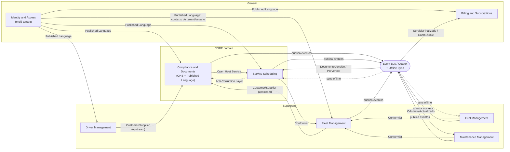
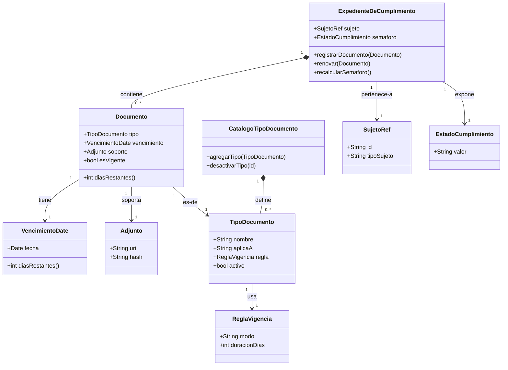
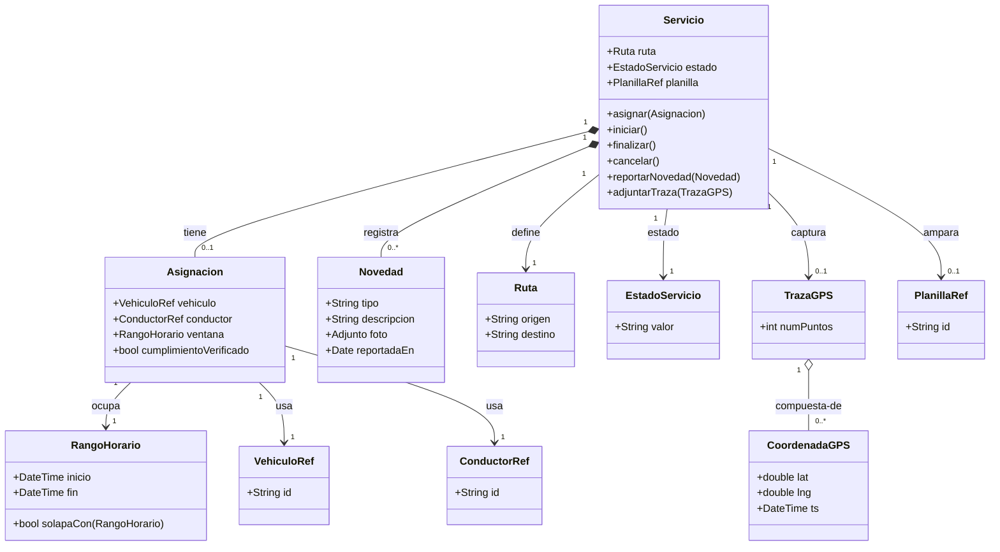
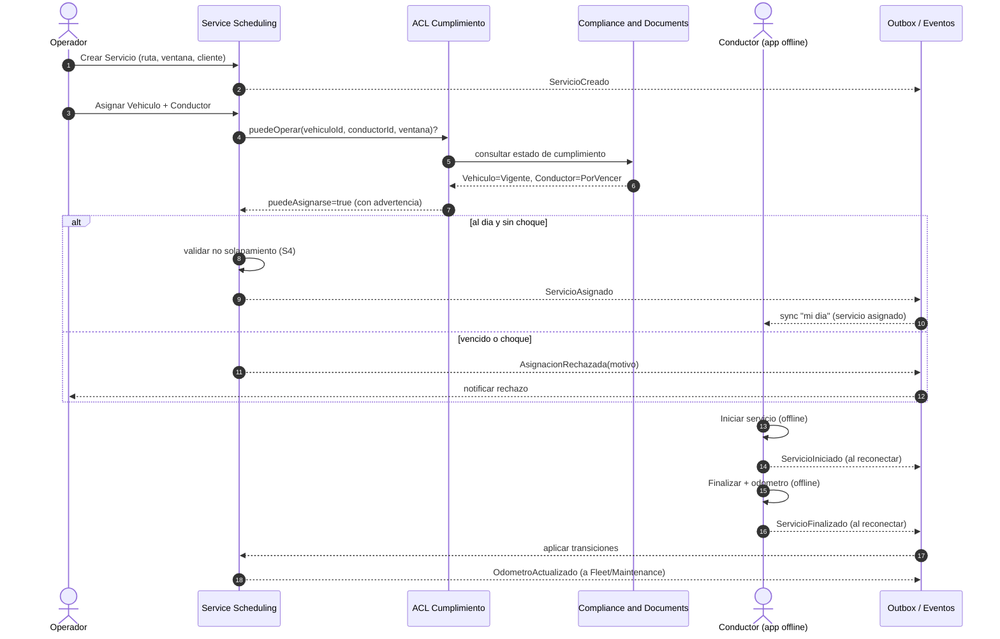
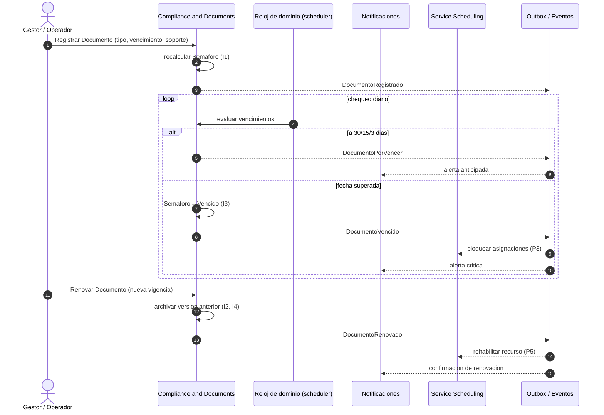
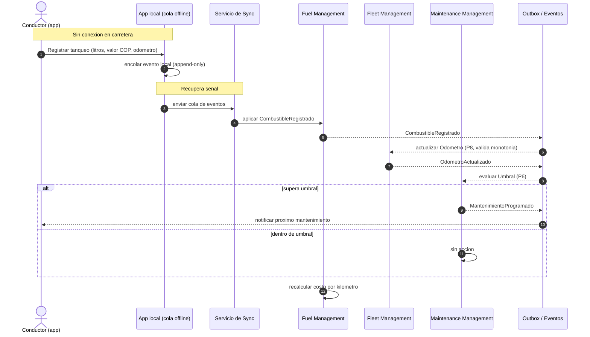

# Fase 2 — Domain Driven Design

> **Objetivo de la fase:** traducir el dolor del negocio (Fase 1) a un modelo de dominio con límites explícitos, lenguaje compartido y eventos, de modo que cada capacidad del MVP tenga un hogar conceptual claro, las reglas de cumplimiento vivan en el corazón del sistema, y la operación offline-first tenga una columna vertebral de eventos sobre la cual sincronizar. Modelamos rico en lo conceptual y austero en lo desplegable: los contextos son módulos de **un único monolito modular**, no microservicios.

---

## 1. Lenguaje Ubicuo (glosario)

El lenguaje ubicuo es el contrato semántico entre el negocio, el código, las specs (Fase 3) y los agentes IA (Fase 8). Si un término aparece aquí, aparece igual en el código, en las pruebas y en la UI. Se usa el vocabulario real del transportador especial colombiano.

| Término | Definición en el dominio |
|---|---|
| **Empresa / Tenant** | Entidad de negocio que contrata FleetSpecial. Unidad de aislamiento de datos: todo registro pertenece a exactamente una empresa. Puede ser un propietario individual o una flota de 5–30 unidades. |
| **Empresa transportadora (Afiliadora)** | Empresa habilitada para prestar transporte especial a la que un propietario **afilia** su vehículo. Puede ser, ella misma, un tenant, o un actor externo referenciado. |
| **Afiliación** | Vínculo contractual entre un Vehículo (de un Propietario) y una Empresa transportadora que lo habilita para operar bajo su habilitación. Genera obligaciones documentales (tarjeta de operación, planilla). |
| **Propietario** | Persona o empresa dueña de un Vehículo. Puede no ser el conductor ni el tenant administrador. En el caso del fundador, propietario afiliado de una sola Duster. |
| **Vehículo** | Unidad de transporte (placa, marca, modelo, clase). Sujeto principal de cumplimiento documental y de servicios. |
| **Placa** | Identificador único del Vehículo ante el tránsito (p. ej. `ABC123`). Inmutable durante la vida del registro. |
| **Odómetro** | Lectura de kilometraje acumulado del Vehículo. Monótonamente creciente: una lectura nunca puede ser menor a la anterior registrada. |
| **Conductor** | Persona habilitada para conducir un Vehículo. Sujeto de cumplimiento documental propio (licencia, exámenes). Opera la app móvil offline. |
| **Licencia de conducción** | Documento del Conductor con categoría y fecha de vencimiento que lo habilita para una clase de vehículo. |
| **Documento** | Cualquier soporte con vigencia legal asociado a un Vehículo o Conductor: SOAT, revisión técnico-mecánica (RTM), tarjeta de operación, licencia, exámenes médicos, póliza contractual y extracontractual. |
| **Tipo de documento** | Catálogo **configurable** de clases de documento con su regla de vigencia. Configurable para absorber cambios normativos sin redeploy. |
| **Vencimiento** | Fecha en que un Documento deja de tener validez legal. Eje central del valor del producto: un vencimiento no avisado = vehículo varado o multa. |
| **Estado de cumplimiento (Semáforo)** | Resumen del estado documental de un Vehículo o Conductor: `Vigente` (verde), `Por vencer` (amarillo), `Vencido` (rojo). Calculado a partir de los Vencimientos de sus Documentos. |
| **Renovación** | Acto de sustituir un Documento vencido o por vencer por una nueva versión vigente, conservando el histórico. |
| **Servicio** | Encargo de transporte concreto: origen, destino, fecha/hora, cliente. Unidad operativa que se asigna y ejecuta. |
| **Asignación** | Vínculo de un Servicio con un Vehículo y un Conductor para una ventana horaria. No puede haber solapamiento de asignaciones para el mismo recurso. |
| **Ventana horaria (RangoHorario)** | Intervalo `[inicio, fin)` durante el cual un Servicio ocupa a un Vehículo y un Conductor. Base de la detección de choques. |
| **Planilla / Extracto de viaje** | Documento de transporte especial (marco Decreto 1079/2015) que ampara un Servicio o conjunto de servicios ante la autoridad. Se genera y se adjunta al Servicio. |
| **Carga de combustible (Tanqueo)** | Registro de un abastecimiento: litros/galones, valor en COP, odómetro y fecha. Capturado **offline** por el Conductor. Append-only. |
| **Costo por kilómetro** | Métrica derivada del gasto de combustible y mantenimiento sobre los kilómetros recorridos (deltas de odómetro). |
| **Mantenimiento preventivo** | Intervención programada por umbral de kilometraje o de fecha para evitar fallas. |
| **Mantenimiento correctivo** | Intervención reactiva ante una falla ya ocurrida. |
| **Umbral de mantenimiento** | Regla (cada N km o cada T tiempo) que dispara la programación de un mantenimiento preventivo al ser superada por el Odómetro. |
| **Novedad** | Evento operativo reportado por el Conductor durante un Servicio (incidente, retraso, siniestro), opcionalmente con foto. Capturado offline. |
| **Traza GPS** | Secuencia de Coordenadas capturadas por la app durante un Servicio. En el MVP se captura offline y se envía al reconectar. |
| **Coordenada GPS** | Par `(latitud, longitud)` con marca de tiempo. |
| **Dinero (Money)** | Monto monetario siempre con moneda explícita; en este dominio, **COP** (peso colombiano). |
| **Suscripción** | Contrato SaaS de un Tenant a un Plan, con vehículos activos facturables y ciclo de cobro. |
| **Plan** | Nivel de servicio comercial (gratis 1 vehículo, tramos de flota, upsells). |
| **Usuario** | Persona con credenciales que actúa dentro de un Tenant bajo uno o más Roles. |
| **Rol** | Conjunto de permisos: conductor, dueño de vehículo, administrador/operador, gestor de planilla, representante legal, cliente. |
| **Outbox de eventos** | Tabla transaccional donde se persisten los Domain Events junto con el cambio que los origina, para publicarlos de forma confiable y para alimentar la sincronización offline. |

---

## 2. Bounded Contexts

Cada capacidad del MVP (Fase 1, §4) se traduce en un **contexto acotado**: un límite dentro del cual un modelo y su lenguaje son consistentes. Identificamos **ocho (8) contextos**. La clasificación en subdominios guía la inversión: en el **Core** ponemos el mejor diseño y esfuerzo (es donde está la ventaja competitiva); en **Supporting** un diseño correcto pero pragmático; en **Generic** preferimos comprar/adoptar soluciones estándar antes que construir.

| # | Bounded Context | Tipo de subdominio |
|---|---|---|
| BC-1 | Identity & Access | Generic / Supporting |
| BC-2 | Fleet Management | Supporting |
| BC-3 | Driver Management | Supporting |
| BC-4 | **Compliance & Documents** | **CORE** |
| BC-5 | **Service Scheduling** | **CORE** |
| BC-6 | Fuel Management | Supporting |
| BC-7 | Maintenance Management | Supporting |
| BC-8 | Billing & Subscriptions | Generic |

> *Telemetry/GPS* no se modela como contexto desplegable en el MVP: la captura de Traza GPS vive como capacidad **dentro de Service Scheduling** (la traza pertenece a un Servicio) y la ingestión en tiempo real se difiere a V1/V2 (Fase 1). Se deja la **costura** (seam) preparada para extraerlo como contexto propio cuando el GPS live lo justifique.

### BC-1 — Identity & Access (IAM)
- **Responsabilidad:** identidad de Usuarios, autenticación, autorización por Roles, y sobre todo el **modelo multi-tenant** (a qué Empresa pertenece cada usuario y dato). Emite y valida el contexto de tenant que todos los demás contextos consumen.
- **Por qué es un límite:** el modelo de identidad y aislamiento de datos tiene su propio lenguaje (Usuario, Rol, permiso, tenant) y su propio ciclo de cambio (políticas de seguridad), distinto del dominio de transporte. Es transversal pero no debe contaminar las reglas de negocio.
- **Subdominio:** **Generic/Supporting.** La autenticación es un problema resuelto (se adopta un estándar/lib); la **tenancy** es lo único específico y se trata como Supporting con cuidado, porque retrofitearla es carísimo (Fase 1, R4; `docs/07`).

### BC-2 — Fleet Management
- **Responsabilidad:** ciclo de vida del Vehículo: alta, datos básicos (placa, clase, marca/modelo), Propietario, Afiliación a empresa transportadora, y la lectura **autoritativa del Odómetro**.
- **Por qué es un límite:** el Vehículo es una entidad con identidad y reglas propias (placa única por tenant, odómetro monótono) que muchos contextos referencian pero ninguno debería poseer. Centralizar evita duplicación e inconsistencia.
- **Subdominio:** **Supporting.** Necesario y específico, pero no es donde se gana el mercado; un CRUD bien hecho con buenas invariantes.

### BC-3 — Driver Management
- **Responsabilidad:** ciclo de vida del Conductor: datos personales, habilitación, y vínculo con Usuario de IAM (un conductor que usa la app es también un Usuario).
- **Por qué es un límite:** el Conductor tiene su propio cumplimiento y su propio flujo de habilitación, separable del Vehículo. Mantener Vehículo y Conductor en contextos distintos evita un "god aggregate" y permite que ambos sean sujetos de cumplimiento de forma uniforme.
- **Subdominio:** **Supporting.**

### BC-4 — Compliance & Documents  (CORE)
- **Responsabilidad:** **el corazón del valor.** Gestiona Documentos de Vehículos y Conductores, sus Vencimientos, el catálogo configurable de Tipos de documento, el cálculo del Estado de cumplimiento (Semáforo), las alertas anticipadas (30/15/3 días) y la Renovación con histórico. Es el oráculo de "¿este vehículo/conductor puede operar hoy?".
- **Por qué es un límite:** es un subdominio cohesivo con su propio lenguaje (Vigencia, Vencimiento, Semáforo, Renovación) y sus propias reglas de consistencia, independientes de cómo se programen los servicios o se registre el combustible. Su evolución (cambios normativos) debe poder ocurrir sin tocar otros contextos.
- **Por qué es CORE:** es **el dolor #1** validado en Fase 1 (vencimientos invisibles) y la razón principal por la que un transportador pagaría. Aquí va el mejor diseño.

### BC-5 — Service Scheduling  (CORE)
- **Responsabilidad:** crear Servicios, **Asignar** Vehículo + Conductor evitando choques de Ventana horaria, gestionar la agenda, el ciclo de vida del Servicio (planificado → iniciado → finalizado), la captura offline de Novedades y Traza GPS, y el enganche con la Planilla/Extracto de viaje.
- **Por qué es un límite:** la programación tiene reglas temporales propias (no solapamiento, transiciones de estado) y un lenguaje propio (Asignación, Ventana horaria, agenda) distinto del cumplimiento. Además es el principal punto de operación **offline** del Conductor.
- **Por qué es CORE:** es la segunda mitad de la propuesta de valor (ordenar la operación) y el contexto donde la **app del conductor offline-first** vive. La regla de oro del negocio — *no asignar un servicio a un vehículo o conductor que no esté al día documentalmente* — cruza este contexto con Compliance y exige un diseño cuidadoso.

### BC-6 — Fuel Management
- **Responsabilidad:** registro **append-only** de Cargas de combustible (Tanqueo) con litros/galones, valor en COP y Odómetro; cálculo de costo por kilómetro.
- **Por qué es un límite:** datos de naturaleza distinta (financiero-operativos, de alto volumen, capturados offline) con reglas simples pero propias; aislarlo mantiene Fleet y Scheduling limpios.
- **Subdominio:** **Supporting.** Es deliberadamente simple (append-only) para minimizar conflictos de sincronización (Fase 1, R2).

### BC-7 — Maintenance Management
- **Responsabilidad:** programar y registrar Mantenimientos preventivos (por Umbral de km/fecha) y correctivos; reaccionar al avance del Odómetro para disparar preventivos.
- **Por qué es un límite:** tiene su propio lenguaje (preventivo/correctivo, umbral, orden de trabajo) y reacciona a eventos de otros contextos (lecturas de odómetro) sin poseer el Vehículo.
- **Subdominio:** **Supporting.**

### BC-8 — Billing & Subscriptions
- **Responsabilidad:** Planes, Suscripciones, conteo de vehículos activos facturables, ciclo de cobro y (horizonte V2) la integración de facturación electrónica DIAN.
- **Por qué es un límite:** el dominio de cobro SaaS es genérico y evoluciona con criterios comerciales/fiscales, no operativos. Debe poder cambiar de motor de cobro o de pasarela sin tocar la operación.
- **Subdominio:** **Generic.** Se apoya en estándares y proveedores externos; la facturación DIAN se delega a un proveedor tecnológico autorizado (Fase 1).

---

## 3. Context Map

El mapa muestra las relaciones entre contextos usando patrones de DDD. **Identity & Access** publica el contexto de tenant/usuario como un **Published Language** que todos consumen. **Compliance & Documents** actúa como **Open Host Service (OHS)**: expone una consulta estable de "estado de cumplimiento" que **Service Scheduling** consume tras una **Anti-Corruption Layer (ACL)**, para no acoplar su modelo de Servicio al modelo de Vencimientos. Todo lo asíncrono fluye por un **bus de eventos (outbox)** que también alimenta la **sincronización offline**.

**Lectura de los patrones aplicados**

| Relación | Patrón | Por qué |
|---|---|---|
| IAM → (todos) | **Published Language** | El contrato de tenant/usuario/rol es estable y compartido; nadie reinterpreta la identidad. |
| Fleet → Compliance, Driver → Compliance | **Customer/Supplier** | Compliance es cliente: necesita saber qué Vehículos/Conductores existen para gestionar sus Documentos. Fleet/Driver (upstream) le proveen identidades. |
| Compliance → Scheduling | **Open Host Service** | Compliance expone una consulta pública estable: *¿el recurso está al día para operar?* |
| Scheduling → Compliance | **Anti-Corruption Layer** | Scheduling traduce la respuesta de cumplimiento a su propio lenguaje (`puedeAsignarse`), sin importar Vencimientos ni Semáforo a su modelo. Protege el Core de Scheduling. |
| Scheduling/Fuel/Maint → Fleet | **Conformist** | Solo referencian al Vehículo y su Odómetro tal como Fleet los define; no negocian un modelo propio. |
| (todos) ↔ Event Bus/Outbox | **Event-driven + Shared Kernel mínimo** | El catálogo de Domain Events y sus payloads es el único *shared kernel* del sistema. Es la columna que habilita reacciones asíncronas y la sincronización offline. |

---

## 4. Modelado de los contextos CORE

Modelamos en detalle los dos contextos Core. Convenciones: **AR** = raíz de agregado (Aggregate Root), **E** = entidad, **VO** = value object. Los VOs son inmutables y se comparan por valor; las entidades por identidad.

### 4.1 BC-4 — Compliance & Documents (CORE)

**Aggregates e invariantes**

- **AR: `ExpedienteDeCumplimiento`** — agregado por *sujeto* (un Vehículo o un Conductor). Es la frontera de consistencia de "todos los documentos de este sujeto".
  - *Invariante I1:* el Estado de cumplimiento (Semáforo) se deriva **siempre** del peor estado entre sus Documentos vigentes/requeridos; no se almacena un estado contradictorio con los documentos.
  - *Invariante I2:* no puede existir más de un Documento **vigente** del mismo Tipo para el mismo sujeto (al renovar, el anterior pasa a histórico).
  - *Invariante I3:* un Documento requerido por el catálogo y ausente cuenta como **incumplimiento** (rojo), no como ausencia neutra.
  - *Invariante I4:* la Renovación exige que la nueva Vigencia sea posterior a la fecha de emisión y deja el Documento anterior como versión histórica inmutable.

- **AR: `CatalogoTipoDocumento`** — agregado de configuración por Tenant. Define qué Tipos existen, a qué sujeto aplican (Vehículo/Conductor) y su regla de Vigencia.
  - *Invariante I5:* un Tipo de documento no puede eliminarse si existen Documentos vigentes que lo referencian (solo desactivarse).

**Entities**
- `Documento` (E) — versión concreta de un Tipo para un sujeto, con su Vigencia y adjunto. Identidad propia; participa en el ciclo de Renovación.
- `TipoDocumento` (E) — dentro del catálogo configurable.

**Value Objects**
- `VencimientoDate` (VO) — fecha de vencimiento con lógica de "días restantes" y umbrales (30/15/3).
- `EstadoCumplimiento` (VO) — enum `Vigente | PorVencer | Vencido` (el Semáforo).
- `SujetoRef` (VO) — referencia tipada a `Vehiculo` o `Conductor` (id + tipo de sujeto).
- `Adjunto` (VO) — metadatos del archivo soporte (uri, hash, tamaño).
- `ReglaVigencia` (VO) — cómo se calcula la vigencia de un Tipo (duración fija, fecha explícita).

### 4.2 BC-5 — Service Scheduling (CORE)

**Aggregates e invariantes**

- **AR: `Servicio`** — agregado central de la operación. Frontera de consistencia de "este encargo y su asignación".
  - *Invariante S1:* un Servicio solo puede pasar a `Iniciado` si tiene una Asignación válida (Vehículo + Conductor).
  - *Invariante S2:* transiciones de estado válidas únicamente: `Planificado → Iniciado → Finalizado` (o `Planificado → Cancelado`). No se salta ni retrocede.
  - *Invariante S3:* **regla de oro** — una Asignación solo es válida si, en el momento de asignar, el Vehículo y el Conductor están al día documentalmente (consulta vía ACL a Compliance). Esta verificación es parte de la creación de la Asignación.
  - *Invariante S4:* la Ventana horaria de la Asignación no puede solaparse con otra Asignación activa del mismo Vehículo o del mismo Conductor (no double-booking).
  - *Invariante S5:* `inicioReal` y `finReal` (operación del Conductor, posiblemente offline) deben respetar `inicioReal <= finReal`; las Novedades y la Traza pertenecen a un Servicio existente.

- **AR: `AgendaDeRecurso`** *(opcional de lectura/consistencia)* — proyección que materializa las ventanas ocupadas por Vehículo/Conductor para resolver S4 de forma eficiente. En el MVP puede vivir como índice dentro del mismo módulo.

**Entities**
- `Asignacion` (E) — vínculo Servicio↔Vehículo↔Conductor con su Ventana horaria. Identidad propia para poder reasignar.
- `Novedad` (E) — incidente/retraso reportado por el Conductor durante el Servicio.

**Value Objects**
- `RangoHorario` (VO) — `[inicio, fin)` con operación `solapaCon(otro)`.
- `Ruta` (VO) — origen y destino (texto/punto) del Servicio.
- `EstadoServicio` (VO) — enum `Planificado | Iniciado | Finalizado | Cancelado`.
- `VehiculoRef` / `ConductorRef` (VO) — referencias por id a recursos de Fleet/Driver (Conformist).
- `CoordenadaGPS` (VO) — `(lat, lng, timestamp)`.
- `TrazaGPS` (VO) — secuencia inmutable de `CoordenadaGPS` (capturada offline).
- `PlanillaRef` (VO) — referencia a la Planilla/Extracto de viaje adjunta.

> *Nota sobre el agregado `ExtractoDeViaje`/Planilla:* en el MVP la Planilla se modela como **VO de referencia** (`PlanillaRef`) y su contenido formal (marco Decreto 1079/2015) se trata como adjunto generado/cargado, evitando construir prematuramente un agregado regulatorio completo antes de validar el formato exacto con la afiliadora (Fase 1, §8).

---

## 5. Domain Events

Los eventos de dominio son el sistema nervioso de FleetSpecial. Se persisten en un **outbox** transaccional junto al cambio que los origina (garantía de publicación) y son la base de la **sincronización offline**: la app del conductor produce y consume estos mismos eventos al reconectar (`docs/06`). Nombres en pasado, inmutables, con `tenantId` y `ocurridoEn` implícitos en todos.

| Evento | Contexto emisor | Payload clave | Consumidor(es) |
|---|---|---|---|
| `VehiculoRegistrado` | Fleet | `vehiculoId`, `placa`, `clase`, `propietarioId` | Compliance (crea expediente), Scheduling, Billing (conteo) |
| `VehiculoAfiliado` | Fleet | `vehiculoId`, `empresaTransportadoraId`, `desde` | Compliance (obligaciones documentales) |
| `OdometroActualizado` | Fleet | `vehiculoId`, `lectura`, `fuente` (tanqueo/servicio) | Maintenance (evaluar umbral), Fuel (costo/km) |
| `ConductorRegistrado` | Driver | `conductorId`, `usuarioId` | Compliance (crea expediente), Scheduling |
| `DocumentoRegistrado` | Compliance | `documentoId`, `sujetoRef`, `tipo`, `vencimiento` | Scheduling (recalcular elegibilidad), Fleet/Driver (semáforo) |
| `DocumentoPorVencer` | Compliance | `documentoId`, `sujetoRef`, `tipo`, `diasRestantes` (30/15/3) | Notificaciones (alertas), Scheduling (advertencia) |
| `DocumentoVencido` | Compliance | `documentoId`, `sujetoRef`, `tipo` | Scheduling (bloquear asignación), Notificaciones, Fleet/Driver (semáforo rojo) |
| `DocumentoRenovado` | Compliance | `documentoId`, `nuevoVencimiento`, `versionAnterior` | Scheduling (rehabilitar elegibilidad), Notificaciones |
| `ServicioCreado` | Scheduling | `servicioId`, `ruta`, `ventana`, `clienteRef` | Agenda, Billing (uso) |
| `ServicioAsignado` | Scheduling | `servicioId`, `vehiculoId`, `conductorId`, `ventana` | App conductor (sync), Notificaciones |
| `AsignacionRechazada` | Scheduling | `servicioId`, `motivo` (choque/incumplimiento) | Operador (UI), Notificaciones |
| `ServicioIniciado` | Scheduling | `servicioId`, `inicioReal`, `odometroInicio?` | Fleet (odómetro), Billing |
| `ServicioFinalizado` | Scheduling | `servicioId`, `finReal`, `odometroFin?`, `trazaRef?` | Fleet (odómetro), Billing, Maintenance |
| `NovedadReportada` | Scheduling | `servicioId`, `tipo`, `fotoRef?` | Operador, memoria operativa |
| `TrazaGpsSincronizada` | Scheduling | `servicioId`, `numPuntos`, `rango` | Reportes (post-MVP), GPS futuro |
| `CombustibleRegistrado` | Fuel | `tanqueoId`, `vehiculoId`, `litros`, `valorCop`, `odometro` | Fleet (odómetro), Maintenance (umbral), Billing (costos) |
| `MantenimientoProgramado` | Maintenance | `mantenimientoId`, `vehiculoId`, `tipo`, `dispararPor` (km/fecha) | Notificaciones, Scheduling (disponibilidad) |
| `MantenimientoVencido` | Maintenance | `mantenimientoId`, `vehiculoId`, `umbralSuperado` | Notificaciones, Scheduling (advertir/bloquear) |
| `MantenimientoRegistrado` | Maintenance | `mantenimientoId`, `vehiculoId`, `costoCop`, `odometro` | Billing (costos), Fleet (odómetro) |
| `PlanillaGenerada` | Scheduling | `planillaId`, `servicioId`, `documentoRef` | Compliance (soporte), Notificaciones |
| `UsuarioInvitado` | IAM | `usuarioId`, `tenantId`, `roles` | Notificaciones (onboarding) |
| `SuscripcionActivada` | Billing | `tenantId`, `planId`, `vehiculosIncluidos` | IAM (límites), todos (habilitación) |

---

## 6. Policies (reacciones a eventos)

Las políticas expresan la lógica reactiva del negocio en forma *"cuando <evento> entonces <acción>"*. Son el pegamento entre eventos y comandos. Su acumulación es lo que diferencia un dominio rico de un CRUD.

1. **P1 — Alerta escalonada de vencimiento.** *Cuando* un Documento queda a 30, 15 o 3 días de su `VencimientoDate` *entonces* emitir `DocumentoPorVencer` y notificar al propietario/operador por el canal configurado.
2. **P2 — Marcado de vencimiento.** *Cuando* la fecha actual supera el `VencimientoDate` de un Documento vigente *entonces* emitir `DocumentoVencido`, poner el Semáforo del sujeto en rojo y recalcular su `EstadoCumplimiento`.
3. **P3 — Bloqueo de asignación por incumplimiento (regla de oro).** *Cuando* se intenta crear una Asignación y el Vehículo o el Conductor están `Vencido` (consulta ACL a Compliance) *entonces* rechazar la asignación y emitir `AsignacionRechazada(motivo=incumplimiento)`.
4. **P4 — Bloqueo por choque de horario.** *Cuando* la Ventana horaria de una nueva Asignación solapa con otra activa del mismo Vehículo o Conductor *entonces* rechazar y emitir `AsignacionRechazada(motivo=choque)`.
5. **P5 — Rehabilitación tras renovación.** *Cuando* se emite `DocumentoRenovado` y con ello el sujeto vuelve a `Vigente` *entonces* levantar el bloqueo de asignaciones futuras para ese recurso.
6. **P6 — Disparo de mantenimiento preventivo por kilometraje.** *Cuando* `OdometroActualizado` hace que el Odómetro supere el Umbral de mantenimiento *entonces* emitir `MantenimientoProgramado(dispararPor=km)`.
7. **P7 — Disparo de mantenimiento preventivo por fecha.** *Cuando* se alcanza la fecha objetivo de un mantenimiento preventivo programado *entonces* emitir `MantenimientoVencido` si no se ha registrado su ejecución.
8. **P8 — Actualización de odómetro desde la operación.** *Cuando* se emite `CombustibleRegistrado` o `ServicioFinalizado` con lectura *entonces* actualizar el Odómetro del Vehículo en Fleet (validando monotonía) y emitir `OdometroActualizado`.
9. **P9 — Conteo de uso para facturación.** *Cuando* se emite `VehiculoRegistrado` o `ServicioFinalizado` *entonces* actualizar las métricas de vehículos activos / uso del Tenant en Billing.
10. **P10 — Materialización de agenda.** *Cuando* se emite `ServicioAsignado` o `AsignacionRechazada` *entonces* actualizar la proyección `AgendaDeRecurso` para futuras verificaciones de choque.
11. **P11 — Advertencia anticipada en programación.** *Cuando* se intenta asignar un recurso con un Documento `PorVencer` dentro de la Ventana del Servicio *entonces* permitir la asignación pero emitir una advertencia visible al operador (no bloquea, informa).
12. **P12 — Resolución de sincronización offline (append-only primero).** *Cuando* llegan eventos `CombustibleRegistrado` o `NovedadReportada` desde un dispositivo reconectado *entonces* aplicarlos sin conflicto por ser append-only; para `ServicioIniciado/Finalizado` aplicar la regla de conflicto definida en `docs/06` (last-writer-wins por servicio + bitácora).

---

## 7. Workflows / Sagas

Tres flujos de negocio que cruzan contextos. Las sagas coordinan vía eventos; ningún contexto invoca directamente la base de datos de otro.

### 7.1 Programar y ejecutar un Servicio (con verificación de cumplimiento — ACL)

Ilustra la **regla de oro**: antes de confirmar una Asignación, Service Scheduling consulta a Compliance a través de una **Anti-Corruption Layer**.

### 7.2 Ciclo de vida de un Documento (alta a alertas a vencimiento a renovación)

### 7.3 Registro offline de combustible y su sincronización

Muestra cómo un dato capturado **sin señal** se vuelve eventos al reconectar y propaga efectos a Fleet y Maintenance.

---

## 8. Nota anti-sobreingeniería

Modelamos ocho contextos acotados con agregados, invariantes, eventos y sagas — pero **esto no implica ocho servicios desplegables**. En el MVP, FleetSpecial es **un único monolito modular**: cada bounded context es un **módulo lógico** (un paquete/carpeta con su propio dominio, aislado por convenciones de capas y por dependencias hacia adentro, no hacia frameworks), todos compilados y desplegados como una sola aplicación contra **una sola base de datos PostgreSQL** con un **outbox de eventos** en la misma transacción. El "bus de eventos" del Context Map es, en el MVP, un despachador in-process respaldado por la tabla outbox; no hay broker distribuido, ni base de datos por servicio, ni event sourcing completo. Las relaciones de DDD (ACL, OHS, Published Language, Conformist) se materializan como **fronteras de paquete y contratos de interfaz internos**, no como llamadas de red. El valor de haber modelado contextos ricos es que esas fronteras son **costuras (seams) explícitas**: si — y solo si — el escalamiento lo exige (volumen, equipos, aislamiento de fallas), un módulo como Telemetry/GPS o Billing puede extraerse a un servicio propio sin reescribir el dominio, porque ya conversa por eventos y por contratos. Construimos para evolucionar, no para impresionar: el modelo es rico en lo conceptual y deliberadamente austero en lo operativo. Estas decisiones — monolito modular sobre microservicios, y una base de datos con outbox sobre arquitecturas distribuidas — están registradas y justificadas en `adr/0001` (estilo arquitectónico) y `adr/0004` (persistencia y mensajería de eventos), y son coherentes con los principios no negociables del blueprint (Fase 1, R4; README §Principios de diseño).

---

## Trazabilidad

Este modelo de dominio alimenta directamente:
- Las **specs** de la Fase 3 ([`specs/`](../specs/)): cada agregado y política se traduce en escenarios Gherkin verificables.
- La **arquitectura técnica** de la Fase 5 ([`docs/05-arquitectura-tecnica.md`](05-arquitectura-tecnica.md)): los módulos = bounded contexts; el outbox = mecanismo de la Fase 6.
- La **sincronización offline** de la Fase 6 ([`docs/06-offline-first.md`](06-offline-first.md)): los Domain Events son la unidad de sincronización.
- El modelo **multi-tenant** de la Fase 7 ([`docs/07-saas-multitenant.md`](07-saas-multitenant.md)): el Published Language de IAM y el contexto Billing.
- Las decisiones de arquitectura [`adr/0001`](../adr/) (monolito modular) y [`adr/0004`](../adr/) (outbox de eventos / persistencia).
