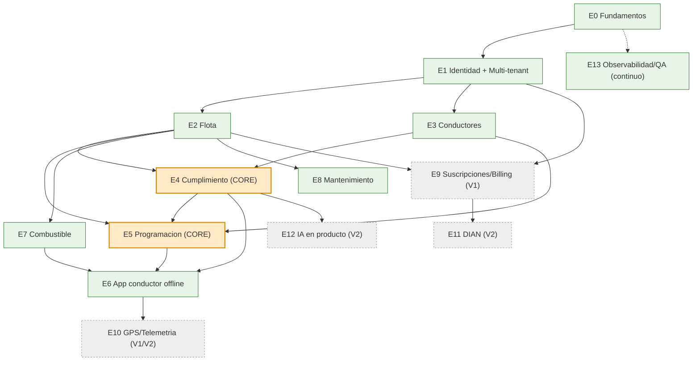

# Fase 4 — EDT / WBS (Estructura de Desglose del Trabajo)

> **Objetivo de la fase:** descomponer el blueprint en unidades de trabajo ejecutables y estimables, con dependencias explícitas, para que el fundador (apoyado por los agentes IA de la Fase 8) sepa **qué construir, en qué orden y cuánto cuesta**. La EDT es la bisagra entre las specs (Fase 3) y la ejecución, y alimenta el roadmap (Fase 10).

---

## Cómo leer esta EDT

Jerarquía: **Epic → Feature → Story → Task → Subtask**.

- **Epic:** gran bloque de valor, típicamente mapeado a uno o varios bounded contexts (Fase 2).
- **Feature:** capacidad entregable dentro de un epic.
- **Story:** unidad de valor para un usuario, normalmente trazable a una spec (Fase 3).
- **Task / Subtask:** trabajo técnico concreto.

**Convenciones de los atributos**

| Atributo | Escala | Significado |
|---|---|---|
| **Prioridad** | `P0` / `P1` / `P2` | P0 = MVP (imprescindible para operar la Duster). P1 = V1 (comercializable). P2 = V2+ (escalamiento). |
| **Complejidad** | `S` / `M` / `L` / `XL` | Talla de esfuerzo+riesgo. S≈≤2 días, M≈3–5 días, L≈1–2 semanas, XL≈≥3 semanas (1 desarrollador). |
| **Estimación** | puntos (pts) | Story points (Fibonacci: 1,2,3,5,8,13). Referencia de conversión aproximada: 1 pt ≈ medio día efectivo de un dev senior. Las estimaciones son **órdenes de magnitud para planear**, no compromisos. |
| **Dependencias** | IDs | Qué debe existir antes. |
| **Spec** | spec-NNN | Trazabilidad a la especificación (Fase 3). |

> **Nota de estimación honesta:** las cifras suman ~**320 pts** para MVP+fundamentos. A ~2 pts/día efectivos de un solo desarrollador (descontando soporte, dogfooding y vida real), eso es del orden de **3–4 meses** para el MVP operable, consistente con el roadmap de la Fase 1. Si entran agentes IA y/o un segundo dev, se comprime. **No multiplicar linealmente:** la curva de aprendizaje, el offline-first (riesgo R2) y el cumplimiento (R3) absorben holgura.

---

## Resumen de Epics

| ID | Epic | Bounded Context(s) | Prioridad | Σ pts (aprox.) |
|---|---|---|---|---|
| **E0** | Fundamentos de plataforma | Transversal | P0 | 55 |
| **E1** | Identidad, multi-tenant y acceso | BC-1 | P0 | 42 |
| **E2** | Gestión de flota (vehículos) | BC-2 | P0 | 21 |
| **E3** | Gestión de conductores | BC-3 | P0 | 18 |
| **E4** | Cumplimiento y documentos (CORE) | BC-4 | P0 | 55 |
| **E5** | Programación de servicios (CORE) | BC-5 | P0 | 50 |
| **E6** | App del conductor offline-first | BC-5/BC-6 (móvil) | P0 | 60 |
| **E7** | Combustible | BC-6 | P0 | 16 |
| **E8** | Mantenimiento | BC-7 | P0 | 21 |
| **E9** | SaaS: suscripciones y billing | BC-8 | P1 | 34 |
| **E10** | GPS / Telemetría | BC-5→ Telemetry | P1/P2 | 29 |
| **E11** | Facturación electrónica DIAN | BC-8 | P2 | 21 |
| **E12** | Capa de agentes IA en producto | Transversal | P2 | 21 |
| **E13** | Observabilidad, QA y hardening | Transversal | P0→continuo | 26 |

---

## E0 — Fundamentos de plataforma  · P0

> *Los cimientos. Baratos si se ponen ahora, carísimos de retrofitear. Habilitan todo lo demás.* (ADR-0001, 0002, 0003, 0004, 0006)

### F0.1 — Andamiaje del monolito modular (NestJS + Clean Architecture)
| Story | Prioridad | Complejidad | pts | Dep. |
|---|---|---|---|---|
| S0.1.1 Esqueleto NestJS con estructura por módulos/capas (domain/application/infrastructure/adapters) | P0 | M | 5 | — |
| S0.1.2 Kernel compartido: `Money(COP)`, `Result`, base `Aggregate/Entity/ValueObject`, errores de dominio | P0 | M | 5 | S0.1.1 |
| S0.1.3 Configuración 12-factor, gestión de secretos, perfiles dev/QA/prod | P0 | S | 3 | S0.1.1 |

- T0.1.1 Definir convención de carpetas y lint/format · Subtask: configurar ESLint+Prettier+tsconfig estricto.
- T0.1.2 Plantilla de módulo (generador) para nuevos bounded contexts.

### F0.2 — Persistencia y contrato (PostgreSQL + API First)
| Story | Prioridad | Complejidad | pts | Dep. |
|---|---|---|---|---|
| S0.2.1 PostgreSQL + ORM + sistema de migraciones | P0 | M | 5 | S0.1.1 |
| S0.2.2 Estructura `contracts/` con `openapi.yaml` y `asyncapi.yaml` + pipeline de generación de clientes | P0 | M | 5 | S0.1.1 |
| S0.2.3 Outbox pattern: tabla outbox + dispatcher/worker idempotente | P0 | L | 8 | S0.2.1 |

- T0.2.1 Esquema base de `outbox` (id, aggregate, tipo, payload, estado, intentos, timestamps).
- T0.2.2 Worker de publicación con reintentos y marca de procesado (idempotencia).

### F0.3 — DevEx y CI/CD mínimo (ADR-0006)
| Story | Prioridad | Complejidad | pts | Dep. |
|---|---|---|---|---|
| S0.3.1 `docker-compose` de desarrollo (API + Postgres + adminer) | P0 | S | 3 | S0.2.1 |
| S0.3.2 Pipeline CI (lint, test, build de imagen) | P0 | M | 5 | S0.1.1 |
| S0.3.3 Dockerfile de producción + IaC inicial (Terraform) para VPS/PaaS barato | P0 | L | 8 | S0.3.2 |

**Σ E0 ≈ 55 pts.** Sin dependencias externas (es el punto de partida).

---

## E1 — Identidad, multi-tenant y acceso  · P0  · (BC-1)

> *El aislamiento por tenant se construye AQUÍ y desde el día 1 (ADR-0008). RLS = defensa en profundidad.*

### F1.1 — Multi-tenancy (shared DB + tenant_id + RLS)
| Story | Prioridad | Complejidad | pts | Dep. | Spec |
|---|---|---|---|---|---|
| S1.1.1 `tenant_id` en modelo base + middleware que resuelve tenant y lo fija en la conexión | P0 | L | 8 | E0 | — |
| S1.1.2 Políticas RLS de PostgreSQL (deny-by-default) + helpers | P0 | L | 8 | S1.1.1, S0.2.1 | — |
| S1.1.3 Pruebas de aislamiento entre tenants (ningún query cruza) | P0 | M | 5 | S1.1.2 | — |

### F1.2 — Autenticación y autorización (OIDC/JWT + RBAC)
| Story | Prioridad | Complejidad | pts | Dep. | Spec |
|---|---|---|---|---|---|
| S1.2.1 Integración OIDC/JWT (auth self-host o servicio; ADR-0002) | P0 | L | 8 | E0 | — |
| S1.2.2 RBAC scoped por tenant (roles del dominio) + guard de permisos | P0 | M | 5 | S1.2.1, S1.1.1 | spec-002 |
| S1.2.3 Onboarding de Empresa (tenant) + primer admin + consentimiento Habeas Data | P0 | M | 5 | S1.2.1, S1.1.2 | spec-001 |
| S1.2.4 Invitar usuarios y asignar roles | P0 | S | 3 | S1.2.2 | spec-002 |

**Σ E1 ≈ 42 pts.** Dep. principal: E0.

---

## E2 — Gestión de flota (vehículos)  · P0  · (BC-2)

| Story | Prioridad | Complejidad | pts | Dep. | Spec |
|---|---|---|---|---|---|
| S2.1 Aggregate `Vehiculo` (invariante: placa única por tenant) | P0 | M | 5 | E1 | spec-003 |
| S2.2 CRUD de vehículo (alta, edición datos básicos, baja lógica) | P0 | M | 5 | S2.1 | spec-003 |
| S2.3 Odómetro autoritativo (invariante monótono creciente) + evento `OdometroActualizado` | P0 | M | 5 | S2.1, S0.2.3 | — |
| S2.4 Vínculo Propietario ↔ Vehículo ↔ Afiliación (referencia a transportadora) | P0 | S | 3 | S2.1 | — |
| S2.5 Eventos `VehiculoRegistrado` / `VehiculoDadoDeBaja` al outbox | P0 | S | 3 | S2.1, S0.2.3 | — |

**Σ E2 ≈ 21 pts.** Dep.: E1.

---

## E3 — Gestión de conductores  · P0  · (BC-3)

| Story | Prioridad | Complejidad | pts | Dep. | Spec |
|---|---|---|---|---|---|
| S3.1 Aggregate `Conductor` + datos personales (Habeas Data: minimización) | P0 | M | 5 | E1 | spec-004 |
| S3.2 Alta de conductor + Licencia de conducción (categoría, vencimiento) | P0 | M | 5 | S3.1 | spec-004 |
| S3.3 Vínculo Conductor ↔ Usuario (el conductor que usa la app es un Usuario) | P0 | M | 5 | S3.1, S1.2.1 | — |
| S3.4 Eventos `ConductorRegistrado` al outbox | P0 | S | 3 | S3.1, S0.2.3 | — |

**Σ E3 ≈ 18 pts.** Dep.: E1.

---

## E4 — Cumplimiento y documentos (CORE)  · P0  · (BC-4)

> *El corazón del valor (Fase 1, dolor #1). Mejor diseño y mayor esfuerzo. El catálogo de tipos de documento es CONFIGURABLE para absorber cambios normativos sin redeploy.*

### F4.1 — Documentos y catálogo configurable
| Story | Prioridad | Complejidad | pts | Dep. | Spec |
|---|---|---|---|---|---|
| S4.1.1 Catálogo configurable de Tipos de documento (reglas de vigencia) | P0 | M | 5 | E1 | spec-005 |
| S4.1.2 Aggregate `Documento` (Vehículo/Conductor) + `Vencimiento` (VO) + adjunto | P0 | L | 8 | S4.1.1, S2.1, S3.1 | spec-005 |
| S4.1.3 Almacenamiento de adjuntos por tenant (storage aislado) | P0 | M | 5 | S4.1.2 | spec-005 |

### F4.2 — Semáforo y alertas (la joya)
| Story | Prioridad | Complejidad | pts | Dep. | Spec |
|---|---|---|---|---|---|
| S4.2.1 Cálculo del Estado de cumplimiento (Semáforo) por Vehículo/Conductor | P0 | L | 8 | S4.1.2 | spec-006 |
| S4.2.2 Job de evaluación de vencimientos (30/15/3 días) → eventos `DocumentoPorVencer`/`DocumentoVencido` | P0 | L | 8 | S4.2.1, S0.2.3 | spec-006 |
| S4.2.3 Notificaciones (push/email/SMS) de alertas — vía proveedor abstraído | P0 | M | 5 | S4.2.2 | spec-006 |

### F4.3 — Renovación con histórico
| Story | Prioridad | Complejidad | pts | Dep. | Spec |
|---|---|---|---|---|---|
| S4.3.1 Renovación de Documento conservando versiones (histórico) | P0 | M | 5 | S4.1.2 | spec-007 |

### F4.4 — Open Host Service de cumplimiento
| Story | Prioridad | Complejidad | pts | Dep. | Spec |
|---|---|---|---|---|---|
| S4.4.1 Consulta estable "¿está al día?" (OHS para Scheduling) | P0 | M | 5 | S4.2.1 | spec-009 |

**Σ E4 ≈ 55 pts.** Dep.: E1, E2, E3.

---

## E5 — Programación de servicios (CORE)  · P0  · (BC-5)

> *Segunda mitad del valor. Aquí vive la **regla de oro** (no asignar a quien no esté al día), implementada vía ACL contra el OHS de Compliance.*

### F5.1 — Servicios y asignación
| Story | Prioridad | Complejidad | pts | Dep. | Spec |
|---|---|---|---|---|---|
| S5.1.1 Aggregate `Servicio` (origen, destino, Ventana horaria, cliente) | P0 | M | 5 | E1 | spec-008 |
| S5.1.2 `Asignacion` Vehículo+Conductor + detección de choques de ventana | P0 | L | 8 | S5.1.1, S2.1, S3.1 | spec-008 |
| S5.1.3 ACL a Compliance (OHS) + **regla de oro**: rojo bloquea, amarillo advierte | P0 | L | 8 | S5.1.2, S4.4.1 | spec-009 |

### F5.2 — Ciclo de vida y agenda
| Story | Prioridad | Complejidad | pts | Dep. | Spec |
|---|---|---|---|---|---|
| S5.2.1 Estados del Servicio (planificado→iniciado→finalizado) + eventos | P0 | M | 5 | S5.1.1, S0.2.3 | spec-010 |
| S5.2.2 Agenda día/semana (vista web) | P0 | M | 5 | S5.1.2 | spec-008 |
| S5.2.3 Planilla / Extracto de viaje adjunta al servicio | P0 | M | 5 | S5.1.1 | — |

### F5.3 — Endpoints de sincronización (soporte a móvil)
| Story | Prioridad | Complejidad | pts | Dep. | Spec |
|---|---|---|---|---|---|
| S5.3.1 API de pull (agenda/documentos por cursor) e ingesta idempotente de push | P0 | L | 8 | S5.2.1, S0.2.3 | spec-010, spec-011 |

**Σ E5 ≈ 50 pts.** Dep.: E1, E2, E3, E4.

---

## E6 — App del conductor offline-first  · P0  · (Flutter, BC-5/BC-6)

> *El riesgo técnico #1 (Fase 1, R2; Fase 6). Estrategia anti-sobreingeniería: primero solo-lectura cacheada + append-only; los conflictos al final.*

### F6.1 — Cimientos móviles
| Story | Prioridad | Complejidad | pts | Dep. | Spec |
|---|---|---|---|---|---|
| S6.1.1 Esqueleto Flutter (Clean Architecture móvil) + navegación | P0 | M | 5 | — | — |
| S6.1.2 Base local Drift/SQLite **cifrada** + tablas espejo | P0 | L | 8 | S6.1.1 | spec-010 |
| S6.1.3 Cola de cambios (outbox del cliente) con estados y reintentos | P0 | L | 8 | S6.1.2 | spec-011 |
| S6.1.4 Login OIDC con sesión persistente offline | P0 | M | 5 | S6.1.1, S1.2.1 | — |

### F6.2 — "Mi día" (lectura offline) — *Fase A de sync*
| Story | Prioridad | Complejidad | pts | Dep. | Spec |
|---|---|---|---|---|---|
| S6.2.1 Pull + cache de agenda, documentos (Semáforo) y datos de vehículo | P0 | L | 8 | S6.1.2, S5.3.1 | spec-010 |
| S6.2.2 Pantalla "mi día" 100% navegable sin señal | P0 | M | 5 | S6.2.1 | spec-010 |

### F6.3 — Escrituras del conductor — *Fase A (append-only) → B (estado)*
| Story | Prioridad | Complejidad | pts | Dep. | Spec |
|---|---|---|---|---|---|
| S6.3.1 Registrar Tanqueo offline (append-only, UUID cliente) | P0 | M | 5 | S6.1.3 | spec-011 |
| S6.3.2 Registrar Novedad offline con foto (blob local → subida diferida) | P0 | M | 5 | S6.1.3 | spec-014 |
| S6.3.3 Marcar servicio iniciado/finalizado offline (estado, LWW + regla de autoridad de campo) | P0 | L | 8 | S6.1.3, S5.2.1 | spec-010 |

### F6.4 — Indicadores de sync
| Story | Prioridad | Complejidad | pts | Dep. | Spec |
|---|---|---|---|---|---|
| S6.4.1 Indicador "N cambios pendientes / última sync" + sync manual y por reconexión | P0 | S | 3 | S6.1.3 | spec-010 |

**Σ E6 ≈ 60 pts (el epic más grande y más arriesgado).** Dep.: E1, E5; consume E4 (Semáforo) y E7 (combustible).

---

## E7 — Combustible  · P0  · (BC-6)

| Story | Prioridad | Complejidad | pts | Dep. | Spec |
|---|---|---|---|---|---|
| S7.1 Aggregate `Tanqueo` append-only (litros/galones, valor COP, odómetro) | P0 | M | 5 | E2 | spec-011 |
| S7.2 Ingesta idempotente desde móvil + evento `CombustibleRegistrado` | P0 | M | 5 | S7.1, S5.3.1 | spec-011 |
| S7.3 Cálculo de Costo por kilómetro (deltas de odómetro) | P0 | M | 5 | S7.1, S2.3 | — |

**Σ E7 ≈ 16 pts (un pt extra por validaciones).** Dep.: E2.

---

## E8 — Mantenimiento  · P0  · (BC-7)

| Story | Prioridad | Complejidad | pts | Dep. | Spec |
|---|---|---|---|---|---|
| S8.1 Aggregate de Mantenimiento (preventivo/correctivo) + Umbral (km/fecha) | P0 | M | 5 | E2 | spec-012 |
| S8.2 Política: `OdometroActualizado` supera umbral → `MantenimientoProgramado` | P0 | L | 8 | S8.1, S2.3 | spec-012 |
| S8.3 Registro de mantenimiento ejecutado + costo | P0 | M | 5 | S8.1 | spec-012 |
| S8.4 Alerta de mantenimiento vencido | P0 | S | 3 | S8.2 | spec-012 |

**Σ E8 ≈ 21 pts.** Dep.: E2.

---

## E9 — SaaS: suscripciones y billing  · P1  · (BC-8)

> *Habilita la comercialización (V1). No entra al MVP de dogfooding.*

| Story | Prioridad | Complejidad | pts | Dep. | Spec |
|---|---|---|---|---|---|
| S9.1 Modelo de Planes + entitlements (feature flags por plan) | P1 | M | 5 | E1 | spec-013 |
| S9.2 Suscripción por vehículo activo/mes + conteo de facturables | P1 | L | 8 | S9.1, E2 | spec-013 |
| S9.3 Ciclo de vida de suscripción (trial→activa→morosa→cancelada) | P1 | M | 5 | S9.2 | spec-013 |
| S9.4 Integración pasarela de pagos (PSE/tarjeta; proveedor abstraído) | P1 | L | 8 | S9.2 | spec-013 |
| S9.5 Self-service de plan (upgrade/downgrade) + bloqueo suave al exceder límites | P1 | M | 5 | S9.1, S9.4 | spec-013 |
| S9.6 Métricas SaaS (MRR, ARPU, churn) | P1 | S | 3 | S9.2 | — |

**Σ E9 ≈ 34 pts.** Dep.: E1, E2.

---

## E10 — GPS / Telemetría  · P1/P2

| Story | Prioridad | Complejidad | pts | Dep. | Spec |
|---|---|---|---|---|---|
| S10.1 Captura de Traza GPS offline durante el servicio (puntos en cola) | P1 | M | 5 | E6 | — |
| S10.2 Envío diferido y almacenamiento de trazas por servicio | P1 | M | 5 | S10.1, S5.3.1 | — |
| S10.3 Visualización de traza en el portal (mapa) | P1 | M | 5 | S10.2 | — |
| S10.4 GPS en tiempo real (ingestión de stream) — extraer contexto Telemetry | P2 | XL | 13 | S10.2 | — |
| S10.5 Geofencing / alertas de ruta | P2 | S | 1 | S10.4 | — |

**Σ E10 ≈ 29 pts.** Dep.: E6 (offline), E5.

---

## E11 — Facturación electrónica DIAN  · P2  · (BC-8)

> *Alta complejidad regulatoria (Fase 1, R3). Se delega a proveedor tecnológico autorizado. Diferida hasta tener ingresos que la justifiquen.*

| Story | Prioridad | Complejidad | pts | Dep. | Spec |
|---|---|---|---|---|---|
| S11.1 Investigación regulatoria + selección de proveedor autorizado | P2 | M | 5 | — | — |
| S11.2 Adaptador de facturación detrás de interfaz (independencia de proveedor) | P2 | L | 8 | S11.1, E9 | — |
| S11.3 Emisión, numeración y contingencia | P2 | L | 8 | S11.2 | — |

**Σ E11 ≈ 21 pts.** Dep.: E9.

---

## E12 — Capa de agentes IA en producto  · P2  · (Transversal, ADR-0007)

> *IA DENTRO del producto (no confundir con los agentes de desarrollo de la Fase 8). Detrás de la interfaz `AIProvider` para independencia de proveedor.*

| Story | Prioridad | Complejidad | pts | Dep. | Spec |
|---|---|---|---|---|---|
| S12.1 Interfaz `AIProvider` + adaptadores intercambiables (Claude/OpenAI/Gemini/local) | P2 | M | 5 | E0 | — |
| S12.2 Asistente de cumplimiento (lenguaje natural sobre el Semáforo y vencimientos) | P2 | L | 8 | S12.1, E4 | — |
| S12.3 Captura asistida (OCR de documentos → extraer vencimiento) | P2 | L | 8 | S12.1, E4 | — |

**Σ E12 ≈ 21 pts.** Dep.: E0, E4.

---

## E13 — Observabilidad, QA y hardening  · P0 → continuo  · (Transversal)

> *No es una fase final; corre en paralelo desde E0. QA deriva pruebas de los criterios Gherkin de las specs (Fase 8, agent-qa).*

| Story | Prioridad | Complejidad | pts | Dep. | Spec |
|---|---|---|---|---|---|
| S13.1 Logs estructurados + OpenTelemetry (trazas/métricas) | P0 | M | 5 | E0 | — |
| S13.2 Suite de pruebas: unit (dominio) + integración (RLS, outbox) | P0 | L | 8 | E0..E5 | todas |
| S13.3 Pruebas E2E de la regla de oro y del flujo offline (pérdida de red, duplicado, conflicto) | P0 | L | 8 | E5, E6 | spec-009,010,011 |
| S13.4 Backups, gestión de secretos, revisión Habeas Data y hardening | P0 | M | 5 | E0, E1 | — |

**Σ E13 ≈ 26 pts.** Transversal.

---

## Grafo de dependencias entre Epics

**Ruta crítica del MVP:** `E0 → E1 → {E2, E3} → E4 → E5 → E6`. El offline-first (E6) es el cuello de botella de riesgo; E7/E8 corren en paralelo a E4/E5 una vez existe E2.

---

## Tablero de priorización (vista MVP)

| Orden | Bloque | Epics | Resultado entregable |
|---|---|---|---|
| 1 | Cimientos | E0, E1, E13 (arranque) | Plataforma multi-tenant segura, CI/CD, outbox. |
| 2 | Maestros | E2, E3 | Vehículos y conductores cargados. |
| 3 | **Valor CORE** | E4 | Documentos + Semáforo + alertas (¡el gancho!). |
| 4 | **Operación CORE** | E5 | Servicios + asignación + regla de oro. |
| 5 | Campo | E6, E7, E8 | App offline del conductor + combustible + mantenimiento. |
| 6 | **Hito** | — | **Dogfooding con la Duster real.** |

---

## Trazabilidad

- Cada **Story** referencia su **spec** (Fase 3) y su **bounded context** (Fase 2).
- Los **epics** y su orden alimentan el **roadmap por horizontes** (Fase 10).
- Los **criterios Gherkin** de las specs son la base de las pruebas de **E13** y del `agent-qa` (Fase 8).
- Las decisiones técnicas referenciadas (`ADR-000x`) están en [`adr/`](../adr/).
