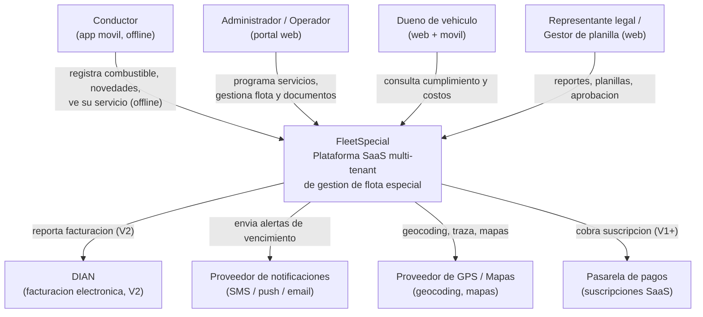
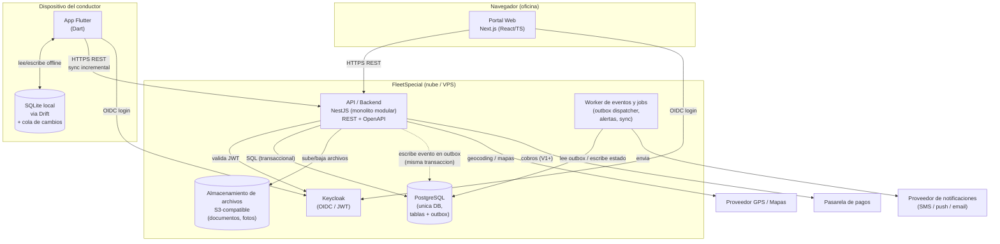
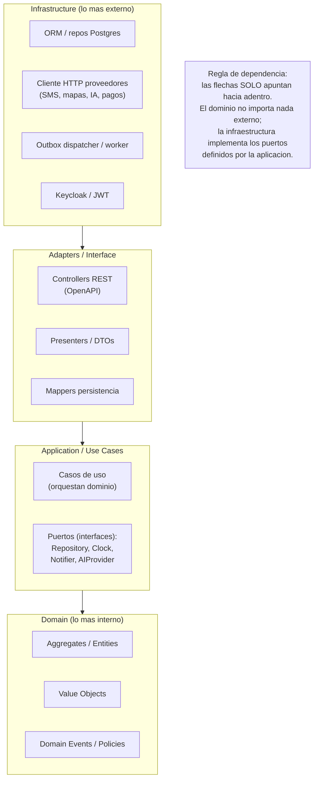
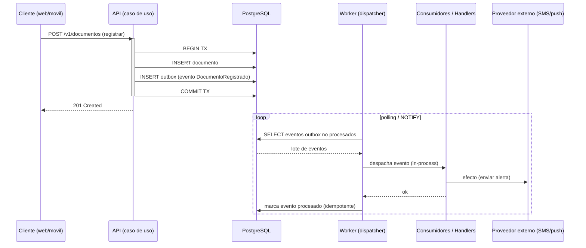
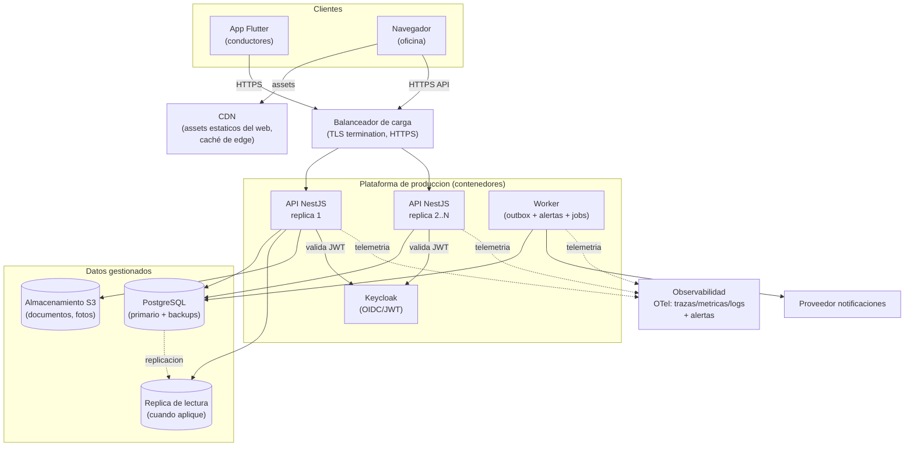

# Fase 5 — Arquitectura Técnica

> **Objetivo de la fase:** traducir el negocio (Fase 1) y el dominio (Fase 2) en una arquitectura **construible por un equipo muy pequeño, con presupuesto de bootstrapping y time-to-market agresivo**, sin sobreingeniería, pero con las costuras (seams) correctas para escalar de **una Renault Duster a un SaaS multiempresa** sin reescribir. Esta fase define el *cómo* técnico: estilo arquitectónico, stack recomendado y justificado, vistas C4, capas de Clean Architecture, frontend, backend, multi-tenancy, infraestructura por ambiente, seguridad/cumplimiento y observabilidad.

Este documento es el **contrato técnico de alto nivel**. Las decisiones puntuales se formalizan en los [ADRs](../adr/README.md) y los detalles profundos se delegan a las fases especializadas: **offline (Fase 6)**, **multi-tenant (Fase 7)** y **agentes IA (Fase 8)**.

---

## 1. Principios que gobiernan esta arquitectura

Toda decisión de esta fase se valida contra siete principios **no negociables**. La sección §13 cierra con la tabla de mapeo Principio → Decisión.

1. **Spec Driven Development (SDD).** El contrato (OpenAPI + AsyncAPI + specs Gherkin de Fase 3) antecede al código.
2. **Domain Driven Design (DDD).** Cada bounded context de la Fase 2 es un módulo con lenguaje ubicuo propio.
3. **Clean Architecture.** El dominio no depende de frameworks; las dependencias apuntan hacia adentro.
4. **API First.** El contrato REST se diseña primero; cliente web y móvil son consumidores iguales.
5. **Offline First.** El dispositivo del conductor es fuente de verdad temporal; la nube reconcilia.
6. **Cloud Native.** Contenedores, IaC, 12-factor, observabilidad desde el día 1.
7. **AI Agent Friendly.** Toda integración con IA pasa por una interfaz; los agentes son ciudadanos de primera clase.

Y dos **restricciones de bootstrapping** que actúan como antídoto contra la sobreingeniería:

- **Monolito modular, NO microservicios.** *(Ver [ADR-0001](../adr/0001-monolito-modular-vs-microservicios.md).)*
- **Una sola base de datos relacional (PostgreSQL), NO multi-DB ni event sourcing completo.** *(Ver [ADR-0003](../adr/0003-postgresql-unica-base-de-datos.md).)*

---

## 2. Recomendación de stack (argumentada)

El usuario pidió una **recomendación argumentada**, no un catálogo. La regla de selección es una sola: **maximizar el throughput de un equipo de 1–3 personas con costo operativo cercano a cero, sin sacrificar tipado fuerte ni portabilidad.**

| Capa | Recomendación | Por qué (resumen) | Alternativas honestas |
|---|---|---|---|
| **Móvil** | **Flutter / Dart** *(ya definido)* | Un solo código para Android/iOS; excelente soporte offline (Drift/SQLite); UI consistente. | React Native, Kotlin Multiplatform. |
| **Backend** | **NestJS sobre TypeScript (Node.js)** | Tipado fuerte, ecosistema enorme, **mismo lenguaje que el front web → un cerebro, no dos**; arquitectura modular nativa que mapea 1:1 a bounded contexts. *(Ver [ADR-0002](../adr/0002-stack-backend.md).)* | .NET 8 (más rápido en runtime, gran tipado), Spring Boot (maduro, verboso). |
| **Base de datos** | **PostgreSQL** | Relacional, transaccional, **Row Level Security nativo** para multi-tenant, JSONB para datos flexibles, planes gratuitos en todos los PaaS. *(Ver [ADR-0003](../adr/0003-postgresql-unica-base-de-datos.md).)* | MySQL/MariaDB (sin RLS comparable). |
| **API** | **REST + OpenAPI 3.1** (síncrono) y **AsyncAPI** documentando los eventos | API First; contrato versionado; tooling de generación de SDK y mocks. | gRPC (peor para web/móvil heterogéneo en MVP), GraphQL (sobredimensionado). |
| **Eventos** | **Outbox pattern + worker** (sin broker en MVP) | Atomicidad evento↔entidad con una sola DB; evolución a NATS/RabbitMQ solo si hace falta. *(Ver [ADR-0004](../adr/0004-eventos-outbox-pattern-sin-broker.md).)* | Kafka (sobreingeniería para 1–30 vehículos). |
| **Frontend web** | **Next.js (React + TypeScript)** en modo SPA/SSR híbrido | Mismo lenguaje que backend; SSR para SEO de landing; ecosistema y velocidad de desarrollo; despliegue barato. | SvelteKit (más liviano, menos talento disponible), Angular (más pesado). |
| **Sync offline** | **SQLite local vía Drift** + cola de cambios (outbox del cliente) + sync incremental | Estándar de facto en Flutter; tipado; reactividad. *(Detalle en [Fase 6](06-offline-first.md), [ADR-0005](../adr/0005-offline-first-sqlite-sync.md).)* | Hive/Isar (NoSQL, peor para relacional), PowerSync (servicio, costo). |
| **Auth** | **OIDC/JWT con Keycloak self-host** (o servicio gestionado con capa free) | Estándar abierto, multi-tenant por realms/claims, **sin lock-in**; corre en el mismo VPS en MVP. | Auth0/Clerk (rápidos pero costo crece con usuarios y atan el modelo). |
| **Infra** | **Docker + Terraform**, desplegado en **un VPS/PaaS barato** en MVP | Portabilidad total; ruta a Kubernetes sin reescribir. *(Ver [ADR-0006](../adr/0006-independencia-de-nube-contenedores-iac.md).)* | Serverless puro (lock-in y cold-starts complican offline-sync). |
| **Observabilidad** | **OpenTelemetry** (trazas/métricas/logs) + backend OSS (Grafana/Tempo/Loki o equivalente) | Estándar vendor-neutral; un solo SDK para todo. | APM propietario (costo, lock-in). |
| **IA** | **Capa de abstracción `AIProvider`** detrás de interfaz | Intercambiar Claude/OpenAI/Gemini/local sin tocar dominio. *(Ver [ADR-0007](../adr/0007-independencia-de-proveedor-ia-capa-abstraccion.md), [Fase 8](../agents/README.md).)* | Acoplar SDK de un proveedor (lock-in). |

> **Honestidad sobre el trade-off de backend.** .NET probablemente rinde mejor en CPU y Spring Boot es más maduro en entornos enterprise. Elegimos **NestJS/TypeScript** porque, para **este equipo y este momento**, **compartir lenguaje y modelos de tipos entre web y backend** reduce la carga cognitiva a la mitad, acelera el time-to-market y abarata la contratación de un único perfil full-stack. Es una decisión de *velocidad de equipo*, no de *pico de rendimiento*; el rendimiento de Node es más que suficiente para 1–30 vehículos por tenant. El detalle del trade-off está en [ADR-0002](../adr/0002-stack-backend.md).

---

## 3. Vista de contexto (C4 nivel 1)

Quién usa el sistema y con qué sistemas externos habla. FleetSpecial es **una caja**; sus tripas se abren en el nivel 2.



**Notas de contexto:**
- DIAN y la pasarela de pagos son **integraciones diferidas** (V1/V2) pero se dibujan porque condicionan los seams del dominio (`Facturacion`, `Suscripcion`).
- Todos los sistemas externos se consumen **detrás de un puerto** (interfaz) en la capa de aplicación, para no atar el dominio a ningún proveedor (principio de independencia).

---

## 4. Vista de contenedores (C4 nivel 2)

Cómo se divide FleetSpecial en unidades desplegables. Nótese que la **app móvil tiene su propia base de datos local** (offline-first) y que el **backend es un único monolito modular** con un worker para trabajos asíncronos.



**Decisiones de contenedores:**
- **Un solo proceso de API** (monolito modular) y **un solo proceso worker**. No hay un servicio por contexto; los contextos son *módulos* dentro del mismo deployable. *(Ver [ADR-0001](../adr/0001-monolito-modular-vs-microservicios.md).)*
- **El worker comparte la base de datos** con la API (lee la tabla `outbox`, procesa alertas y jobs). Es el mismo binario arrancado con un flag de rol distinto, o un proceso hermano — no un microservicio con su propia DB.
- **Almacenamiento de archivos S3-compatible** (MinIO self-host en MVP, o el bucket del PaaS) para documentos y fotos de novedades; el archivo nunca se guarda en la DB, solo su metadato y URL.
- La **app móvil** habla con la misma API que el web; **no hay BFF**. El offline vive en el cliente (Fase 6), no en un servicio aparte.

---

## 5. Clean Architecture en capas

El corazón de la independencia de framework. **Las dependencias apuntan hacia adentro**: nada del dominio conoce NestJS, Postgres, Flutter ni un proveedor de IA.



### 5.1 Cada bounded context es un módulo con estas capas

Los contextos de la **Fase 2** (Identidad/Tenancy, Vehículos, Conductores, Gestión Documental, Programación de Servicios, Combustible, Mantenimiento, GPS/Telemetría, Notificaciones) **no son microservicios**: son **módulos** dentro del monolito, cada uno con su propia estructura de capas y su lenguaje ubicuo. Estructura típica de un módulo:

```text
src/modules/gestion-documental/
├── domain/                  # Entidades, VOs, eventos, reglas (cero imports de framework)
│   ├── documento.aggregate.ts
│   ├── fecha-vencimiento.vo.ts
│   └── documento-por-vencer.event.ts
├── application/             # Casos de uso + puertos (interfaces)
│   ├── registrar-documento.usecase.ts
│   ├── ports/documento.repository.ts
│   └── ports/notificador.port.ts
├── adapters/                # Controllers REST, DTOs, mappers
│   ├── documento.controller.ts
│   └── documento.dto.ts
└── infrastructure/          # Implementaciones concretas (Postgres, etc.)
    └── documento.postgres.repository.ts
```

- **Comunicación entre módulos:** preferentemente por **eventos de dominio vía outbox** (acoplamiento débil) o por la **interfaz de aplicación pública** de otro módulo (nunca alcanzando su capa de dominio o su tabla directamente). Esto preserva los límites y deja la puerta abierta a extraer un módulo a su propio servicio el día que de verdad haga falta — **sin reescribir el dominio**.
- **Beneficio AI-friendly:** un módulo aislado con capas explícitas es la unidad perfecta para que un agente IA (Fase 8) lea su spec, genere el caso de uso y sus pruebas sin entender todo el sistema.

---

## 6. Frontend

### 6.1 Web — Portal administrativo (Next.js / React / TypeScript)

**Por qué Next.js:**
- **Un solo lenguaje (TypeScript) en web y backend** → se comparten tipos del contrato (DTOs generados desde OpenAPI), un solo perfil de desarrollador, menos contexto que cargar.
- **SSR/SSG para la landing y SEO** (captación de operadores) y **SPA para el portal autenticado** (listas, semáforos, agenda). El modo híbrido evita mantener dos apps.
- Ecosistema gigante, despliegue barato (contenedor en el mismo VPS, o capa free de un PaaS), gran cantidad de componentes y talento disponible.

**Estructura (alto nivel):**

```text
apps/web/
├── app/                     # Rutas (App Router): dashboard, vehiculos, documentos, agenda
├── features/                # Una carpeta por capacidad de negocio (alineada a contextos)
│   ├── documentos/          #   componentes + hooks + estado local de la feature
│   ├── servicios/
│   └── vehiculos/
├── shared/
│   ├── api/                 # Cliente generado desde OpenAPI (SDK tipado)
│   ├── ui/                  # Design system / componentes base
│   └── i18n/                # Mensajes es-CO (default)
└── lib/                     # Auth (OIDC), config, utilidades
```

- **Cómo consume la API:** mediante un **SDK TypeScript generado a partir del OpenAPI** del backend (API First). El front **no inventa tipos**; los importa del contrato. Versionado por prefijo de ruta (`/v1`).
- **Manejo de estado:**
  - *Estado de servidor* (datos remotos, caché, revalidación): **TanStack Query** (React Query). Maneja caché, reintentos y estados de carga/error de forma declarativa.
  - *Estado de UI local* (filtros, modales, wizard): hooks/`useState` o un store ligero (Zustand) si crece. **Nada de Redux por defecto** (sobreingeniería para este alcance).
- **i18n español (Colombia):** `es-CO` como locale por defecto desde el día 1 (formatos de fecha, moneda COP, terminología local: "tarjeta de operación", "RTM", "SOAT"). Estructura de mensajes lista para añadir otros locales sin refactor, pero **sin construir el multi-idioma completo en MVP** (YAGNI).
- **Accesibilidad y simplicidad:** el portal prioriza **listas claras + semáforos de cumplimiento**; sin dashboards de BI en MVP (eso es upsell, ver Fase 1 §5).

### 6.2 Mobile — App del conductor (Flutter, offline-first)

La app móvil es la superficie **offline-first**: el dispositivo es la **fuente de verdad temporal** mientras no hay señal. Aquí solo el **alto nivel**; el detalle profundo (estrategia de sync, resolución de conflictos, recuperación) está en **[Fase 6 — Offline First](06-offline-first.md)** y la decisión en **[ADR-0005](../adr/0005-offline-first-sqlite-sync.md)**.

- **Arquitectura interna:** misma **Clean Architecture** que el backend (domain / application / adapters / infrastructure), de modo que las **reglas de negocio del cliente** (validar un registro de combustible, detectar que un servicio ya inició) no dependan de Flutter.
- **Persistencia local:** **SQLite vía Drift** (tipado, reactivo). La app **lee y escribe siempre contra la base local**; nunca bloquea al usuario esperando red.
- **Cola de cambios (outbox del cliente):** cada mutación local (combustible, novedad, cambio de estado de servicio) se encola; un sincronizador la envía cuando hay conexión y aplica los cambios entrantes del servidor.
- **Estrategia de conflictos (resumen):** empezar con datos **append-only** (combustible, novedades) que casi no generan conflictos; para entidades editables, reglas de *last-write-wins* con marca de tiempo del servidor y bitácora. **Detalle y casos límite → Fase 6.**
- **Sin login constante:** sesión persistente (refresh token seguro) para no exigir red en cada arranque; coherente con "un flujo a la vez" y baja fricción (Fase 1 §3).

---

## 7. Backend

### 7.1 APIs — REST + OpenAPI, API First, versionado

- **API First:** el **contrato OpenAPI 3.1 se escribe antes que el código** (vive en `backend/contracts/`). De él se generan: el **SDK del web**, los **stubs/mocks** para que móvil y web avancen en paralelo, y la **validación de requests** en runtime.
- **Estilo:** REST sobre HTTPS, JSON. Recursos por contexto: `/v1/vehiculos`, `/v1/conductores`, `/v1/documentos`, `/v1/servicios`, `/v1/combustible`, `/v1/mantenimientos`.
- **Versionado:** por **prefijo de ruta** (`/v1`, `/v2`). Cambios incompatibles → nueva versión mayor; aditivos → misma versión. Política de deprecación documentada en el contrato.
- **Multi-tenant en la API:** el `tenant_id` **no viaja en el body**; se deriva del **claim del JWT** (ver §8 y Fase 7). El cliente nunca elige su tenant por parámetro.
- **Idempotencia de escritura:** los endpoints de creación que el cliente móvil puede reintentar tras una caída aceptan una cabecera `Idempotency-Key` (clave generada en el dispositivo), de modo que reintentos de sync no dupliquen registros.
- **Eventos documentados con AsyncAPI:** además del REST síncrono, los eventos de dominio (p. ej. `DocumentoPorVencer`, `ServicioAsignado`) se documentan en un contrato **AsyncAPI**, para que productores/consumidores (y agentes IA) tengan el esquema.

### 7.2 Eventos — Outbox pattern (sin broker en MVP)

Necesitamos efectos secundarios desacoplados (enviar alerta cuando un documento está por vencer, notificar al conductor cuando se le asigna un servicio) **sin** introducir un broker (Kafka/Rabbit) que es sobreingeniería para este volumen. La solución: **outbox pattern**. *(Decisión completa en [ADR-0004](../adr/0004-eventos-outbox-pattern-sin-broker.md).)*

**Idea central:** la entidad y su evento se escriben en la **misma transacción** de Postgres. Un **worker** lee la tabla `outbox` y publica/procesa los eventos. Así **nunca** hay un evento sin su cambio de datos, ni un cambio sin su evento (atomicidad), aun sin broker.



**Garantías y matices (honestos):**
- **At-least-once, no exactly-once.** El worker puede entregar un evento más de una vez (p. ej. si cae tras el efecto pero antes de marcarlo). Por eso **los handlers deben ser idempotentes** (clave de evento + tabla de "ya procesado", o efectos naturalmente idempotentes).
- **Despacho in-process en MVP:** los handlers viven en el mismo monolito; el "publicar" es una llamada interna. La tabla outbox da **durabilidad y orden**, no distribución.
- **Evolución sin reescribir:** si algún día el volumen lo exige, el worker pasa de "despachar in-process" a "publicar a NATS/RabbitMQ" **cambiando solo el dispatcher**; los productores (que escriben en outbox) y la semántica de idempotencia no cambian. *(Ver [ADR-0004](../adr/0004-eventos-outbox-pattern-sin-broker.md).)*

### 7.3 Persistencia — PostgreSQL, una sola DB

- **Por qué una sola DB relacional:** el dominio es **altamente relacional y transaccional** (un servicio referencia vehículo + conductor + documentos vigentes). Una DB ACID con *foreign keys* da integridad gratis; múltiples DBs introducirían consistencia eventual y complejidad operativa **sin beneficio** a esta escala. *(Decisión en [ADR-0003](../adr/0003-postgresql-unica-base-de-datos.md).)*
- **Esquema multi-tenant:** **shared database + `tenant_id` en cada tabla + Row Level Security (RLS)**. El detalle (políticas RLS, índices por tenant, fugas a evitar) está en **[Fase 7](07-saas-multitenant.md)** y la decisión en **[ADR-0008](../adr/0008-multi-tenant-shared-db-rls.md)**. Aquí basta saber que **el aislamiento se aplica en la base**, no solo en el código.
- **Migraciones:** versionadas y reproducibles (herramienta de migraciones del ORM o equivalente), corren en CI y en cada ambiente. **Nunca** cambios manuales en producción.
- **JSONB donde aporta:** catálogos configurables (p. ej. tipos de documento y sus vigencias, que la Fase 1 §8 pide *configurables sin redeploy*) pueden usar JSONB, sin renunciar a tablas normalizadas para el núcleo transaccional.
- **Archivos fuera de la DB:** documentos y fotos en almacenamiento S3-compatible; en la DB solo metadatos y la referencia.

---

## 8. Multi-tenant a nivel arquitectura

**Estrategia:** **shared database, shared schema**, con **`tenant_id` en cada fila** y **Row Level Security (RLS) de PostgreSQL** que filtra automáticamente por el tenant del usuario autenticado.

- El `tenant_id` proviene del **claim del JWT** emitido por el IdP (Keycloak). En cada request, el backend fija una variable de sesión de Postgres (p. ej. `SET app.current_tenant`) y las **políticas RLS** garantizan que ninguna consulta vea filas de otro tenant — **aunque el código tenga un bug**.
- **Por qué shared DB y no DB por tenant:** a escala de bootstrapping (de 1 a cientos de tenants pequeños), una DB por tenant multiplica costo y operación; shared DB + RLS da aislamiento fuerte con costo casi nulo. La ruta de evolución (mover un tenant grande a su propio esquema/DB) queda abierta sin reescribir el dominio.
- **Detalle completo** (modelo de roles, planes, onboarding, índices, pruebas de aislamiento, fugas comunes) → **[Fase 7 — SaaS Multi-tenant](07-saas-multitenant.md)** y **[ADR-0008](../adr/0008-multi-tenant-shared-db-rls.md)**.

---

## 9. Infraestructura por ambiente

Tres ambientes, **misma imagen de contenedor**, distinta configuración (12-factor). El MVP corre barato; la ruta a Kubernetes no exige reescribir porque **todo está contenerizado**. *(Ver [ADR-0006](../adr/0006-independencia-de-nube-contenedores-iac.md).)*

| Aspecto | Desarrollo (local) | QA / Staging | Producción |
|---|---|---|---|
| **Orquestación** | Docker Compose | Docker Compose / un VPS pequeño | VPS o PaaS (contenedores); ruta a K8s |
| **Base de datos** | Postgres en contenedor | Postgres gestionado pequeño o contenedor | Postgres gestionado con **backups automáticos** y réplica de lectura (cuando aplique) |
| **Datos** | Semillas (seeds) y datos sintéticos | **Datos de prueba** anonimizados | Datos reales (cifrados, con retención) |
| **Auth (IdP)** | Keycloak en contenedor | Keycloak compartido reducido | Keycloak dedicado o servicio gestionado |
| **Archivos** | MinIO local | MinIO / bucket de prueba | Bucket S3-compatible con versionado |
| **Escalado** | 1 instancia | 1 instancia | **Backend horizontalmente escalable** (stateless) + worker; CDN para assets |
| **Observabilidad** | Logs a consola | OTel → backend OSS reducido | OTel → trazas/métricas/logs + alertas |
| **Secrets** | `.env` local (no commiteado) | Gestor de secretos del entorno | Gestor de secretos (Vault / del proveedor) |
| **CI/CD** | — | Deploy automático en merge a `develop` | Deploy en release/tag, con migraciones |

**Por qué el backend escala horizontalmente:** la API es **stateless** (la sesión vive en el JWT, no en memoria del servidor; el estado vive en Postgres y en el almacenamiento de archivos). Por eso se pueden correr **N réplicas detrás de un balanceador** sin sesiones pegajosas. El **worker** corre como 1 instancia en MVP (con bloqueo por fila en el outbox para evitar doble procesamiento si se escala).

### 9.1 Diagrama de despliegue de producción



### 9.2 Estrategia de bajo costo y ruta de evolución

- **MVP (bajo costo):** todo en **un VPS** o un **PaaS con capa gratuita** — API + worker + Keycloak + MinIO en contenedores, y Postgres gestionado pequeño (o contenedor con backups a un bucket). Costo operativo casi nulo, suficiente para la Duster y los primeros pilotos.
- **V1+ (comercializable):** separar Postgres a servicio gestionado, mover assets a CDN, 2+ réplicas de API.
- **Evolución a Kubernetes SIN reescribir:** como **todo es una imagen de contenedor descrita en Terraform**, migrar a un clúster K8s gestionado es un cambio de *target de despliegue* (manifiestos/Helm), **no de código**. El dominio, la API y el worker no se enteran. *(Ver [ADR-0006](../adr/0006-independencia-de-nube-contenedores-iac.md).)*

---

## 10. Seguridad y cumplimiento

Breve y concreto. El detalle legal vive en Fase 1 §8 y Fase 7; aquí, los controles técnicos.

- **Cifrado en tránsito:** **TLS 1.2+** en todo (clientes↔LB, y entre servicios cuando salen del host). Sin HTTP plano.
- **Cifrado en reposo:** disco de la DB y del almacenamiento de archivos cifrados (capacidad estándar del proveedor gestionado / volumen). Secretos nunca en claro.
- **Datos personales (Habeas Data — Ley 1581 de 2012):**
  - **Consentimiento** de titulares (conductores, clientes) capturado en el onboarding (Fase 1 §8.7).
  - **Minimización**: solo los datos necesarios para la operación.
  - **Derechos ARCO** (acceso, rectificación, cancelación): endpoints/flujos para exportar y eliminar datos de un titular.
  - **Aislamiento por tenant** (RLS) protege datos personales entre empresas.
- **Auditoría:** bitácora de acciones sensibles (quién creó/modificó/eliminó qué y cuándo), inmutable y consultable. Alimenta la "memoria operativa" que pide Fase 1.
- **Backups:** automáticos y **probados** (restore drills), con retención definida y cifrados; archivos versionados en el bucket.
- **Gestión de secretos:** **nunca en el repo**. `.env` solo local; en QA/Prod, gestor de secretos (Vault o el del proveedor) inyectado por entorno.
- **AuthN/AuthZ:** **OIDC/JWT** vía Keycloak; autorización por **roles** (Fase 1 §3: conductor, admin, gestor de planilla, representante legal) aplicada en la capa de aplicación **y** reforzada por RLS en datos.
- **Superficie mínima:** principio de menor privilegio en credenciales de servicio; rate limiting en la API; validación de entrada por el contrato OpenAPI.

---

## 11. Observabilidad

Vendor-neutral con **OpenTelemetry**: un solo SDK instrumenta todo y exporta a un backend OSS (Grafana/Tempo/Loki o equivalente), intercambiable sin tocar el código.

- **Logs estructurados** (JSON) con `tenant_id`, `request_id`, `trace_id` correlacionados — nunca datos personales en claro en los logs.
- **Métricas:** técnicas (latencia, throughput, errores, profundidad de la cola outbox, *lag* de sync) y de negocio (documentos por vencer, sincronizaciones fallidas).
- **Trazas distribuidas (OTel):** seguir una request del cliente → API → DB → worker → proveedor externo; clave para depurar sync y eventos.
- **Alertas:** sobre síntomas que importan al negocio y a la operación: outbox atascado, errores de sync elevados, latencia/errores de API, **fallos de envío de alertas de vencimiento** (porque ese es el corazón del valor), espacio/CPU de DB.

---

## 12. Resumen de decisiones y su trazabilidad a ADRs

| Decisión | ADR | Principio que honra |
|---|---|---|
| Monolito modular (no microservicios) | [0001](../adr/0001-monolito-modular-vs-microservicios.md) | No sobreingeniería · DDD |
| Backend NestJS/TypeScript | [0002](../adr/0002-stack-backend.md) | Time-to-market · Independencia de framework |
| PostgreSQL única DB | [0003](../adr/0003-postgresql-unica-base-de-datos.md) | No sobreingeniería · Bootstrapping |
| Eventos por outbox sin broker | [0004](../adr/0004-eventos-outbox-pattern-sin-broker.md) | No sobreingeniería · Cloud Native |
| Offline-first SQLite + sync | [0005](../adr/0005-offline-first-sqlite-sync.md) | Offline First |
| Independencia de nube (contenedores + IaC) | [0006](../adr/0006-independencia-de-nube-contenedores-iac.md) | Cloud Native · Independencia de nube |
| Independencia de proveedor IA (capa de abstracción) | [0007](../adr/0007-independencia-de-proveedor-ia-capa-abstraccion.md) | AI Agent Friendly · Independencia de IA |
| Multi-tenant shared DB + RLS | [0008](../adr/0008-multi-tenant-shared-db-rls.md) | Bootstrapping · Cumplimiento |

---

## 13. Tabla de mapeo: Principio → Cómo se cumple

| # | Principio | Cómo lo honra esta arquitectura |
|---|---|---|
| 1 | **Spec Driven Development** | El **contrato OpenAPI/AsyncAPI y las specs Gherkin (Fase 3) anteceden al código**; de ellos se generan SDK, mocks y validaciones. Cada caso de uso nace de una spec. |
| 2 | **Domain Driven Design** | Cada **bounded context de la Fase 2 es un módulo** con su lenguaje ubicuo y sus capas; la comunicación entre módulos es por eventos de dominio (outbox) o interfaces públicas, nunca alcanzando tablas ajenas. |
| 3 | **Clean Architecture** | **Regla de dependencia hacia adentro**: el dominio no importa NestJS, ORM, Flutter ni proveedores; la infraestructura implementa los **puertos** que define la aplicación (Repository, Notifier, AIProvider, Clock). |
| 4 | **API First** | El **contrato REST/OpenAPI se diseña primero**; web y móvil son consumidores iguales del mismo SDK tipado generado; versionado por ruta. |
| 5 | **Offline First** | La app Flutter usa **SQLite local (Drift) + cola de cambios + sync idempotente**; el dispositivo es fuente de verdad temporal. Detalle en Fase 6, decisión en ADR-0005. |
| 6 | **Cloud Native** | **Contenedores + Terraform + 12-factor**, backend stateless escalable horizontalmente, observabilidad OTel; ruta a Kubernetes sin reescribir (ADR-0006). |
| 7 | **AI Agent Friendly** | Toda integración IA detrás de la interfaz **`AIProvider`** (intercambia Claude/OpenAI/Gemini/local); módulos con capas explícitas y contratos legibles facilitan que los agentes generen código por spec. Fase 8, ADR-0007. |

---

## 14. Qué NO se decide aquí (anti-sobreingeniería) y qué sigue

**Conscientemente fuera del MVP** (coherente con Fase 1 §5): GPS en tiempo real, facturación DIAN integrada, broker de mensajería, multi-DB, BFFs, BI avanzado, multi-idioma completo. Cada uno tiene un seam listo para cuando el negocio lo justifique.

**Trazabilidad de salida:**
- El **detalle de offline/sync** → [Fase 6](06-offline-first.md).
- El **detalle de tenancy/roles/planes** → [Fase 7](07-saas-multitenant.md).
- La **capa de agentes IA** → [Fase 8](../agents/README.md).
- La **estructura del repositorio** que materializa estos módulos → [Fase 9](09-estructura-repositorio.md).
- El **orden de construcción** → [Fase 10](10-roadmap.md).
- Las **decisiones puntuales** → [ADRs](../adr/README.md).
