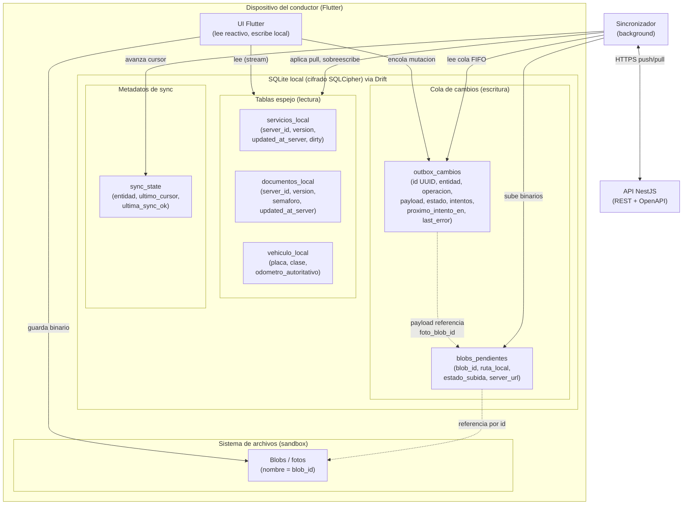
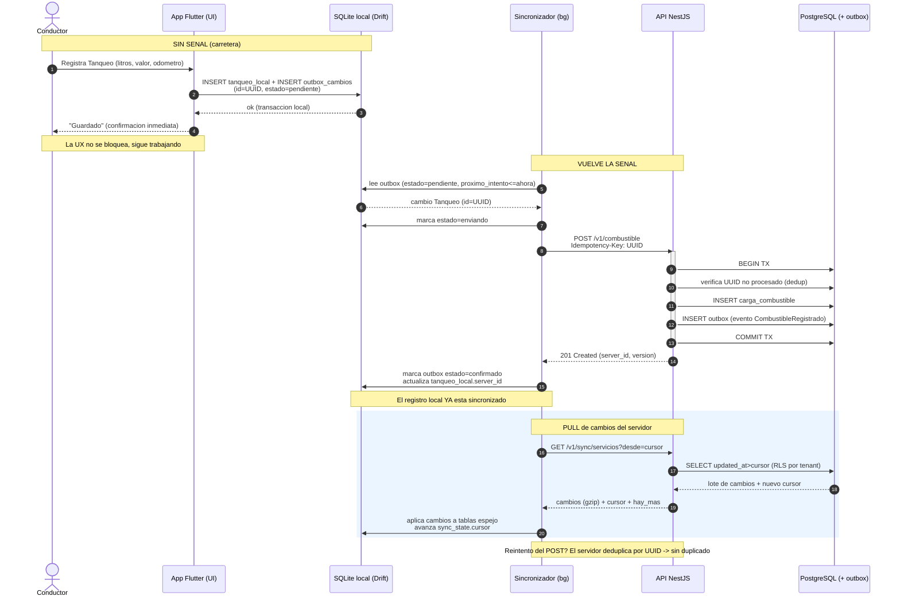
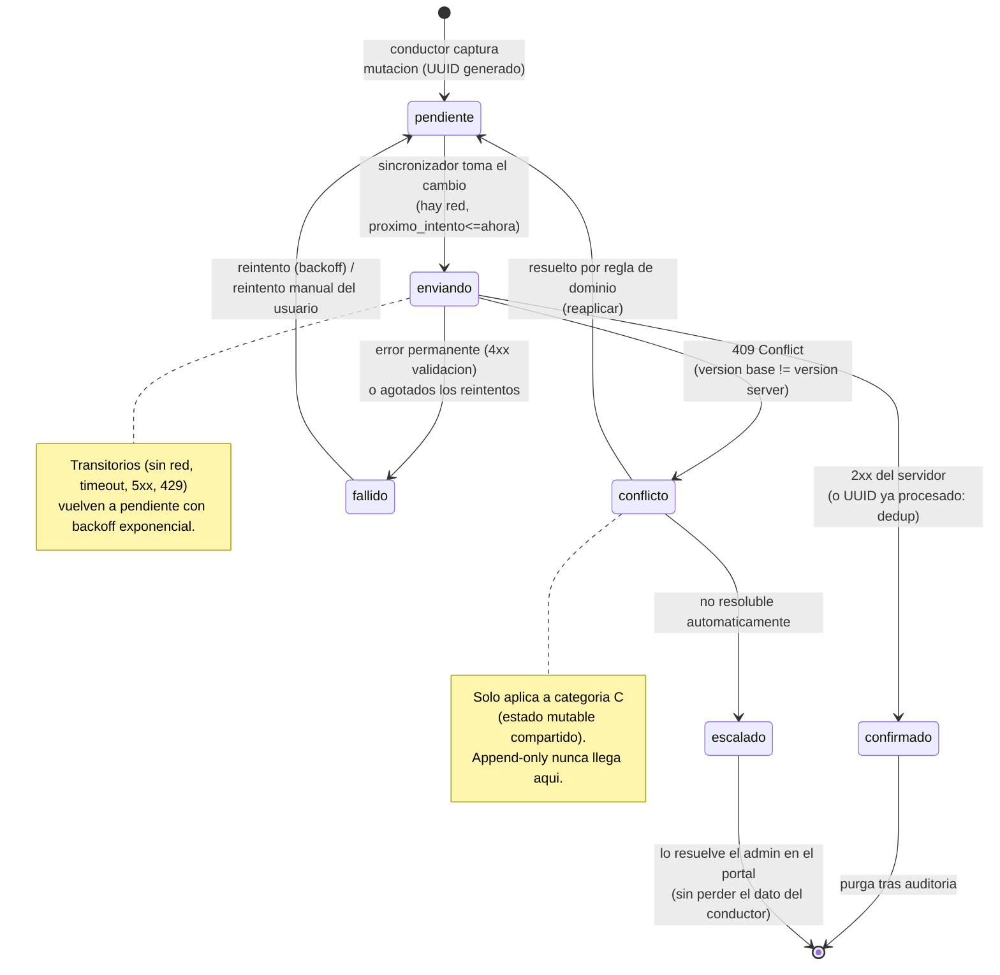

# Fase 6 — Arquitectura Offline First

> **Objetivo de la fase:** definir, con detalle de ingeniería **construible y sin sobreingeniería**, cómo la app del **Conductor** (Flutter) funciona **plenamente sin señal** y reconcilia con el backend al recuperar conectividad. Esta fase materializa el principio **Offline First** (Fase 5 §1.5) y desarrolla la decisión de **[ADR-0005](../adr/0005-offline-first-sqlite-sync.md)**: SQLite (Drift) local + cola de cambios (outbox del cliente) + sincronización incremental contra nuestra propia API REST. El offline-first es, según el análisis de negocio (Fase 1), **el diferenciador defendible del producto y el riesgo técnico #1 (R2)**; por eso se trata aquí con rigor, pero **empezando por lo simple**.

Este documento es el **contrato de comportamiento offline**. Asume y respeta lo ya decidido: móvil **Flutter + Drift/SQLite**, backend **NestJS** (monolito modular), DB **PostgreSQL única**, **API REST + OpenAPI 3.1**, **eventos vía outbox** (Fase 5 §7.2, [ADR-0004](../adr/0004-eventos-outbox-pattern-sin-broker.md)) y **multi-tenant `tenant_id` + RLS** (Fase 5 §8, [ADR-0008](../adr/0008-multi-tenant-shared-db-rls.md)). Reusa el lenguaje ubicuo de la Fase 2 (Servicio, Tanqueo, Novedad, Traza GPS, Documento, Semáforo).

---

## 0. La tesis de esta fase (léase primero)

El offline-first puede convertirse en un monstruo de conflictos y consistencia eventual si se ataca todo a la vez. **No lo haremos.** La idea rectora es:

> **La mayoría de lo que el conductor *escribe* es append-only (solo añade) y casi nunca genera conflictos. La mayoría de lo que el conductor *lee* es propiedad del servidor (server-authoritative) y el cliente nunca lo edita, así que tampoco hay conflictos. El problema difícil — estado mutable compartido — es una porción pequeña que aislamos y tratamos con reglas explícitas.**

Si interiorizas esa frase, el resto del documento es la mecánica. **Empezamos por append-only**, que cubre ~80% del valor con ~20% de la complejidad, y dejamos los conflictos reales para una fase posterior y acotada.

---

## 1. Principios offline-first para FleetSpecial

Cinco principios no negociables gobiernan todo el diseño de esta fase.

1. **El dispositivo es la fuente de verdad TEMPORAL del conductor.** Mientras no hay red, lo que el conductor capturó en su teléfono **es** la realidad operativa. El servidor no "manda" sobre datos que aún no conoce. La nube es la fuente de verdad *consolidada y duradera*; el dispositivo lo es *en el aquí y ahora del conductor*. Reconciliar es fusionar ambas, no imponer una sobre la otra.

2. **Toda acción del conductor se ejecuta y persiste localmente sin red.** Registrar un Tanqueo, reportar una Novedad con foto, marcar un Servicio iniciado/finalizado, capturar Traza GPS: **todas** se escriben primero en SQLite local y se confirman al usuario **de inmediato**, exista o no conexión. La red nunca es prerrequisito de una acción.

3. **La sincronización es un detalle de fondo, NUNCA un bloqueo de la UX.** El sincronizador corre en segundo plano. El conductor **jamás** ve un spinner de "subiendo…" que le impida seguir trabajando. La UI lee siempre de la base local (reactiva vía Drift) y refleja el estado local; el estado de sync se comunica de forma **discreta** (indicador "N pendientes"), no intrusiva.

4. **Degradación elegante.** Sin red, la app no muestra errores rojos ni pantallas vacías: muestra lo último que descargó (su agenda, sus documentos) con una marca honesta de "datos de hace N min" y permite escribir con normalidad. Las funciones que *exigen* red en línea (p. ej. ver un mapa de geocoding nuevo) se degradan con un mensaje claro, sin romper el flujo principal.

5. **No pérdida de datos del conductor — invariante sagrada.** Ningún dato capturado por el conductor se borra del dispositivo hasta que el servidor **confirma** su recepción. Ante crash, batería agotada, cierre de app o corrupción, la cola local sobrevive. Si un conflicto no se puede resolver automáticamente, **se marca y se escala — nunca se descarta en silencio**. Esta invariante manda sobre cualquier optimización.

> **Coherencia con Fase 1 §3:** "un flujo a la vez", baja fricción, sesión persistente. El conductor al volante no negocia con la red.

---

## 2. Clasificación de datos por estrategia de sincronización (la decisión clave)

Antes de hablar de almacenamiento o de sync, **clasificamos cada dato**. Esta clasificación es la herramienta #1 contra la sobreingeniería: define *cuánto* esfuerzo merece cada tipo de dato y *cuándo* construirlo. No todos los datos son iguales; tratarlos igual es el error caro.

### 2.1 Las tres categorías

| Categoría | Qué es | Datos de FleetSpecial | ¿Conflictos? | Estrategia de sync | ¿Cuándo se construye? |
|---|---|---|---|---|---|
| **A. Solo lectura (cacheada, server-authoritative)** | El servidor es dueño; el cliente **solo descarga y muestra**. El cliente **nunca** edita estos datos. | Agenda/servicios del día (lectura), **Documentos** del vehículo y del conductor, **Semáforo** de vencimientos, **datos del vehículo** (placa, clase, odómetro autoritativo) | **Ninguno.** Como el cliente no escribe, no hay nada que chocar. | **Pull** incremental: se descargan y se refrescan desde un cursor. Se sobreescriben localmente con la versión del servidor sin miramientos. | **Fase A** (primero) |
| **B. Append-only (event-like, client-generated)** | El cliente **solo AÑADE** registros nuevos; no edita ni borra los ya creados. Cada registro es un hecho inmutable. | **Cargas de combustible (Tanqueo)**, **Novedades/incidentes** (texto + foto), **puntos de Traza GPS** | **Casi nunca.** Dos dispositivos no "editan el mismo registro"; cada uno añade los suyos. El único riesgo es el duplicado, que se resuelve con idempotencia (UUID). | **Push** de la cola: se encolan y se suben; el servidor los inserta deduplicando por UUID. | **Fase A** (primero — **EMPEZAR AQUÍ**) |
| **C. Estado mutable compartido (requiere resolución de conflictos)** | Una entidad que **tanto el conductor como el admin pueden modificar**, y cuyo valor "actual" es uno solo. | **Estado del Servicio** (planificado → iniciado → finalizado) que el conductor marca en campo y el admin puede tocar en el portal; cualquier campo editable por ambos lados | **Sí — aquí viven los conflictos reales.** Dos lados cambian el mismo campo de la misma entidad sin verse. | **Pull + push con detección de conflicto** (versión/etag) y **reglas de dominio explícitas** (§5). | **Fase B** (después de A) |

### 2.2 Por qué esta clasificación reduce el problema

La intuición ingenua dice "offline-first = resolver conflictos en todo". **Es falso para este dominio.** Si miramos lo que el conductor realmente hace en campo:

- **Lo que LEE** (agenda, documentos, semáforo, datos del vehículo) es categoría **A**: el conductor no edita su licencia ni el SOAT desde la carretera; los *consulta*. **Cero conflictos.** Refrescar = sobreescribir local con server.
- **Lo que ESCRIBE** es, en su abrumadora mayoría, categoría **B**: el Tanqueo es un hecho ("eché 40 litros a las 3pm con odómetro 152.300"), la Novedad es un hecho ("pinchazo en la vía, foto adjunta"), cada punto GPS es un hecho. **Son inmutables y solo se añaden.** Dos teléfonos jamás "editan el mismo tanqueo"; cada conductor añade los suyos. El único modo de fallo es el **duplicado** por reintento, y eso se resuelve con un **UUID por registro** (§4.2), no con un motor de merge.
- Solo una rebanada estrecha — categoría **C**, esencialmente el **estado del Servicio** — es mutable y compartida. Y aun ahí, las reglas de dominio (el conductor en campo tiene autoridad sobre "iniciado/finalizado") **eliminan la mayoría de los conflictos** sin necesidad de resolución manual.

**Conclusión operativa:** el problema "difícil" del offline (conflictos) se reduce a **una entidad y un puñado de campos**. Todo lo demás es *descargar* (A) o *encolar y subir con idempotencia* (B). Por eso el **roadmap (§7)** ordena: primero A + B (simple, alto valor), luego C (acotado).

> **Antídoto anti-sobreingeniería:** no construyas CRDTs, vector clocks ni un motor de merge genérico en el MVP. La naturaleza append-only de las escrituras del conductor hace que **un UUID + una cola** resuelvan el 80% del valor. Reserva el rigor de conflictos para la categoría C, y solo cuando llegues a ella.

---

## 3. Almacenamiento local (Drift / SQLite en Flutter)

El almacén local es **SQLite accedido vía Drift** (tipado, reactivo) — decidido en [ADR-0005](../adr/0005-offline-first-sqlite-sync.md). El diseño se organiza en tres piezas: **tablas espejo** (categorías A y C que se leen), la **cola de cambios** (outbox del cliente, categorías B y C que se escriben) y el **blob store** (archivos/fotos).

### 3.1 Tablas espejo locales

Cada entidad que el conductor necesita offline tiene una **tabla espejo** en SQLite que refleja el subconjunto relevante del servidor (su vehículo, su agenda, sus documentos — **nunca toda la flota**). Las tablas espejo llevan **metadatos de sync** además de los campos de negocio:

| Campo de sync (en cada tabla espejo) | Tipo | Para qué |
|---|---|---|
| `server_id` | TEXT | Identidad asignada por el servidor (UUID). Para datos descargados. |
| `tenant_id` | TEXT | Aislamiento; coherente con RLS del servidor. Se valida al aplicar pulls. |
| `version` | INTEGER | Versión/etag de la fila en el servidor. Base de detección de conflictos (categoría C). |
| `updated_at_server` | INTEGER (epoch ms) | Marca de tiempo del **servidor**; alimenta el cursor de pull. |
| `synced_at` | INTEGER (epoch ms) | Cuándo se aplicó localmente por última vez. |
| `dirty` | BOOLEAN | `true` si hay cambios locales no confirmados sobre esta fila (solo categoría C). |

> **Importante:** las tablas espejo de **categoría A** se tratan como **caché reemplazable**: si se corrompen o se pierden, se reconstruyen desde el servidor (§6). Las de **categoría C** pueden tener un `dirty=true` que aún no subió: ese cambio vive **realmente** en la cola (§3.2), no solo en la fila.

### 3.2 La cola de cambios (outbox del cliente)

El corazón de la escritura offline. **Toda** mutación del conductor (categorías B y C) se registra como una fila en `outbox_cambios`. Esta tabla es **lo único irreemplazable** del dispositivo (todo lo demás se puede re-descargar), por eso se protege por encima de todo.

**Esquema de `outbox_cambios`:**

| Campo | Tipo | Descripción |
|---|---|---|
| `id` | TEXT (UUID v4) | **Client-generated UUID.** Identidad del cambio y **clave de idempotencia** (`Idempotency-Key`) que el servidor usa para deduplicar (§4.2). Generado en el dispositivo en el instante de la captura. |
| `entidad` | TEXT | Tipo de entidad: `tanqueo`, `novedad`, `gps_punto`, `servicio_estado`. |
| `operacion` | TEXT | `create` (append-only) o `update` (estado mutable). En el MVP **no hay `delete`** del conductor. |
| `payload` | TEXT (JSON) | Datos del cambio (litros, valor, odómetro; texto de novedad + ref de foto; coordenadas; nuevo estado del servicio + `base_version`). |
| `estado` | TEXT | Máquina de estados del cambio (§4.7): `pendiente`, `enviando`, `confirmado`, `fallido`, `conflicto`. |
| `creado_en` | INTEGER (epoch ms) | Cuándo lo capturó el conductor (reloj del dispositivo). |
| `actualizado_en` | INTEGER (epoch ms) | Última transición de estado. |
| `intentos` | INTEGER | Número de envíos intentados; alimenta el backoff (§4.4). |
| `proximo_intento_en` | INTEGER (epoch ms) | Cuándo reintentar (backoff exponencial). |
| `last_error` | TEXT (nullable) | Último error (código HTTP + mensaje), para diagnóstico y soporte. |
| `tenant_id` | TEXT | Tenant del conductor; viaja para trazabilidad (el servidor lo deriva del JWT, no confía en el body — Fase 5 §7.1). |

**Reglas de la cola:**
- Es **persistente**: vive en SQLite, sobrevive a cierre de app, crash y reinicio del teléfono.
- Se procesa **en orden de `creado_en`** por entidad (FIFO), respetando dependencias (p. ej. una Novedad con foto no se sube antes que su blob, §3.3).
- Una fila **solo se elimina** cuando el servidor confirma (`confirmado`) — y aun así se puede conservar un tiempo para auditoría/observabilidad antes de purgar.
- El `payload` es **autocontenido**: lleva todo lo necesario para reconstruir la mutación sin depender del estado actual de las tablas espejo (que pudo cambiar por un pull intermedio).

### 3.3 Manejo de archivos/fotos offline (blob store)

Las **fotos de Novedades** son binarios que no caben (ni deben caber) en la cola JSON. Se manejan aparte:

1. Al capturar una Novedad con foto, el binario se guarda en el **sistema de archivos del dispositivo** (directorio de la app), con un **nombre = UUID local** del blob.
2. La fila de `outbox_cambios` de la Novedad **referencia el blob por ese UUID** en su `payload` (`{ "foto_blob_id": "..." }`), no incrusta el binario.
3. Una tabla auxiliar `blobs_pendientes` rastrea cada archivo: `(blob_id, ruta_local, estado_subida, server_url, intentos, last_error)`.
4. La subida es **en dos pasos**: primero se sube el binario (multipart o URL prefirmada del almacenamiento S3-compatible — Fase 5 §4), el servidor responde con una **URL/ID de archivo**, y **luego** se sube el cambio de Novedad referenciando esa URL. Así el metadato nunca apunta a un archivo inexistente.
5. El blob local **no se borra** hasta que su subida está confirmada (invariante de no pérdida).

> **Por qué dos pasos y no incrustar:** subir base64 en la cola infla la DB local, complica reintentos y revienta límites de payload. Separar binario (blob store) de metadato (cola) es estándar y mantiene la cola liviana y rápida.

### 3.4 Cifrado de la base local (Habeas Data)

La base local contiene **datos personales** (del conductor, de clientes en los servicios) sujetos a la **Ley 1581 de 2012 (Habeas Data)** — ver Fase 5 §10. Por tanto:

- **Cifrado en reposo de SQLite** mediante **SQLCipher** (cifrado de toda la base con AES-256), integrado con Drift a través de su soporte de cifrado.
- La **clave de cifrado** se guarda en el **almacén seguro del sistema operativo** (Keystore en Android, Keychain en iOS), **nunca** en SharedPreferences ni en código.
- Los **blobs/fotos** sensibles se guardan en el directorio privado de la app (sandbox); en plataformas que lo permitan, se apoya el cifrado de archivos del SO.
- **Borrado seguro** ante baja del conductor o solicitud de cancelación (derecho ARCO): se elimina la base local y la clave del Keystore. Como el dato consolidado vive en el servidor, no hay pérdida.

### 3.5 Diagrama del modelo de almacenamiento local

---

## 4. Sincronización

La sincronización tiene dos direcciones: **pull** (bajar lo que el servidor sabe) y **push** (subir lo que el conductor capturó). Son independientes y se disparan por separado.

### 4.1 Modelo de sync: pull + push

- **Pull (bajada):** la app pide al servidor "dame todo lo que cambió **desde mi último cursor**" por cada entidad de categoría A y C. Aplica los cambios a las tablas espejo. Para categoría A, **sobreescribe** sin más (server gana). Para categoría C, **detecta conflicto** si la fila local está `dirty` con un cambio pendiente (§5).
- **Push (subida):** la app recorre `outbox_cambios` en estado `pendiente` (cuyo `proximo_intento_en <= ahora`), los envía a la API y procesa la respuesta (confirmado / fallido / conflicto).

Ambas usan los endpoints REST ya contractualizados (Fase 5 §7.1). Push usa los `POST`/`PATCH` de cada recurso (`/v1/combustible`, `/v1/novedades`, `/v1/servicios/{id}/estado`, `/v1/servicios/{id}/traza`) con la cabecera **`Idempotency-Key`**. Pull usa un endpoint de cambios incrementales por entidad (`GET /v1/sync/{entidad}?desde={cursor}`).

### 4.2 Idempotencia (la pieza que hace seguros los reintentos)

**El problema:** sin red estable, un push puede llegar al servidor, insertarse, y la confirmación perderse antes de volver al cliente. El cliente, al no recibir confirmación, **reintenta** → riesgo de duplicado.

**La solución:** cada cambio del cliente lleva un **UUID generado en el dispositivo** (`outbox_cambios.id`), enviado como cabecera **`Idempotency-Key`** (Fase 5 §7.1).

- El servidor mantiene, **por tenant**, un registro de claves de idempotencia ya procesadas (tabla `idempotency_keys` o columna única `client_uuid` en la entidad).
- Si llega un push con un UUID **ya visto**, el servidor **no inserta de nuevo**: responde con el **mismo resultado** de la primera vez (200 con el recurso ya creado). El reintento es **seguro e idempotente**.
- Así, "subir dos veces" produce **un solo registro**. El cliente puede reintentar sin miedo tras cualquier caída.

**Conexión con el outbox del SERVIDOR.** Al recibir y persistir un cambio del cliente (p. ej. un Tanqueo), el servidor lo hace en una **transacción** que también escribe el **evento de dominio** en su tabla `outbox` (Fase 5 §7.2, [ADR-0004](../adr/0004-eventos-outbox-pattern-sin-broker.md)) — p. ej. `CombustibleRegistrado`, `ServicioFinalizado`. Ese outbox del servidor:
1. Dispara efectos secundarios (recalcular costo/km, alertas) vía el worker.
2. **Alimenta el pull de otros clientes/portales:** los eventos de dominio y los `updated_at` que generan son justamente lo que otro dispositivo o el portal web verán en su próximo pull. De este modo, **el outbox del cliente y el outbox del servidor riman**: el cliente encola para subir; el servidor encola (en outbox) para propagar. Un mismo patrón mental en ambos lados, como anota [ADR-0005](../adr/0005-offline-first-sqlite-sync.md).

> **At-least-once, no exactly-once.** Igual que el outbox del servidor (Fase 5 §7.2), el canal de sync es *at-least-once*: un cambio puede intentar entregarse más de una vez. La idempotencia por UUID es lo que lo vuelve **efectivamente exactly-once** desde el punto de vista del dato.

### 4.3 Delta sync con cursor

No se descarga "todo" cada vez — eso sería caro y lento en una red móvil pobre. Se hace **delta sync incremental**:

- Cada entidad de pull tiene un **cursor** por dispositivo, guardado en `sync_state` (p. ej. el mayor `updated_at_server` aplicado, o un token opaco que devuelve el servidor).
- El servidor expone `GET /v1/sync/{entidad}?desde={cursor}&limit={n}` que devuelve **solo las filas con `updated_at > cursor`** para el tenant del JWT (RLS garantiza que jamás vea otro tenant — Fase 5 §8).
- La respuesta incluye un **nuevo cursor** y un flag `hay_mas` para **paginar** (lotes de N filas) y no reventar memoria ni la red.
- **Por tenant y por sujeto:** el delta está acotado al conductor/vehículo relevante; no se sincroniza la flota entera. Esto mantiene el volumen bajo (coherente con la mitigación de tamaño en [ADR-0005](../adr/0005-offline-first-sqlite-sync.md)).
- **Compresión:** las respuestas de sync viajan con **gzip** (negociado por `Accept-Encoding`), clave en redes lentas/caras.

> **`updated_at` con cuidado:** el cursor se basa en el reloj del **servidor**, no del dispositivo (los relojes de teléfonos derivan). El servidor sella `updated_at` en UTC y el cliente nunca lo fabrica.

### 4.4 Política de reintentos con backoff exponencial

Cuando un push falla por red o por un 5xx transitorio, **no se reintenta en bucle agresivo** (gastaría batería y datos). Se aplica **backoff exponencial con jitter**:

- Secuencia base: **2s, 4s, 8s, 16s, 32s, … hasta un techo** (p. ej. 5 min), con **jitter aleatorio** (±20%) para evitar tormentas sincronizadas al volver la señal.
- Cada intento incrementa `intentos` y fija `proximo_intento_en`.
- Tras un **número máximo de reintentos automáticos**, el cambio pasa a `fallido` (sigue en la cola, no se pierde) y se **expone al usuario/soporte** (§6.4) para reintento manual.
- **Distinción de errores:**
  - **Transitorios** (sin red, timeout, 5xx, 429): reintentar con backoff.
  - **Permanentes** (4xx de validación, p. ej. payload inválido): **no reintentar ciegamente**; marcar `fallido` con `last_error` y escalar — reintentar lo mismo solo daría el mismo 400.
  - **409 Conflicto** (categoría C): transita a `conflicto` y entra a resolución (§5).
- La **cola persistente sobrevive a cierre de app**: al reabrir, el sincronizador retoma desde `outbox_cambios` exactamente donde quedó.

### 4.5 Triggers de sincronización

El sync se dispara por **cuatro** gatillos, todos en segundo plano:

| Trigger | Cuándo | Qué hace |
|---|---|---|
| **Recuperación de conectividad** | Un listener de conectividad (`connectivity_plus`) detecta que volvió la red | Dispara **push** de la cola pendiente y luego **pull** de cambios. Es el gatillo más importante. |
| **Periódico** | Temporizador en intervalo razonable (p. ej. cada N minutos) **solo si hay red** | Push de pendientes + pull incremental. Mantiene la agenda/semáforo frescos. |
| **Manual (pull-to-refresh)** | El conductor "hala para refrescar" en la agenda | Fuerza un pull inmediato (y push de pendientes de paso). Da control y confianza. |
| **App a primer plano** | El ciclo de vida de la app pasa a *foreground* | Sync oportunista: el conductor abrió la app, es buen momento para reconciliar. |

> **Nunca al arrancar bloqueando.** El arranque **no espera** al sync. La app abre con datos locales; el sync corre detrás. Coherente con "la sync nunca bloquea la UX" (§1.3).

### 4.6 Diagrama de secuencia: ciclo completo (registrar combustible offline → reconectar → sincronizar)

### 4.7 Diagrama de estados de un cambio en la cola

---

## 5. Resolución de conflictos (solo categoría C)

Esta sección aplica **únicamente** a **estado mutable compartido**: en la práctica, el **estado del Servicio** y cualquier campo que tanto conductor como admin puedan editar. Append-only (categoría B) **nunca** llega aquí — su único riesgo (duplicado) lo zanja la idempotencia. Solo lectura (categoría A) tampoco — el servidor simplemente gana.

### 5.1 Detección de conflicto

Se detecta por **versión (etag) por entidad**:

- Cada fila de categoría C lleva una `version` (entero monótono o etag) que el servidor incrementa en cada cambio.
- Cuando el conductor edita offline, la app guarda en el `payload` del cambio la **`base_version`**: la versión que tenía la fila **cuando empezó a editar**.
- Al hacer push (`PATCH /v1/servicios/{id}/estado`), el servidor compara:
  - Si `base_version == version_actual_servidor` → **sin conflicto**, aplica y sube la versión.
  - Si `base_version != version_actual_servidor` → **conflicto**: alguien cambió la fila entre medias. El servidor responde **409** con la versión y el estado actuales, y el cambio transita a `conflicto` (§4.7).

### 5.2 Estrategias y cuándo usar cada una

| Estrategia | En qué consiste | Cuándo usarla |
|---|---|---|
| **Last-Write-Wins (LWW)** | Gana el cambio con la marca de tiempo más reciente, usando el **reloj del servidor** + `version` como desempate. | Campos sin semántica de "estado terminal", donde el último valor razonablemente es el bueno. Es el **default simple**. |
| **Reglas de dominio específicas** | El dominio decide quién gana según el significado del cambio, no según el reloj. | Estados con semántica fuerte. Ej: una vez el conductor marcó un Servicio **finalizado** (estado terminal), **ese estado gana** aunque el admin intente reabrirlo desde el portal — el conductor en campo es la autoridad sobre la ejecución real. |
| **Merge campo a campo** | Si dos lados tocaron **campos distintos** de la misma entidad, se fusionan ambos cambios. | Entidades con varios campos editables independientes, cuando el choque es en columnas diferentes (no en la misma). Se usa **solo si aplica**; no se construye prematuramente. |

> **Anti-sobreingeniería:** el MVP arranca con **LWW + una o dos reglas de dominio explícitas** para el estado del Servicio. El merge campo a campo se introduce **solo** si aparece una entidad que de verdad lo necesite (Fase C del roadmap, §7).

### 5.3 Reglas concretas por entidad para FleetSpecial

| Entidad / dato | Categoría | Estrategia de conflicto | Quién gana | Justificación |
|---|---|---|---|---|
| **Estado de Servicio: iniciado / finalizado** | C | **Regla de dominio** (autoridad de campo) + LWW como respaldo | **El conductor** sobre la ejecución real; un estado **terminal** (finalizado) gana sobre intentos posteriores de reabrir | El conductor es quien **está** en el servicio; lo que él vivió es la verdad operativa. El admin no puede "des-finalizar" un viaje que ya ocurrió. |
| **Datos del Servicio editados por el admin** (cliente, dirección, ventana horaria, reasignación) | C | **Server gana** (admin authoritative) | **El admin/portal** | La planificación es responsabilidad del back-office; el conductor no reprograma. Si el admin reasigna mientras el conductor estaba offline, manda el admin. |
| **Documentos / Semáforo / datos del vehículo** | A | **Server gana** (sin conflicto posible) | **El servidor** | El conductor nunca los edita; se sobreescriben en cada pull. |
| **Tanqueo (combustible)** | B | **Sin conflicto** (append-only) | — (ambos coexisten) | Cada registro es un hecho inmutable; no se editan. Idempotencia evita duplicados. |
| **Novedad / incidente** | B | **Sin conflicto** (append-only) | — (ambas coexisten) | Igual que Tanqueo: hechos que solo se añaden. |
| **Puntos de Traza GPS** | B | **Sin conflicto** (append-only) | — (todos coexisten) | Secuencia de hechos; se concatenan, nunca chocan. |

> **Caso ilustrativo (autoridad de campo):** el conductor, sin señal, marca el Servicio **finalizado** a las 16:05. Mientras tanto, el admin (que no sabía) editó la ventana horaria del mismo servicio a las 16:00. Al reconectar: el cambio de **estado** del conductor entra por su regla de dominio (gana el estado terminal); el cambio de **ventana** del admin se conservó en el servidor. **Ambos campos sobreviven** (tocaron columnas distintas). Si en cambio ambos hubieran tocado el **mismo** campo de estado, manda la regla de dominio (conductor) y el otro intento se **registra en bitácora**, no se descarta.

### 5.4 Conflictos no resolubles automáticamente

Cuando una regla no alcanza para decidir sin ambigüedad:

1. **Marcar, no perder.** El cambio queda en estado `conflicto`/`escalado` en la cola; **el dato del conductor se conserva íntegro** (en el `payload` y, si aplica, en una tabla de conflictos del servidor).
2. **Exponer al admin en el portal web** para **resolución manual**: el portal muestra "este servicio tiene un conflicto de sincronización: versión del conductor vs. versión del sistema", con ambos valores y quién/cuándo.
3. El admin **elige** o **fusiona** explícitamente; la resolución vuelve a propagarse por pull al dispositivo.
4. **NUNCA se descarta el dato del conductor en silencio.** Esta es la invariante #5 (§1) llevada a los conflictos: el peor resultado posible es perder, sin avisar, lo que el conductor capturó en campo. Eso está **prohibido**.

> **Bitácora de sync (audit log):** todo conflicto y toda resolución (automática o manual) se registra con quién, qué versión, cuándo y qué regla aplicó. Alimenta la "memoria operativa" (Fase 1) y la observabilidad (Fase 5 §11), y es la red de seguridad ante el riesgo R2.

---

## 6. Recuperación (resiliencia)

El offline-first vive en dispositivos reales que se quedan sin batería, sin espacio y se cierran a media tarea. La recuperación es parte del diseño, no un parche.

### 6.1 Matriz de fallos y recuperación

| Fallo | Qué protege el dato | Cómo se recupera |
|---|---|---|
| **App cerrada / crash a mitad de sync** | Cola persistente (SQLite) + idempotencia | Al reabrir, el sincronizador lee `outbox_cambios` y **retoma**. Si un push se había enviado pero no confirmado, el reintento es **seguro** (el servidor deduplica por UUID). Cero duplicados, cero pérdida. |
| **Batería agotada en medio de una captura** | Transacción local atómica | Toda captura es **una transacción** (fila espejo + fila outbox). O se escribió completa o no se escribió; nunca a medias. Lo confirmado al usuario está en disco. |
| **Almacenamiento lleno** | Detección proactiva + degradación | La app **vigila el espacio libre**; si está crítico, **poda primero las tablas espejo de categoría A** (caché reemplazable, se re-descarga luego) y **protege la cola y los blobs pendientes** (irreemplazables). Avisa al conductor que libere espacio. Jamás se borra un dato no confirmado para hacer sitio. |
| **Corrupción de la DB local** | Separación caché vs. irreemplazable | **Categoría A** (espejo): se **reconstruye desde el servidor** (bootstrap, §6.2). **La cola y los blobs** son lo único irreemplazable: se intenta **rescatar** (la cola es pequeña, se puede respaldar periódicamente en un archivo aparte). El diseño minimiza la superficie irreemplazable justamente para que la mayoría sea re-descargable. |
| **Pérdida / robo del dispositivo** | Cifrado + servidor como verdad consolidada | Los datos **ya confirmados** viven en el servidor (no se pierden). El **cifrado SQLCipher** (§3.4) protege lo que quedó en el teléfono. Se revoca la sesión (refresh token) del dispositivo perdido. Lo único en riesgo es lo capturado y **aún no subido** — minimizado porque el sync sube en cuanto hay red. |

### 6.2 Bootstrap inicial y re-sync completo

- **Bootstrap (primer arranque / nuevo dispositivo):** la app, tras login, descarga el **subconjunto relevante del conductor** (su agenda, su vehículo, sus documentos, su semáforo) en una **sincronización inicial paginada**. Establece los cursores de cada entidad. **No descarga toda la flota** — solo lo del conductor. Mientras descarga, muestra progreso, pero permite operar con lo que ya bajó.
- **Re-sync completo (si el cursor se pierde o se sospecha divergencia):** se **resetea el cursor** de la(s) entidad(es) afectada(s) a cero y se vuelve a paginar **todo** el subconjunto desde el servidor, **sobreescribiendo** las tablas espejo de categoría A. **Clave:** un re-sync completo **NO toca la cola** `outbox_cambios` — los cambios pendientes del conductor permanecen intactos y se suben aparte. Re-bajar la verdad del servidor jamás puede borrar lo que el conductor aún no ha logrado subir.

### 6.3 Garantía de no pérdida de datos del conductor

Se reafirma como invariante operativa, verificable:

- **Nada se borra local hasta confirmación del servidor.** Una fila de `outbox_cambios` solo pasa a purgable tras `confirmado`. Un blob solo se borra tras subida confirmada.
- **La poda por espacio** ataca **solo** caché re-descargable (categoría A), nunca la cola ni blobs pendientes.
- **El re-sync** sobreescribe espejos, **nunca** la cola.
- **Los conflictos** se marcan y escalan; **no se descartan** (§5.4).

> Si en algún punto del diseño una optimización propusiera borrar un dato no confirmado del conductor, **esa optimización se rechaza**. La regla no tiene excepciones en el MVP.

### 6.4 Observabilidad del estado de sync

Para el **conductor** (confianza) y para **soporte** (diagnóstico):

- **Indicador para el usuario:** un badge discreto con **"N cambios pendientes"** y **"última sync hace M min"**. Estados visuales claros: *todo sincronizado* (verde), *N pendientes* (ámbar), *hay un problema, toca revisar* (rojo, p. ej. cambios `fallido`/`conflicto`). Tap → detalle legible (qué falta subir).
- **Reintento manual** desde ese detalle para cambios `fallido`.
- **Para soporte:** la cola guarda `intentos` y `last_error` por cambio; un diagnóstico exportable (anónimo de datos sensibles) ayuda a depurar sin acceder al dispositivo físico.
- **Para la plataforma:** el servidor emite métricas de sync (lag, tasa de errores de push, profundidad de colas, conflictos por tenant) integradas en OpenTelemetry (Fase 5 §11). Alertas sobre "sync fallida elevada" porque es el corazón del valor.

---

## 7. Roadmap de implementación (anti-sobreingeniería)

El orden de construcción **minimiza el riesgo** entregando primero lo simple y de alto valor, y aplazando lo complejo hasta que el negocio lo exija. Materializa la "estrategia de conflictos por fases" de [ADR-0005](../adr/0005-offline-first-sqlite-sync.md).

| Fase | Alcance | Entrega de valor | Riesgo | Por qué este orden |
|---|---|---|---|---|
| **Fase A — Lectura cacheada + Append-only** | Tablas espejo de categoría A (agenda, documentos, semáforo, vehículo) con **pull** incremental. **Cola + push** de **categoría B**: Tanqueo y Novedades (con fotos). Idempotencia por UUID. Indicador de pendientes. | **~80% del valor offline**: el conductor ve su día sin señal y registra combustible/novedades sin perder nada. | **Bajo.** Sin conflictos: A no se edita, B solo añade. El único modo de fallo (duplicado) lo cubre la idempotencia. | Es lo que el conductor más necesita y lo técnicamente más simple. Valida el motor de sync (cursor, backoff, cola persistente) **sin** el peso de los conflictos. |
| **Fase B — Estado de Servicio (mutable) con LWW + reglas** | Categoría C para el **estado del Servicio** (iniciado/finalizado): versión/etag, detección de conflicto (409), **LWW + reglas de dominio** (autoridad de campo del conductor), escalado al portal. | El conductor controla el ciclo del servicio offline; conflictos raros se resuelven con reglas claras. | **Medio.** Aquí aparecen los conflictos, pero **acotados a una entidad y pocos campos**, con reglas explícitas y red de seguridad (escalado). | Solo se aborda cuando el motor de sync ya es sólido (Fase A). El problema difícil se ataca **aislado y pequeño**, no disperso. |
| **Fase C — Traza GPS a escala + merge avanzado** | Optimización de la **Traza GPS** (alto volumen de puntos: batching, compresión, poda) y **merge campo a campo** si alguna entidad lo requiere de verdad. | Telemetría offline robusta; reconciliación fina donde haga falta. | **Medio/alto** en volumen, **bajo** en conflicto (GPS es append-only). | Se deja al final porque el GPS, aunque append-only (sin conflicto), exige **ingeniería de volumen** (miles de puntos) que no aporta valor hasta tener lo básico. El merge avanzado se construye **solo si** apareció la necesidad — no antes (YAGNI). |

**Por qué este orden minimiza el riesgo:**
- **Separa el riesgo de *mecánica de sync* del riesgo de *conflictos*.** Fase A prueba toda la mecánica (cola, cursor, backoff, idempotencia, recuperación) en el terreno **sin conflictos**. Cuando llega Fase B, el único problema nuevo es el conflicto — todo lo demás ya está probado.
- **Entrega valor temprano y defendible.** Tras Fase A el producto **ya cumple su diferenciador** (operar sin señal) para la mayoría de casos. No hay que esperar a resolver conflictos para salir al mercado.
- **Evita construir lo que quizá no se necesite.** El merge campo a campo y CRDTs se posponen indefinidamente hasta que un caso real los exija. La clasificación (§2) garantiza que **rara vez** se exigirán.

---

## 8. Pruebas (cómo se prueba el offline)

El offline-first es difícil de probar precisamente porque sus fallos ocurren en condiciones adversas (sin red, a media sync, con choques). El enfoque de pruebas se diseña aquí; **QA detallará los casos concretos y la automatización** en `docs/tests` (Fase 3 y suite de QA).

| Escenario a probar | Cómo se simula | Qué se verifica |
|---|---|---|
| **Pérdida de red** | Forzar modo avión / interceptar la capa HTTP para fallar; toggling de conectividad | La app **escribe y confirma local** sin bloquear; la cola acumula `pendiente`; al "volver la red" se sube todo. |
| **Doble envío / reintento** | Enviar el mismo push dos veces (simular confirmación perdida) | El servidor **deduplica por UUID**; queda **un solo** registro; el cliente marca `confirmado`. |
| **Conflicto de categoría C** | Editar el estado de un Servicio en el portal y en el dispositivo offline a la vez | Se detecta el **409**; aplica la **regla de dominio** correcta (autoridad de campo); los no resolubles **escalan** sin perder dato. |
| **Crash a media sync** | Matar el proceso entre "enviando" y "confirmado" | Al reabrir, el sincronizador **retoma** desde la cola; idempotencia evita duplicado; **cero pérdida**. |
| **Almacenamiento lleno** | Llenar el disco / simular error de escritura | La app **poda solo categoría A**, protege cola y blobs, avisa al usuario. |
| **Corrupción de DB / re-sync** | Corromper el archivo SQLite de espejo | Categoría A se **reconstruye desde el servidor**; la **cola sobrevive** y se sube. |
| **Bootstrap en dispositivo nuevo** | Login limpio sin datos locales | Descarga paginada del **subconjunto del conductor**; cursores correctos; operable durante la descarga. |

**Niveles de prueba:**
- **Unitarias** (dominio de cliente, sin Flutter ni Drift): reglas de validación, detección de conflicto, decisión de regla de dominio. Posibles gracias a la Clean Architecture en móvil ([ADR-0005](../adr/0005-offline-first-sqlite-sync.md)).
- **Integración** (con SQLite en memoria vía Drift): cola, transiciones de estado, cursores, backoff.
- **Contrato** (contra el OpenAPI y un mock del servidor): push/pull, idempotencia, paginación.
- **End-to-end de resiliencia** (escenarios de la tabla): los que reproducen condiciones de campo.

> **Referencia:** los casos Gherkin y la automatización viven en la suite de QA (`docs/tests`); esta fase fija **qué** debe garantizarse, QA fija **cómo** se ejecuta y se mide.

---

## 9. Resumen y trazabilidad

| Decisión de esta fase | Coherente con | Anti-sobreingeniería |
|---|---|---|
| SQLite (Drift) cifrado + cola (outbox del cliente) | [ADR-0005](../adr/0005-offline-first-sqlite-sync.md), Fase 5 §6.2 | Sync propio sobre nuestra API; sin servicio gestionado ni lock-in |
| Clasificación A/B/C de datos | Fase 2 (Tanqueo/Novedad append-only; Servicio mutable) | Reduce el problema: la mayoría es A (pull) o B (append) |
| Idempotencia por UUID = `Idempotency-Key` | Fase 5 §7.1, [ADR-0004](../adr/0004-eventos-outbox-pattern-sin-broker.md) | Reintentos seguros sin motor de exactly-once |
| Outbox del cliente ↔ outbox del servidor | Fase 5 §7.2 | Mismo patrón mental; el outbox del server alimenta el pull |
| Delta sync con cursor por tenant + RLS | Fase 5 §8, [ADR-0008](../adr/0008-multi-tenant-shared-db-rls.md) | Solo el subconjunto del conductor; sin sincronizar la flota |
| Conflictos solo en categoría C, con reglas explícitas | Fase 1 R2 | LWW + reglas; merge solo si se necesita (YAGNI) |
| No pérdida de datos del conductor (invariante) | Fase 1 §8 (Habeas Data), §1.5 de esta fase | Nada se borra hasta confirmación; conflictos se escalan |
| Roadmap A → B → C | [ADR-0005](../adr/0005-offline-first-sqlite-sync.md) | Empezar por append-only; aplazar lo complejo |

**Salidas relacionadas:** la decisión raíz está en **[ADR-0005](../adr/0005-offline-first-sqlite-sync.md)**; la arquitectura que la enmarca en **[Fase 5](05-arquitectura-tecnica.md)**; el dominio (entidades, append-only) en **[Fase 2](02-domain-driven-design.md)**; el multi-tenant que el sync respeta en **[Fase 7](07-saas-multitenant.md)**; y las pruebas detalladas en la suite de **QA (`docs/tests`)**.

> **Cierre — la frase que resume la fase:** *empezar por append-only.* La app del conductor es offline-first porque el dispositivo es su verdad temporal, escribe siempre local, sincroniza en segundo plano con idempotencia, y trata los conflictos — pocos y acotados — con reglas explícitas que **nunca** descartan el trabajo del conductor.
