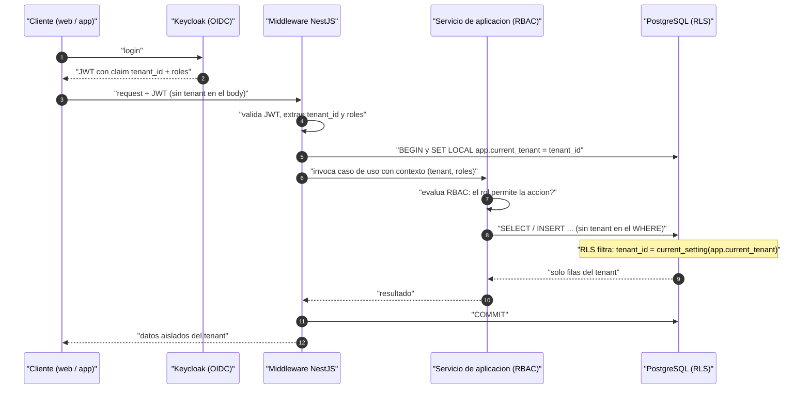
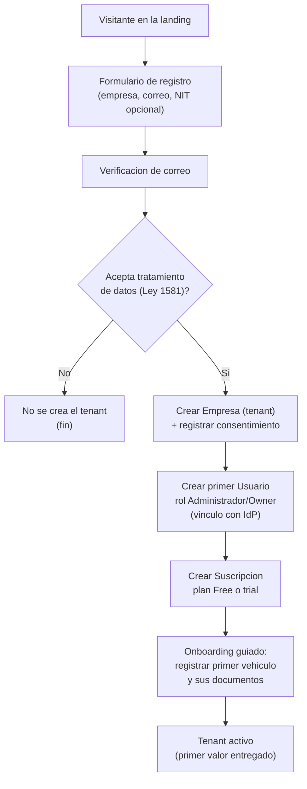
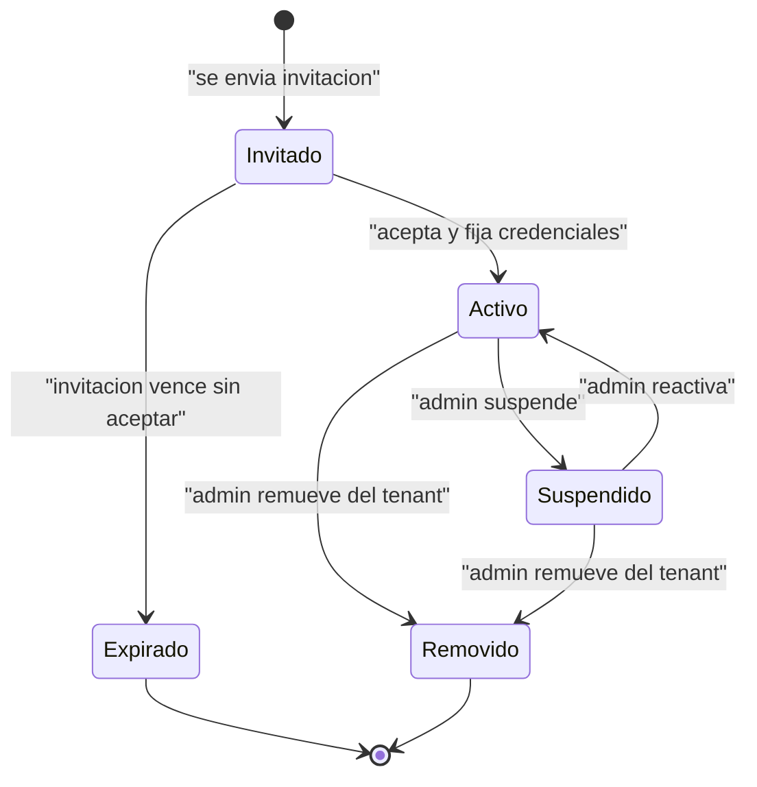
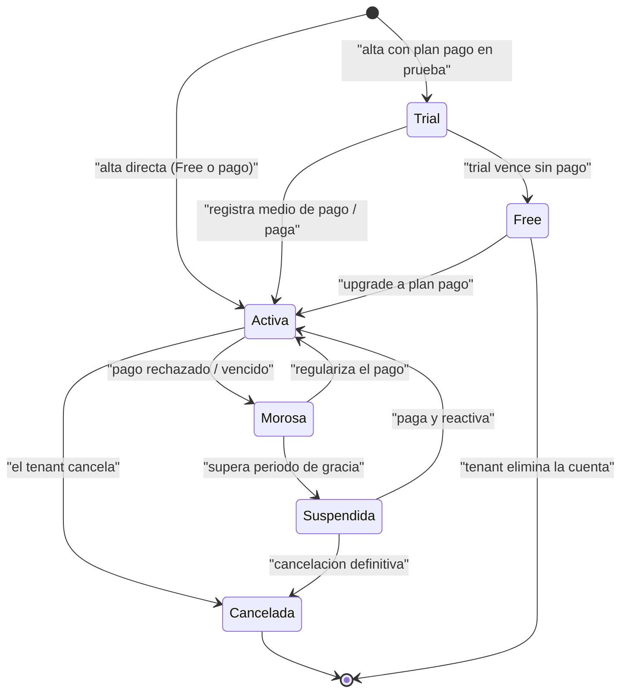

# Fase 7 — Estrategia SaaS Multi-Tenant

> **Objetivo de la fase:** definir **cómo FleetSpecial se vende y opera como un SaaS multiempresa** sin sobreingeniería y a costo de bootstrapping. Esta fase traduce la decisión de tenancy ya tomada ([ADR-0008](../adr/0008-multi-tenant-shared-db-rls.md): shared database + `tenant_id` + Row Level Security) en un diseño concreto de **tenant, usuarios, roles y permisos (RBAC), planes y suscripciones, monetización y cumplimiento Habeas Data por tenant**. Es la continuación natural de la Fase 2 (contextos **Identity & Access** y **Billing & Subscriptions**) y de la Fase 5 (§8 Multi-tenant a nivel arquitectura), que delegan aquí el detalle.

El hilo conductor es el mismo de todo el blueprint: **la herramienta debe servir para una sola Renault Duster (el tenant del fundador) antes de servir para mil empresas.** Por eso el modelo SaaS arranca con lo mínimo viable — una base de datos, un par de planes, RBAC simple — y deja **costuras (seams)** explícitas para crecer sin reescribir.

> **Trazabilidad de entrada:** Fase 1 (negocio, R4 multi-tenant, supuestos legales §8), Fase 2 (BC-1 Identity & Access, BC-8 Billing & Subscriptions, eventos `UsuarioInvitado`/`SuscripcionActivada`), Fase 5 (§7 datos, §8 multi-tenant, §11 seguridad), [ADR-0003](../adr/0003-postgresql-unica-base-de-datos.md) (una sola DB), [ADR-0008](../adr/0008-multi-tenant-shared-db-rls.md) (shared DB + RLS).

---

## Índice

1. [Modelo de Tenant](#1-modelo-de-tenant)
2. [Usuarios](#2-usuarios)
3. [Roles y permisos (RBAC)](#3-roles-y-permisos-rbac)
4. [Suscripciones](#4-suscripciones)
5. [Monetización](#5-monetizacion)
6. [Cumplimiento y aislamiento de datos (Habeas Data por tenant)](#6-cumplimiento-y-aislamiento-de-datos-habeas-data-por-tenant)
7. [Nota anti-sobreingeniería](#7-nota-anti-sobreingenieria)

---

## 1. Modelo de Tenant

### 1.1 ¿Qué es un tenant en FleetSpecial?

Un **tenant** es la **unidad de aislamiento de datos y de facturación** del SaaS. En el lenguaje ubicuo de la Fase 2 corresponde a la **Empresa**: *"entidad de negocio que contrata FleetSpecial; todo registro pertenece a exactamente una empresa"*.

En concreto, en FleetSpecial un tenant es **una operación de transporte especial**, que puede tener tres tamaños:

| Forma de tenant | Descripción | Ejemplo |
|---|---|---|
| **Propietario afiliado (micro)** | Una persona dueña de uno o pocos vehículos afiliados a una transportadora. Es su **propio tenant pequeño**: gestiona su(s) vehículo(s), su cumplimiento y su operación. | El **fundador con su Renault Duster** — el primer tenant del sistema, el caso que valida el MVP. |
| **Empresa transportadora / operador (pyme)** | Una flota de 5–30 unidades con varios conductores, operador(es), gestor de planilla y representante legal. | Una empresa de transporte especial escolar o empresarial. |
| **Empresa afiliadora (grande)** | Una transportadora habilitada que afilia vehículos de muchos propietarios y quiere gestionar a sus afiliados en la plataforma. | Caso de upsell futuro: cobrar a la afiliadora por administrar a sus propietarios (ver §5). |

> **Clave del modelo:** el propietario afiliado **no es un usuario dentro del tenant de la afiliadora**; es **su propio tenant**. Esto permite el gancho viral (§5): el fundador y otros propietarios usan FleetSpecial gratis para su vehículo, y la afiliadora puede luego contratar un plan para gestionarlos a todos. La **Afiliación** (vínculo Vehículo↔Transportadora de la Fase 2) se modela como un dato del vehículo, **no** como una relación entre tenants en el MVP.

Todo dato de negocio (vehículos, conductores, documentos, servicios, combustible, mantenimiento, archivos) **pertenece a exactamente un tenant** y **nunca** es visible para otro. Este aislamiento no es una feature opcional: es un requisito de **seguridad** y de **Habeas Data** (§6), porque los datos incluyen información personal de conductores y clientes.

### 1.2 Estrategias de multi-tenancy comparadas

Existen tres patrones canónicos de aislamiento de datos en SaaS (terminología AWS SaaS Lens):

- **Silo (DB por tenant):** cada empresa tiene su **propia base de datos** independiente.
- **Pool (shared DB + `tenant_id`):** todas las empresas comparten **una base y unas mismas tablas**; cada fila lleva `tenant_id` y el aislamiento se aplica por fila (en nuestro caso, reforzado con RLS).
- **Bridge (shared DB, schema por tenant):** una sola base, pero **un esquema (namespace) de tablas por empresa**.

| Criterio | Silo (DB por tenant) | **Pool (shared DB + `tenant_id` + RLS)** ✅ | Bridge (schema por tenant) |
|---|---|---|---|
| **Costo de infraestructura** | Alto — N bases que aprovisionar, respaldar, monitorear. | **Mínimo — una sola DB para todos los tenants.** | Medio — una DB, pero N esquemas que crecen. |
| **Aislamiento de datos** | Máximo (físico). | **Fuerte (lógico, reforzado por RLS en la base).** | Alto (lógico, por namespace). |
| **Complejidad operativa** | Alta — migraciones × N, despliegues × N, conexiones × N. | **Baja — una migración, un esquema, un backup.** | Media — migraciones × N esquemas; onboarding no instantáneo. |
| **Onboarding de un tenant** | Lento — aprovisionar una base nueva. | **Instantáneo — insertar filas (crear una Empresa).** | Medio — crear y migrar un esquema nuevo. |
| **Escalabilidad (muchos tenants pequeños)** | Mala — no escala a cientos de bases. | **Excelente — un motor sirve a cientos de tenants pequeños.** | Limitada — cientos de esquemas se vuelven difíciles de migrar. |
| **Escalabilidad (un tenant gigante)** | Excelente — recursos dedicados. | Media — riesgo de "vecino ruidoso" (mitigable). | Media. |
| **"Blast radius" de un fallo** | Contenido a un tenant. | Compartido (mitigado por RLS + backups + límites por plan). | Compartido. |
| **Encaja con bootstrapping** | ❌ No (costo y operación). | ✅ **Sí.** | ⚠️ Parcial. |

### 1.3 Por qué se elige POOL (shared DB + `tenant_id` + RLS)

La decisión está **formalizada en [ADR-0008](../adr/0008-multi-tenant-shared-db-rls.md)**; aquí se justifica desde el negocio:

1. **El perfil de FleetSpecial es "muchos tenants pequeños".** Cada tenant maneja 1–30 vehículos. Una DB por tenant (silo) multiplicaría costo y operación para resolver un problema de escala que **no tenemos**. Pool da aislamiento fuerte con costo casi nulo — exactamente lo que pide el bootstrapping.
2. **El primer tenant es el fundador con una Duster.** Crear un tenant debe ser **insertar filas**, no aprovisionar infraestructura. Pool hace el onboarding instantáneo (§1.6).
3. **Defensa en profundidad para Habeas Data.** Con RLS, **aunque el código tenga un bug** y olvide filtrar por `tenant_id`, la base **no** devuelve filas de otro tenant (§1.4). Esto convierte un bug de código en un no-evento, no en una fuga de datos personales.
4. **Coherencia con el resto del blueprint:** una sola DB ([ADR-0003](../adr/0003-postgresql-unica-base-de-datos.md)), monolito modular ([ADR-0001](../adr/0001-monolito-modular-vs-microservicios.md)), equipo de 1–3 personas. Pool es el único patrón que respeta las tres restricciones a la vez.

### 1.4 Implementación con Row Level Security (RLS)

El aislamiento se aplica en **dos capas** (defensa en profundidad): el **código** filtra por `tenant_id`, y **RLS en la base** lo garantiza aunque el código falle.

**a) `tenant_id` en cada tabla.** Toda tabla de datos de negocio lleva una columna `tenant_id` (UUID) con índice. Es una **convención obligatoria**: ninguna tabla de negocio se crea sin ella. Plantilla conceptual:

```sql
CREATE TABLE vehiculo (
  id          uuid PRIMARY KEY DEFAULT gen_random_uuid(),
  tenant_id   uuid NOT NULL,
  placa       text NOT NULL,
  clase       text NOT NULL,
  -- ... resto de columnas ...
  UNIQUE (tenant_id, placa)        -- placa única POR tenant, no global
);
CREATE INDEX idx_vehiculo_tenant ON vehiculo (tenant_id);
```

> Nota: las restricciones de unicidad del dominio (p. ej. "placa única") se hacen **por tenant** (`UNIQUE (tenant_id, placa)`), no globales — dos empresas distintas pueden tener registros que no deben colisionar entre sí.

**b) Política RLS por defecto-denegar.** Cada tabla activa RLS y define una política que solo deja ver/escribir filas del tenant actual:

```sql
ALTER TABLE vehiculo ENABLE ROW LEVEL SECURITY;
ALTER TABLE vehiculo FORCE ROW LEVEL SECURITY;   -- aplica incluso al dueño de la tabla

CREATE POLICY tenant_aislamiento ON vehiculo
  USING      (tenant_id = current_setting('app.current_tenant')::uuid)   -- lectura
  WITH CHECK (tenant_id = current_setting('app.current_tenant')::uuid);  -- escritura
```

Con esto, un `SELECT * FROM vehiculo` **sin** `WHERE tenant_id = ...` devuelve **solo** las filas del tenant en sesión. Si la variable no está seteada, la política **no hace match** y no se devuelve nada (por defecto-denegar): un fallo "cierra", no "abre".

**c) Cómo se setea el tenant en la conexión.** El `tenant_id` **no viaja en el body** ni lo elige el cliente: proviene del **claim del JWT** emitido por el IdP (Keycloak, OIDC — ver Fase 5 §2 y §8). En cada request, un **middleware/guard** de NestJS:

1. Valida el JWT y extrae el claim `tenant_id` (y los roles).
2. Antes de cualquier query, ejecuta sobre la conexión: `SET LOCAL app.current_tenant = '<tenant_id>'` dentro de la transacción del request.
3. RLS filtra automáticamente todas las consultas de ese request.

> `SET LOCAL` ata el valor a la transacción, de modo que **no se filtra entre requests** que reusan una conexión del pool. Es el seam crítico: si el pool de conexiones se reutiliza sin re-setear el tenant, se rompe el aislamiento. Por eso se setea **siempre** al inicio de cada request, dentro de su transacción.

**d) Relación con Identity & Access (BC-1).** El contexto **Identity & Access** es el dueño del modelo de tenancy: publica el **contexto de tenant/usuario como Published Language** (Fase 2 §3) que **todos** los demás contextos consumen. RLS es la **materialización en la base** de ese contrato: Identity resuelve *quién eres y a qué tenant perteneces*; RLS garantiza que *solo veas tu tenant*. El RBAC (§3) vive encima: una vez aislado el tenant, decide *qué puedes hacer dentro de él*.

**Diagrama — resolución de tenant + RLS (request a respuesta):**



> **Pruebas de aislamiento (obligatorias).** Toda tabla nueva debe tener una **prueba automática** que, autenticada como tenant A, intente leer datos de tenant B y verifique que **no** los obtiene. Es la red de seguridad que evita que una política RLS faltante pase a producción.

### 1.5 Aislamiento de archivos y documentos por tenant

Los archivos (documentos escaneados, fotos de novedades) **no** van en la base de datos: van a **almacenamiento S3-compatible** (MinIO self-host en MVP, o el bucket del PaaS — Fase 5 §4.2 y [ADR-0003](../adr/0003-postgresql-unica-base-de-datos.md)). En la DB solo se guarda el **metadato y la referencia** (la clave del objeto).

El aislamiento se logra con un **prefijo (carpeta lógica) por tenant** en la clave del objeto:

```
s3://fleetspecial-docs/<tenant_id>/vehiculos/<vehiculo_id>/soat-2026.pdf
s3://fleetspecial-docs/<tenant_id>/conductores/<conductor_id>/licencia.jpg
s3://fleetspecial-docs/<tenant_id>/novedades/<servicio_id>/foto-001.jpg
```

Reglas:

- El backend **construye la clave** siempre anteponiendo el `tenant_id` del contexto; el cliente nunca elige la ruta cruda.
- El acceso a archivos es por **URLs prefirmadas (presigned) de corta vida** generadas por el backend, **después** de validar tenant + RBAC. El bucket no es público.
- La **eliminación y exportación** de archivos por tenant (Habeas Data, §6) se hace listando por el prefijo `<tenant_id>/`.

> Es el equivalente de RLS para archivos: el `tenant_id` en la clave + la generación de URLs solo tras validar contexto cumple el mismo principio de aislamiento, sin infraestructura extra (un solo bucket).

### 1.6 Onboarding de un nuevo tenant (self-service)

Onboarding **self-service** significa que una empresa puede registrarse sola, sin intervención manual del equipo — clave para escalar de 1 a cientos de tenants sin costo operativo. El flujo del MVP:

1. **Registro de la empresa:** el visitante deja correo, nombre/razón social de la empresa y NIT (opcional en MVP).
2. **Verificación de correo:** se envía un enlace de verificación (anti-spam, anti-typo).
3. **Aceptación de tratamiento de datos (Habeas Data):** el registrante acepta la **política de tratamiento de datos** (Ley 1581/2012) **antes** de crear el tenant. Se registra fecha, versión de la política y evidencia del consentimiento (§6). **Sin aceptación, no hay tenant.**
4. **Creación del tenant + primer usuario admin:** se crea la **Empresa** (fila `tenant`) y el **primer Usuario** con rol **Administrador/Owner** (§3), vinculado al IdP. Se emite el evento `UsuarioInvitado`/alta inicial (Fase 2).
5. **Suscripción inicial:** se crea una **Suscripción** en plan **Free** (1 vehículo) por defecto, o en **trial** de un plan pago (§4). Se emite el evento de alta de suscripción.
6. **Primer valor (activación):** el admin registra su **primer vehículo** y sus **documentos** — el "aha moment" del producto (ver el semáforo de cumplimiento). Para el fundador, esto es cargar la Duster.

**Diagrama — onboarding de un tenant:**



> **Anti-sobreingeniería del onboarding:** en el MVP no hay aprovisionamiento de infraestructura (es solo insertar filas, gracias a Pool + RLS), ni dominios personalizados por tenant, ni white-label. Eso son seams para el futuro, no requisitos del lanzamiento.

---

## 2. Usuarios

### 2.1 Modelo de identidad

En el lenguaje de la Fase 2, un **Usuario** es *"una persona con credenciales que actúa dentro de un Tenant bajo uno o más Roles"*. El modelo de identidad lo posee **Identity & Access (BC-1)** y se apoya en **OIDC/JWT con Keycloak** (Fase 5 §2): la autenticación es un problema resuelto que se adopta de un estándar; lo específico de FleetSpecial es la **tenancy**.

**Decisión para el MVP: un usuario pertenece a UN tenant.** La relación es `Usuario → Tenant` (uno a uno). Es lo más simple, lo más barato de razonar y suficiente para el 95% de los casos: un operador trabaja en su empresa; un conductor maneja para su empresa.

**Trade-off — multi-membresía (un usuario en varios tenants):**

| | Usuario ↔ un tenant (MVP ✅) | Usuario ↔ varios tenants (futuro) |
|---|---|---|
| **Complejidad** | Baja: el tenant del JWT es único e inequívoco. | Alta: el JWT debe portar el tenant **activo**; hace falta un "selector de empresa" y resolver el tenant por sesión. |
| **Casos que cubre** | La operación normal. | Un **gestor de planilla** que atiende varias empresas; un **dueño de vehículo** afiliado a varias; un consultor multi-cliente. |
| **Riesgo de aislamiento** | Menor: imposible confundir tenants. | Mayor: el seteo de `app.current_tenant` debe seguir el tenant **activo**, no el de registro. |
| **Costo de retrofitear** | — | Moderado, **si se deja el seam** (ver abajo). |

**Recomendación: empezar con `Usuario ↔ un tenant`, dejando el seam para multi-membresía.** El seam consiste en modelar conceptualmente una **Membresía** (`Membresia { usuario_id, tenant_id, roles[] }`) aunque hoy cada usuario tenga **exactamente una**. Así, cuando un gestor de planilla necesite atender dos empresas, se agrega una segunda Membresía y un selector de empresa, **sin reescribir** el modelo de identidad ni el de roles. En el MVP, la Membresía única se resuelve directo desde el claim del JWT.

> Esto es coherente con el principio de la Fase 5: *"costuras explícitas donde el producto crecerá: tenancy, eventos, sync"*. La multi-membresía es una de esas costuras.

### 2.2 Invitaciones y ciclo de vida del usuario

Los usuarios (salvo el primer admin, que nace en el onboarding) se crean por **invitación** desde dentro del tenant:

1. Un usuario con permiso de **gestionar usuarios** (Administrador/Owner, §3) invita por correo y asigna **rol(es)**.
2. Se emite el evento **`UsuarioInvitado { usuarioId, tenantId, roles }`** (Fase 2), que dispara la notificación de onboarding.
3. El invitado acepta, fija credenciales (vía Keycloak) y queda **activo** en ese tenant con sus roles.

**Ciclo de vida (estados del usuario dentro del tenant):**



- **Invitado:** existe la invitación pero aún no hay acceso.
- **Activo:** puede autenticarse y operar según sus roles.
- **Suspendido:** no puede autenticarse (p. ej. conductor desvinculado temporalmente), pero su historial se conserva.
- **Removido/Expirado:** termina la membresía; los **datos de negocio** que produjo (servicios, tanqueos) **permanecen** en el tenant (son del tenant, no del usuario).

**Autenticación:** OIDC/JWT vía Keycloak. El JWT porta `sub` (usuario), `tenant_id` y `roles`. La API es **stateless** (la sesión vive en el token, no en memoria del servidor — Fase 5 §9), lo que permite escalar horizontalmente.

### 2.3 El conductor en el modelo de usuarios y tenants

El **Conductor** tiene una doble naturaleza, ya anticipada en la Fase 2 (BC-3 Driver Management: *"un conductor que usa la app es también un Usuario"*):

- Como **entidad de dominio**, el Conductor vive en **Driver Management**: tiene datos personales, habilitación y cumplimiento documental propio (licencia, exámenes).
- Como **Usuario**, el conductor que opera la **app móvil Flutter** es un Usuario de Identity & Access **del mismo tenant** que su empresa, con **rol Conductor** (§3).

Cómo encaja:

1. El operador/admin registra al Conductor (entidad) e **invita** a su usuario con rol **Conductor**.
2. El conductor instala la app, se autentica (OIDC), y su JWT porta el `tenant_id` de su empresa y el rol `Conductor`.
3. La app captura datos **offline** (servicios, tanqueos, novedades, traza GPS — Fase 6); al sincronizar, esos datos llevan implícito el `tenant_id` del conductor, y RLS garantiza que aterrizan en el tenant correcto.
4. El conductor **solo ve lo suyo**: sus servicios asignados, no toda la operación (eso lo restringe el RBAC, §3, con el alcance "propio").

> Un conductor que trabaje para **dos empresas distintas** es, en el MVP, **dos usuarios** (uno por tenant). La unificación en un solo usuario con multi-membresía es el seam descrito en §2.1 — deliberadamente diferido.

---

## 3. Roles y permisos (RBAC)

### 3.1 Roles concretos del dominio

El RBAC de FleetSpecial mapea **1:1** los actores del dominio (Fase 1 §3, Fase 2). Los roles **existen dentro de un tenant** (RBAC *scoped* por tenant, §3.3): el "Administrador" de la empresa A no tiene ningún poder sobre la empresa B.

| Rol | Actor del dominio | Responsabilidad principal |
|---|---|---|
| **Administrador / Owner** | Administrador, dueño de la operación | Control total del tenant: configuración, usuarios, vehículos, **suscripción/billing**. Es el rol del fundador en su tenant. |
| **Operador** | Administrador/operador | Operación diaria: vehículos, conductores, documentos, programación de servicios. **No** toca billing ni gestiona usuarios. |
| **Gestor de Planilla** | Gestor de planilla | Genera y gestiona la **planilla/extracto de viaje** de los servicios; consulta documentos y agenda. Acotado a la operación de planilla. |
| **Representante Legal** | Representante legal | **Lectura y aprobación**: ve cumplimiento, reportes y soportes; **no** opera el día a día. Perfil de supervisión/firma. |
| **Dueño de Vehículo** | Propietario (no operador) | Ve el estado (cumplimiento, costos, servicios) de **sus propios vehículos**. Alcance "propio". |
| **Conductor** | Conductor (app móvil) | Opera **sus propios** servicios asignados desde la app: iniciar/finalizar servicio, registrar combustible, reportar novedades. Alcance "propio". |

> El **Cliente** (quien contrata un servicio de transporte) **no** es un rol de plataforma en el MVP: es un dato de negocio referenciado en el Servicio, no un usuario que inicia sesión. Se deja como seam para un futuro portal de cliente (consultar el estado de su servicio).

### 3.2 Matriz de permisos (rol × capacidad)

Convención: **✅ Permitido** · **❌ Denegado** · **🔵 Propio** (solo sobre los recursos del propio usuario: sus vehículos / sus servicios).

| Capacidad | Admin/Owner | Operador | Gestor Planilla | Repr. Legal | Dueño Vehículo | Conductor |
|---|:---:|:---:|:---:|:---:|:---:|:---:|
| Gestionar vehículos (alta/edición) | ✅ | ✅ | ❌ | ❌ | 🔵 | ❌ |
| Gestionar conductores | ✅ | ✅ | ❌ | ❌ | ❌ | ❌ |
| Gestionar documentos / vencimientos | ✅ | ✅ | 🔵 lectura | 🔵 lectura | 🔵 propios | ❌ |
| Programar / asignar servicios | ✅ | ✅ | ❌ | ❌ | ❌ | ❌ |
| Iniciar / finalizar servicio (operación) | ✅ | ✅ | ❌ | ❌ | ❌ | 🔵 |
| Generar / gestionar planilla | ✅ | ✅ | ✅ | 🔵 lectura | ❌ | ❌ |
| Registrar combustible (tanqueo) | ✅ | ✅ | ❌ | ❌ | ❌ | 🔵 |
| Gestionar mantenimiento | ✅ | ✅ | ❌ | ❌ | 🔵 propios | ❌ |
| Reportar novedades | ✅ | ✅ | ❌ | ❌ | ❌ | 🔵 |
| Ver reportes / dashboards | ✅ | ✅ | 🔵 planilla | ✅ | 🔵 propios | 🔵 propios |
| Aprobar (firma/visto bueno) | ✅ | ❌ | ❌ | ✅ | ❌ | ❌ |
| Gestionar usuarios e invitaciones | ✅ | ❌ | ❌ | ❌ | ❌ | ❌ |
| Configurar catálogo de tipos de documento | ✅ | ✅ | ❌ | ❌ | ❌ | ❌ |
| **Gestionar suscripción / billing** | ✅ | ❌ | ❌ | ❌ | ❌ | ❌ |
| Configuración del tenant (datos empresa) | ✅ | ❌ | ❌ | ❌ | ❌ | ❌ |

> Los permisos **financieros y de gobierno del tenant** (billing, usuarios, configuración) son **exclusivos de Administrador/Owner**, por principio de mínimo privilegio. El **Conductor** solo tiene alcance "propio" — coherente con la app móvil, donde ve únicamente sus servicios. El **Representante Legal** es de **lectura + aprobación**, no de operación.

### 3.3 RBAC scoped por tenant y su combinación con RLS

Dos mecanismos **complementarios**, en capas distintas:

- **RLS (en la base de datos)** responde: *"¿a qué tenant pertenece esta fila y puede verla este usuario?"*. Aísla **entre** tenants. Es la barrera de seguridad de último recurso (§1.4).
- **RBAC (en la capa de aplicación)** responde: *"dentro de este tenant, ¿este rol puede ejecutar esta acción sobre este recurso?"*. Controla el **qué puede hacer** dentro del tenant.

**Cómo se evalúa el RBAC:** en la **capa de aplicación** (servicios/casos de uso de NestJS), no en la base. El middleware extrae los `roles` del JWT; un **guard de autorización** verifica, antes de ejecutar el caso de uso, que el rol tenga la capacidad requerida. El alcance "propio" (🔵) se evalúa comparando el usuario del contexto con el dueño/asignado del recurso (p. ej. el conductor solo puede finalizar un servicio **asignado a él**).

**La combinación en una frase:** **RLS aísla el tenant; RBAC decide qué hace el usuario dentro de él.** Un conductor de la empresa A, aunque por un bug intentara consultar un servicio de la empresa B, **no lo vería** (RLS lo corta en la base); y dentro de la empresa A, **solo** puede operar sus propios servicios (RBAC). Las dos barreras son independientes: una falla de RBAC no rompe el aislamiento entre tenants, y viceversa.

> **Anti-sobreingeniería:** el MVP usa **RBAC simple basado en roles** (no ABAC ni un motor de políticas tipo OPA). Roles fijos + alcance "propio" cubren todos los casos del dominio. Un motor de permisos granular es un seam para cuando un cliente enterprise pida roles a medida.

---

## 4. Suscripciones

### 4.1 Modelo de planes

El modelo de suscripción lo posee **Billing & Subscriptions (BC-8)** (Fase 2): *"Planes, Suscripciones, conteo de vehículos activos facturables, ciclo de cobro"*. Una **Suscripción** vincula un **Tenant** a un **Plan** con un ciclo de cobro mensual.

Se definen **cuatro planes**, alineados con los tres tamaños de tenant (§1.1) y con la estrategia de bootstrapping (§5.5):

| Plan | Para quién | # Vehículos | # Usuarios | GPS live | Reportes | Integraciones | Soporte | Precio |
|---|---|---|---|:---:|---|:---:|---|---|
| **Free** | Propietario afiliado (el caso del fundador). **El gancho viral.** | **1** | Hasta 2 | ❌ | Básicos (semáforo, vencimientos) | ❌ | Comunidad / autoservicio | **$0** |
| **Starter** | Micro-flota / propietario con varios vehículos. | Hasta **N₁** (p. ej. 5) | Hasta 5 | ❌ | Básicos + costos por vehículo | ❌ | Correo | A definir tras validación |
| **Pro / Flota** | Pyme transportadora (5–30 unidades). | Hasta **N₂** (p. ej. 30) | Hasta 20 | ✅ (cuando exista) | **Avanzados** (costo/km, comparativos, exportables) | API / webhooks | Prioritario | A definir tras validación |
| **Enterprise** | Afiliadora / flota grande, a medida. | **Ilimitado / a medida** | A medida | ✅ + retención GPS extendida | A medida + BI | A medida + SSO | **Dedicado / SLA** | A medida (incl. posible **silo**) |

> **No se inventan precios exactos en pesos.** La métrica es **por vehículo activo/mes** (§4.2); los importes se fijan **tras validar disposición a pagar** con los primeros tenants reales. Los límites `N₁`/`N₂` son ilustrativos y se calibran con datos. Las features futuras (GPS live, reportes avanzados) están marcadas según el roadmap: el **GPS en tiempo real es upsell V2** (Fase 1 §5, Fase 5 §14), no MVP.

El **plan Enterprise** es la **puerta de evolución a silo**: si un cliente grande exige aislamiento físico, se le extrae a su propio esquema/DB **sin reescribir el dominio** (porque el código ya filtra por `tenant_id` y RLS ya está; ver §1.3 y [ADR-0008](../adr/0008-multi-tenant-shared-db-rls.md)).

### 4.2 Métrica de cobro: por vehículo activo/mes

FleetSpecial cobra **por vehículo activo al mes**, no por usuario ni una tarifa plana.

**Por qué alinea precio con valor:** el valor que entrega FleetSpecial (control de cumplimiento, evitar multas, ordenar la operación) **crece con el número de vehículos** que gestiona la empresa. Una flota de 30 vehículos obtiene ~30× el valor de un propietario con 1 vehículo, y paga proporcionalmente. Cobrar por usuario penalizaría invitar al equipo (operadores, conductores) — lo contrario a lo que queremos. La métrica por vehículo es **justa, predecible y escala con el cliente** ("good-better-best" + métrica de valor).

**Definición de "vehículo activo":** un vehículo en estado operativo dentro del tenant durante el ciclo (no archivado/dado de baja). El conteo lo lleva **Billing** reaccionando a eventos de **Fleet** (`VehiculoRegistrado`) y al ciclo de vida del vehículo (Fase 2 §6, eventos hacia Billing).

**Manejo de límites (qué pasa al exceder):**

- **Bloqueo suave (soft limit) + upsell, no bloqueo duro.** Si el tenant intenta registrar un vehículo por encima del límite de su plan, **no** se rompe la operación de los vehículos existentes: se muestra un mensaje de **upsell** ("subí a Pro para gestionar más vehículos") y se ofrece el upgrade. Nunca se le quita acceso a datos ya cargados (sería antipático y, en datos personales, problemático).
- En el plan **Free**, el límite de 1 vehículo es el gancho: al querer el segundo, el usuario tiene un motivo claro para pasar a un plan pago.

**Trials, upgrades/downgrades y prorrateo (alto nivel):**

- **Trial:** un tenant puede iniciar en **trial** de un plan pago (p. ej. 14–30 días) con todas las features de ese plan; al vencer, pasa a **Free** o a la suscripción paga si registró medio de pago.
- **Upgrade:** efecto inmediato; se habilitan límites/features del nuevo plan al instante.
- **Downgrade:** efecto al **siguiente ciclo** (evita reembolsos parciales y pérdidas de datos abruptas). Si el tenant tiene más vehículos que el nuevo plan permite, se le pide reducir antes de aplicar (o se mantiene en bloqueo suave para los excedentes).
- **Prorrateo:** los cambios a mitad de ciclo se **prorratean** a alto nivel (cobrar/abonar la fracción del período). El **detalle fino de prorrateo se delega a la pasarela/proveedor de facturación** — no se construye un motor de billing propio en el MVP (§7).

### 4.3 Ciclo de vida de la suscripción



- **Trial:** período de prueba de un plan pago.
- **Activa:** suscripción al día (incluye Free, que es "activa gratuita").
- **Morosa (dunning):** pago fallido; se reintenta el cobro y se notifica, con **período de gracia** antes de degradar — durante la gracia el servicio sigue, para no castigar al cliente por un fallo transitorio de la tarjeta.
- **Suspendida:** acceso restringido (lectura/exportación, pero no operación plena) tras agotar la gracia. Los **datos se conservan** (Habeas Data, §6).
- **Cancelada:** fin del contrato; aplica la **política de retención y exportación** de datos (§6).

> Al activarse una suscripción paga se emite **`SuscripcionActivada { tenantId, planId, vehiculosIncluidos }`** (Fase 2 §6), que **IAM** y todos los contextos consumen para ajustar **límites y habilitaciones** (entitlements, §4.4).

### 4.4 Relación con Billing & Subscriptions y feature flags por plan (entitlements)

El **entitlement** es lo que un plan habilita: límites (# vehículos, # usuarios) y features (GPS live, reportes avanzados, integraciones, SSO). Es la traducción operativa del plan a "qué puede usar este tenant".

- **Fuente de verdad:** el **plan de la Suscripción** (Billing & Subscriptions). El evento `SuscripcionActivada` propaga los entitlements; **IAM** los expone junto al contexto de tenant.
- **Cómo se chequean:** en la **capa de aplicación**, igual que el RBAC, pero la pregunta es distinta — RBAC: *"¿tu rol puede?"*; entitlement: *"¿tu plan incluye esta feature/este límite?"*. Ejemplo: la pantalla de **GPS en vivo** solo se muestra (front) y solo responde (API) si `plan.entitlements.gpsLive === true`; registrar el vehículo N+1 se permite solo si `vehiculosActivos < plan.limiteVehiculos`.
- **Defensa en dos lados:** el front **oculta** lo no incluido (UX), y la API **rechaza** la acción no incluida (seguridad) — nunca confiar solo en el front.

> **Anti-sobreingeniería:** los entitlements del MVP son **un mapa simple plan → límites/flags** (una tabla o config), no un sistema de feature flags dinámico por usuario. Suficiente para 4 planes.

---

## 5. Monetización

### 5.1 Estrategia de ingresos

1. **Base — suscripción recurrente (MRR):** el ingreso principal y predecible es la **suscripción por vehículo activo/mes** (§4.2). Es el corazón del modelo SaaS.
2. **Upsells:** features de mayor valor que mueven al tenant a un plan superior o se cobran aparte:
   - **GPS en tiempo real** (V2) — el upsell estrella para flotas.
   - **Reportes avanzados** (costo/km, comparativos, exportables, BI).
   - **# extra de vehículos** por encima del tramo del plan.
   - **Integraciones** (API/webhooks, y a futuro SSO para enterprise).
3. **Cobro a la empresa afiliadora (futuro):** una afiliadora puede pagar por **gestionar a sus propietarios afiliados** en la plataforma (administrar su cumplimiento, su planilla). Monetiza la relación afiliadora↔propietarios que en el MVP es solo un dato.
4. **Marketplace y comisiones (roadmap, horizonte lejano):** intermediar servicios (seguros, mantenimiento, repuestos, conexión con clientes que buscan transporte) cobrando una **comisión**. Es una referencia de roadmap, **no** un objetivo del MVP — se menciona como dirección, no como compromiso.

### 5.2 Cobro y facturación en Colombia

Dos piezas **distintas** que no hay que confundir:

- **Pasarela de pagos (cobrar el dinero):** debe soportar **medios de pago locales** — **PSE** (débito bancario, muy usado en Colombia para B2B) y **tarjetas**. **No casarse con un proveedor:** el cobro pasa por una **interfaz de pagos** (puerto) en la capa de aplicación, de modo que cambiar de pasarela (o agregar otra) **no toque el dominio** — mismo principio de independencia de proveedor que rige el resto del blueprint ([ADR-0006](../adr/0006-independencia-de-nube-contenedores-iac.md), [ADR-0007](../adr/0007-independencia-de-proveedor-ia-capa-abstraccion.md)).
- **Facturación electrónica DIAN (emitir la factura legal):** para cobrarle a empresas en Colombia se requiere **factura electrónica** validada por la **DIAN**, normalmente a través de un **proveedor tecnológico autorizado**. Esto es **diferido según roadmap** (Fase 1 §5 y §8: *"el MVP registra el dato; la integración con proveedor/DIAN llega en V1 cuando haya ingresos que la justifiquen"*). El MVP puede operar con planes Free y cobros simples; la facturación electrónica formal entra cuando hay facturación real que la exija.

**Habeas Data en datos de facturación:** los datos de facturación (NIT, razón social, contacto, y datos personales del representante) son **datos personales/tratados** y caen bajo Ley 1581/2012 (§6). Se aíslan por tenant (RLS) igual que el resto; los datos sensibles de pago (tarjetas) **no se almacenan** en FleetSpecial: los **tokeniza/custodia la pasarela** (alcance PCI delegado al proveedor).

### 5.3 Métricas SaaS a instrumentar desde temprano

Se instrumentan desde el inicio (con `tenant_id` en los eventos, Fase 5 §10) porque son baratas de capturar temprano y carísimas de reconstruir tarde:

| Métrica | Qué mide | Por qué importa en bootstrapping |
|---|---|---|
| **MRR** (Monthly Recurring Revenue) | Ingreso recurrente mensual. | Es el pulso del negocio SaaS; toda decisión se mide contra el MRR. |
| **ARPU por vehículo** | Ingreso promedio por vehículo activo. | Coherente con la métrica de cobro (§4.2); indica si el pricing captura valor. |
| **Churn** | % de tenants (o vehículos) que cancelan por período. | El asesino silencioso del SaaS; detectar fuga temprano. |
| **Conversión Free → pago** | % de tenants Free que pasan a plan pago. | Valida el **gancho viral** (§5.5): si nadie convierte, el Free no funciona. |
| **CAC / LTV** (a futuro) | Costo de adquisición vs. valor de vida del cliente. | Guía cuánto invertir en crecimiento; se instrumenta cuando haya canal de adquisición real. |

> En el MVP basta capturar los **eventos** que alimentan estas métricas (altas, upgrades, cancelaciones, vehículos activos); los dashboards de métricas SaaS pueden ser simples al inicio (incluso una consulta) y sofisticarse después.

### 5.4 Habeas Data en monetización

Ver §6 para el detalle. En monetización el punto clave es: **los datos de facturación se aíslan por tenant**, los **datos de pago sensibles no se almacenan** (los custodia la pasarela), y cualquier reporte de métricas internas que cruce tenants se hace con **datos agregados/anonimizados** desde un rol administrativo controlado (no exponiendo datos personales de un tenant a otro).

### 5.5 Estrategia de pricing para bootstrapping

1. **Empezar barato para penetrar.** El nicho (1–30 vehículos en pesos) está desatendido **por precio** (Fase 1 §3: los TMS globales cobran en dólares). Entrar con precios bajos y en pesos es la cuña.
2. **Plan Free para viralidad entre propietarios afiliados.** Un propietario gestiona su vehículo gratis (1 vehículo); cuando la afiliadora ve a varios de sus afiliados usándolo, hay un camino natural a un plan de flota (o a cobrarle a la afiliadora, §5.1.3). El Free es **adquisición**, no caridad: convierte vía límite de 1 vehículo y upsells.
3. **Subir valor con upsells, no subir el precio base de golpe.** Mantener barata la base y monetizar el valor incremental (GPS live, reportes, vehículos extra) — el cliente paga más **a medida que obtiene más**.
4. **Validar antes de fijar precios.** Por eso esta fase **no fija importes en pesos**: se calibran con los primeros tenants reales (empezando por el del fundador) midiendo conversión y disposición a pagar.

---

## 6. Cumplimiento y aislamiento de datos (Habeas Data por tenant)

> ⚠️ **Supuesto a confirmar con abogado.** Esta sección asume el marco conocido (Ley 1581 de 2012 y decretos reglamentarios) y **no constituye asesoría legal** (coherente con la nota legal de Fase 1 §8). Confirmar con un profesional la reglamentación vigente antes de operar comercialmente.

**Roles de tratamiento (Ley 1581/2012):**

- **Cada tenant (la Empresa) es el Responsable del tratamiento** de los datos personales de **sus** conductores, propietarios y clientes: decide la finalidad y los medios, y es quien recoge la autorización de sus titulares.
- **FleetSpecial es el Encargado del tratamiento:** trata los datos **por cuenta del Responsable** (el tenant), según sus instrucciones, sin apropiarse de ellos ni usarlos para fines propios no autorizados. Esto debe quedar en un **contrato/acuerdo de tratamiento** entre FleetSpecial y cada tenant (parte de los términos del SaaS).

**Cómo el modelo multi-tenant lo respeta:**

- **Aislamiento por RLS (§1.4):** los datos personales de un tenant **nunca** son visibles para otro — defensa en profundidad (código + RLS), justo lo que exige tratar datos personales de terceros. Mismo principio para archivos (§1.5) y datos de facturación (§5.2).
- **Consentimiento desde el onboarding (§1.6):** la **aceptación de la política de tratamiento** es requisito para crear el tenant, y se registra evidencia (fecha, versión). Para los **titulares** (conductores, clientes), el **tenant** recoge la autorización (FleetSpecial provee el mecanismo, p. ej. al invitar a un conductor).
- **Derechos de los titulares (ARCO / "habeas data"):** el modelo permite, **por tenant**:
  - **Exportación de datos** de un tenant (sus filas por `tenant_id` + sus archivos por prefijo `<tenant_id>/`), útil para portabilidad y para atender solicitudes de titulares.
  - **Eliminación de datos** de un tenant o de un titular concreto (borrado/anonimización), respetando obligaciones de conservación legal (p. ej. soportes con valor probatorio).
- **Política de retención:** definir **cuánto se conservan** los datos tras cancelar la suscripción (§4.3) antes de eliminarlos o anonimizarlos — equilibrando el derecho del titular y posibles obligaciones legales/tributarias. **Valor exacto a confirmar con abogado/contador.**
- **Minimización en logs:** los logs llevan `tenant_id`/`request_id` correlacionados pero **nunca datos personales en claro** (Fase 5 §10/§11). Cifrado en reposo de DB y archivos (capacidad estándar del proveedor — Fase 5 §11).

> En síntesis: **el tenant es dueño y responsable de sus datos; FleetSpecial los aísla (RLS), los custodia como encargado, y provee exportación/eliminación por tenant.** El aislamiento técnico (Pool + RLS) es justamente lo que hace **viable y barato** cumplir Habeas Data en un SaaS multiempresa.

---

## 7. Nota anti-sobreingeniería

Para el **MVP** (operar la Duster del fundador y los primeros tenants), **basta y sobra** con:

- **Shared DB + `tenant_id` + RLS** ([ADR-0008](../adr/0008-multi-tenant-shared-db-rls.md)) — un solo motor, una migración, un backup. **Nada** de DB por tenant, schema por tenant ni multi-región.
- **RBAC simple basado en roles fijos** (§3) con alcance "propio" — **nada** de ABAC ni motores de políticas.
- **Usuario ↔ un tenant** (§2.1), con el **seam** de Membresía listo — **nada** de multi-membresía aún.
- **Un par de planes reales** (Free + uno pago) al lanzar, con **entitlements como un mapa simple** (§4.4) — el resto de planes y el prorrateo fino llegan después.
- **Cobro simple y facturación DIAN diferida** (§5.2) — **nada** de motor de billing propio; el prorrateo y la factura electrónica los hace el proveedor cuando haya ingresos que lo justifiquen.

**Lo que NO se construye al inicio** (cada uno con su seam preparado, no su código): silo/aislamiento físico, multi-región, multi-membresía, marketplace y comisiones, GPS live (V2), BI avanzado, SSO enterprise, motor de feature flags dinámico, motor de billing propio.

> **Principio que respeta:** *No sobreingeniería* y *Bootstrapping*. El modelo SaaS arranca con lo mínimo que entrega valor y cumple (aislamiento + Habeas Data), y **evoluciona incrementalmente** — exactamente como el producto: útil para **una Duster** antes que para mil empresas. Las costuras (tenancy, entitlements, membresía, pagos) están puestas para crecer **sin reescribir**.

---

## Trazabilidad de salida

- **Decisión de tenancy** (shared DB + RLS, con su tabla de consecuencias) → [ADR-0008](../adr/0008-multi-tenant-shared-db-rls.md).
- **Contextos Identity & Access y Billing & Subscriptions** (responsabilidades, eventos) → [Fase 2 — DDD](02-domain-driven-design.md) §2, §6.
- **Multi-tenant a nivel arquitectura, seguridad y storage** → [Fase 5 — Arquitectura Técnica](05-arquitectura-tecnica.md) §7, §8, §11.
- **Onboarding con consentimiento y supuestos legales** → [Fase 1 — Análisis de Negocio](01-analisis-negocio.md) §8.
- **GPS live, facturación DIAN y demás upsells diferidos** → roadmap (Fase 10) y Fase 1 §5.
