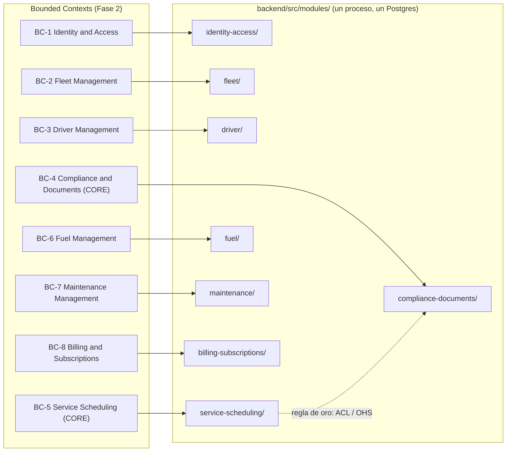
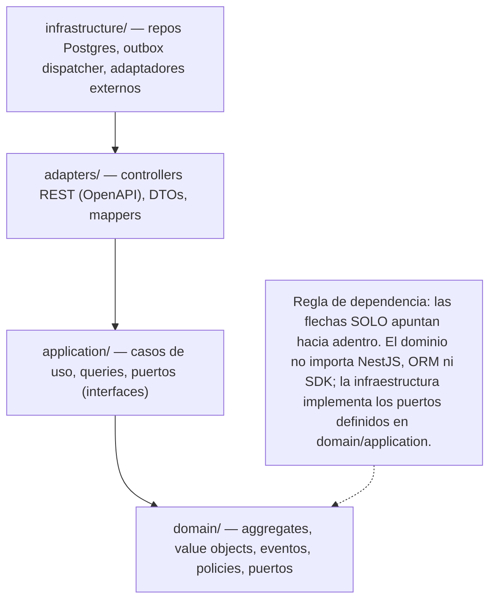

# Fase 9 — Estructura del Repositorio

> **Objetivo de la fase:** materializar en un **árbol de carpetas concreto, profundo y predecible** todo lo decidido en las fases anteriores —dominio (Fase 2), arquitectura (Fase 5), offline (Fase 6), multi-tenant (Fase 7) y agentes IA (Fase 8)—, de modo que **cada cosa tenga un único lugar evidente donde vivir** y ese lugar explique *por qué* está ahí. Esta fase responde a la pregunta operativa: *"¿dónde pongo este archivo y dónde lo busco mañana (yo o un agente IA)?"*. No introduce decisiones nuevas: traduce las costuras (seams) de la arquitectura a directorios.

Este documento es el **mapa del territorio**. Conecta cada carpeta con un principio rector, un bounded context o un ADR, para que la estructura sea **autoexplicativa** y resista el crecimiento de una Renault Duster a un SaaS multiempresa **sin reorganizarse**.

> Convención de capas de este repo: usamos `domain / application / adapters / infrastructure`. La capa **`adapters/`** es la capa de **interfaz/adaptadores de entrada** de Clean Architecture (controllers REST, DTOs, mappers); es donde el contrato OpenAPI toca el código. Mantenemos este nombre por **coherencia total** con [`05-arquitectura-tecnica.md`](05-arquitectura-tecnica.md) §5 y con los agentes [Backend](../agents/agent-backend.md) y [Architect](../agents/agent-architect.md).

---

## 1. Estrategia de monorepo

FleetSpecial vive en **un único repositorio** que contiene specs, backend, web, móvil, infraestructura, ADRs y la definición de los agentes IA. Para un equipo de **1–3 personas** en bootstrapping, esta es la opción de **menor fricción y mayor trazabilidad**.

### 1.1 Por qué monorepo (para este equipo y este momento)

- **Un solo lugar para la cadena de trazabilidad.** La línea **Negocio → Dominio → Spec → Contrato → Código → Pruebas → Infra** vive junta. Un `spec-NNN` en `/specs`, su contrato en `/backend/contracts`, su implementación en `/backend/src/modules/...` y sus pruebas en `/backend/test` se leen sin saltar de repositorio. Esto es **SDD y API First** hechos navegables.
- **Commits atómicos cross-cutting.** Un cambio que toca el contrato OpenAPI, el caso de uso del backend, el SDK del web y la pantalla que lo consume se hace en **un solo commit/PR coherente**. No hay "PR del contrato" desincronizado de "PR del cliente" en otro repo. Para un cambio normativo (p. ej. un nuevo tipo de documento) esto es oro.
- **Una sola fuente de verdad del lenguaje ubicuo.** El glosario de la Fase 2 se respeta igual en specs, backend, móvil y web porque **están en el mismo árbol**; el riesgo de deriva semántica entre repos desaparece.
- **AI Agent Friendly.** Un agente (Fase 8) puede leer la spec, el ADR, el contrato y el código **en un solo checkout**, con rutas estables y predecibles. La estructura *es* parte del prompt: el agente sabe dónde leer y dónde escribir (ver §9.4).
- **Operación barata.** Un repo = un CI, una configuración de permisos, un changelog, un historial. Cero coste de coordinación entre repos para un equipo diminuto.

### 1.2 Cuándo NO sería buena idea (honestidad)

- **Organizaciones grandes con muchos equipos independientes** que despliegan a ritmos muy distintos y quieren *ownership* y permisos por servicio: ahí los multi-repos (o un monorepo con herramientas pesadas de build distribuido) pueden pagar su coste.
- **Cuando de verdad existan servicios desplegables independientes** con ciclos de vida divergentes (no es nuestro caso: tenemos **un** monolito modular, [ADR-0001](../adr/0001-monolito-modular-vs-microservicios.md)).
- **Si el repo creciera a un tamaño que degrade clones/CI** sin que adoptemos herramientas de build incremental. Hoy, con un MVP, eso es un problema inexistente (YAGNI).

### 1.3 Herramientas opcionales (sin sobreingeniería)

El monorepo **no exige** herramientas especiales. Se adoptan solo si el dolor aparece:

- **Workspaces de pnpm/npm** para el lado TypeScript (backend NestJS + web Next.js): permiten compartir tipos/paquetes (p. ej. el SDK generado del OpenAPI) sin publicarlos a un registry. Útil pero **no obligatorio en MVP**.
- **Melos** (o simplemente paquetes locales de Dart) para el lado Flutter si la app móvil se dividiera en paquetes. Hoy **un solo paquete Flutter** basta.
- **Nx / Turborepo / Bazel:** **NO** en MVP. Son orquestadores de build para monorepos grandes; introducirlos ahora es la sobreingeniería que [el Architect](../agents/agent-architect.md) debe rechazar. Se reconsideran solo con un driver real (tiempos de CI inaceptables).

> **Regla de oro de esta fase:** la estructura debe ser entendible **sin** tooling especial. Si necesitas una herramienta para saber dónde está algo, la estructura falló.

---

## 2. Árbol de primer nivel

Las carpetas raíz mapean **1:1** a las fases del blueprint y a los stacks desplegables. Cada una tiene un propósito único.

```text
fleetspecial/                      # raíz del monorepo
├── README.md                      # puerta de entrada: qué es, cómo navegar las 10 fases
├── CONTRIBUTING.md                # cómo contribuir: ramas, commits, naming, definición de hecho
├── CHANGELOG.md                   # historial legible de cambios (Keep a Changelog + SemVer)
├── LICENSE                        # licencia del proyecto
├── .gitignore                     # ignora node_modules, .env, build/, .dart_tool/, terraform state…
├── .editorconfig                  # estilo base compartido (charset, indentación, fin de línea)
├── .env.example                   # plantilla de variables (SIN secretos) para dev local
├── justfile                       # atajos reproducibles: setup, gen-sdk, test, up, migrate
├── docker-compose.yml             # entorno de desarrollo: api, worker, postgres, keycloak, minio
├── .github/                       # CI/CD: workflows de build → test → empaquetado → deploy
│   └── workflows/                 #   (alternativa: .gitlab-ci.yml si el host es GitLab)
│
├── docs/                          # Fase 1,2,5,6,7,9,10: análisis, arquitectura y este documento
├── specs/                         # Fase 3 (SDD): especificaciones de comportamiento en Gherkin
├── adr/                           # Architecture Decision Records (decisiones transversales)
├── agents/                        # Fase 8: definición de los 8 agentes IA (roles + prompts)
│
├── backend/                       # Monolito modular NestJS (API + worker) — el corazón ejecutable
├── frontend/                      # Portal web administrativo (Next.js / React / TypeScript)
├── mobile/                        # App del conductor (Flutter, offline-first)
├── infrastructure/                # IaC: Terraform, Docker, k8s (futuro), observabilidad
└── tests/                         # Pruebas E2E / contract / cross-cutting y recursos de QA
```

> **Nota de naming de stacks.** Los documentos de agentes referencian a veces los stacks como `apps/web` y `apps/mobile`. En este repo, las carpetas reales de primer nivel son **`frontend/`** (≡ el "web app") y **`mobile/`**. Tratamos esos alias como equivalentes; la verdad del árbol es la de esta sección.

**Por qué este corte y no otro:**
- **Separación por stack desplegable** (`backend`, `frontend`, `mobile`, `infrastructure`) porque cada uno tiene su toolchain (Node, Node, Dart, Terraform). Es el límite tecnológico natural.
- **Separación por artefacto metodológico** (`docs`, `specs`, `adr`, `agents`) porque son **fuentes de verdad** que anteceden y gobiernan al código (SDD, DDD, API First, AI-friendly). No son "documentación al final": son **entradas** del proceso.
- **`tests/` raíz** existe **solo** para lo que cruza stacks (E2E, contract, recursos de QA). Las pruebas unitarias/integración viven **junto a su código** (ver §7).

---

## 3. `/backend` — el monolito modular NestJS (lo más importante)

Aquí vive el **único servicio desplegable**: un monolito modular donde **cada bounded context de la Fase 2 es un módulo** con sus cuatro capas de Clean Architecture. No son ocho servicios; es **un proceso** (más un worker hermano para el outbox). Esto honra [ADR-0001](../adr/0001-monolito-modular-vs-microservicios.md) y [ADR-0003](../adr/0003-postgresql-unica-base-de-datos.md).

### 3.1 Árbol detallado de `/backend`

```text
backend/
├── contracts/                     # API First: la FUENTE del contrato (antecede al código)
│   ├── openapi.yaml               #   contrato REST 3.1 (recursos /v1/...) — de aquí se genera el SDK
│   ├── asyncapi.yaml              #   contrato de eventos de dominio (catálogo del outbox)
│   └── README.md                  #   cómo versionar el contrato y regenerar clientes
│
├── src/
│   ├── modules/                   # UN módulo por bounded context (Fase 2). Límites explícitos.
│   │   ├── identity-access/       # BC-1: identidad, roles, contexto de tenant (Published Language)
│   │   ├── fleet/                 # BC-2: Vehículo, Placa única, Odómetro monótono
│   │   ├── driver/                # BC-3: Conductor, habilitación, vínculo con Usuario
│   │   ├── compliance-documents/  # BC-4 · CORE: Documentos, Vencimientos, Semáforo, alertas
│   │   ├── service-scheduling/    # BC-5 · CORE: Servicios, Asignación, agenda, novedades, GPS
│   │   ├── fuel/                  # BC-6: Tanqueo append-only, costo por km
│   │   ├── maintenance/           # BC-7: preventivo/correctivo por umbral de km/fecha
│   │   └── billing-subscriptions/ # BC-8: Planes, Suscripciones, conteo facturable
│   │
│   ├── shared/                    # Shared Kernel: lo que TODO módulo comparte SIN acoplarse
│   │   ├── domain/
│   │   │   ├── aggregate-root.base.ts      # base de Aggregate (registro de eventos de dominio)
│   │   │   ├── entity.base.ts              # base de Entity (identidad)
│   │   │   ├── value-object.base.ts        # base de Value Object (igualdad por valor)
│   │   │   ├── domain-event.base.ts        # base de Domain Event (ocurridoEn, tenantId)
│   │   │   ├── money.value-object.ts       # Money SIEMPRE con moneda explícita (COP)
│   │   │   ├── result.ts                   # Result/Either: errores sin excepciones de control
│   │   │   └── errors/                     # errores de dominio tipados y reutilizables
│   │   └── tenant/
│   │       ├── tenant-context.ts           # objeto del tenant actual (derivado del JWT)
│   │       └── rls.helper.ts               # helper para fijar SET app.current_tenant por request
│   │
│   ├── platform/                  # Cross-cutting técnico (infra transversal, NO dominio)
│   │   ├── auth/                  #   validación de JWT/OIDC, guards de rol, extracción de tenant
│   │   ├── config/               #   configuración 12-factor (env → objeto tipado y validado)
│   │   ├── logging/              #   logs estructurados + OpenTelemetry (trace_id, tenant_id)
│   │   ├── outbox/               #   dispatcher + worker del outbox (lee tabla, despacha in-process)
│   │   ├── db/                   #   conexión Postgres, unit of work, aplicación de tenant/RLS
│   │   └── http/                 #   filtros de error, interceptores, idempotencia (Idempotency-Key)
│   │
│   ├── app.module.ts              # módulo raíz: ensambla modules/ + platform/
│   ├── main.ts                    # bootstrap de la API (rol "api")
│   └── worker.ts                  # bootstrap del worker (mismo binario, rol "worker": outbox/jobs)
│
├── migrations/                    # migraciones versionadas (esquema + políticas RLS por tabla)
│   ├── 0001_init_identity_tenant.sql
│   ├── 0002_fleet_vehiculos.sql
│   ├── 0003_compliance_documentos.sql
│   ├── 0100_outbox.sql            #   tabla outbox (durabilidad y orden de eventos)
│   └── policies/                  #   políticas RLS "por defecto denegar" por tabla
│
├── test/                          # pruebas DEL backend (viven con su código)
│   ├── unit/                      #   dominio y casos de uso con repos/AIProvider FALSOS
│   ├── integration/               #   repos reales contra Postgres efímero (Testcontainers)
│   └── e2e/                       #   API arriba: spec-NNN-*.e2e-spec.ts (trazables a la spec)
│
├── Dockerfile                     # imagen única; arranca como api o worker según el comando
├── package.json
├── tsconfig.json
└── nest-cli.json
```

### 3.2 La regla de dependencia, hecha carpetas

Las cuatro capas dentro de cada módulo materializan la **regla de dependencia de Clean Architecture**: *las dependencias apuntan hacia adentro*.

| Capa (carpeta) | Qué contiene | Qué puede importar |
|---|---|---|
| `domain/` | Aggregates, Entities, Value Objects, Domain Events, **puertos (interfaces)**, invariantes y políticas. | **NADA externo.** Solo `shared/domain`. Cero NestJS, cero ORM, cero SDK. |
| `application/` | Casos de uso (comandos/queries y sus handlers) que **orquestan** el dominio. Define los **puertos** que necesita. | Solo `domain/`. No conoce Postgres ni HTTP. |
| `adapters/` | **Interfaz de entrada:** controllers REST (conformes al OpenAPI), DTOs, mappers de request/response. | `application/` (invoca casos de uso). No toca la DB directamente. |
| `infrastructure/` | **Implementaciones concretas** de los puertos: repositorios Postgres/ORM, persistencia del outbox, adaptadores a proveedores. | Implementa interfaces de `domain/`/`application/`. Es lo más externo. |

> **El dominio no importa nada hacia afuera; la infraestructura implementa los puertos del dominio.** Un `documento.repository.port.ts` (interfaz) vive en el dominio/aplicación; su implementación `documento.typeorm.repository.ts` vive en `infrastructure/`. El caso de uso depende del **puerto**, no de la implementación → se puede testear con un repositorio falso y cambiar de ORM sin tocar el dominio.

### 3.3 Dónde vive el outbox

El **outbox** tiene dos mitades, ambas con lugar fijo (coherente con [ADR-0004](../adr/0004-eventos-outbox-pattern-sin-broker.md)):

1. **La escritura del evento** ocurre dentro del caso de uso, en la **misma transacción** que el cambio de datos. La mecánica de "persistir evento + entidad atómicamente" la provee `platform/db/` (unit of work) y la tabla se define en `migrations/0100_outbox.sql`. El módulo solo dice *"emito `DocumentoVencido`"*; no sabe de polling.
2. **El despacho** (leer la tabla `outbox`, entregar el evento a los handlers in-process, marcarlo procesado de forma idempotente) vive en `platform/outbox/` y se arranca con `worker.ts`. **No hay broker**: el "publicar" es una llamada interna. Si algún día se necesita NATS/RabbitMQ, **solo cambia el dispatcher de `platform/outbox/`**; los productores (que escriben en el outbox) no se enteran.

### 3.4 Dónde viven las políticas RLS

El aislamiento multi-tenant es **defensa en profundidad** ([ADR-0008](../adr/0008-multi-tenant-shared-db-rls.md), Fase 7):

- **En la base:** las **políticas RLS "por defecto denegar"** se definen junto a cada tabla en `migrations/` (y agrupadas en `migrations/policies/`). Son parte del esquema versionado, no configuración suelta.
- **En el request:** `platform/db/` + `shared/tenant/rls.helper.ts` fijan `SET app.current_tenant = <claim del JWT>` al abrir la conexión de cada request. El `tenant_id` **jamás** llega por body o query param.
- **En el código:** cada repositorio filtra por `tenant_id` (primera barrera); RLS es la **segunda barrera** que protege aun si el código tuviera un bug.

### 3.5 Cómo `/contracts` encarna API First

`backend/contracts/` es la **fuente del contrato**, no una salida del código:

- `openapi.yaml` (REST 3.1) **se escribe antes** que el controller. De él se generan: el **SDK tipado del web** (`frontend/shared/api/`), los **mocks/stubs** para que web y móvil avancen en paralelo, y la **validación de requests** en runtime. El controller en `adapters/` **deriva** sus DTOs del contrato; nunca al revés.
- `asyncapi.yaml` documenta el **catálogo de eventos de dominio** (los que viajan por el outbox): `DocumentoVencido`, `DocumentoPorVencer`, `ServicioAsignado`, `OdometroActualizado`, `CombustibleRegistrado`, `NovedadReportada`, `DocumentoRenovado`, etc. Da el esquema a productores, consumidores y agentes IA.

### 3.6 Árbol interno de un módulo CORE: `compliance-documents`

Este es el **corazón del valor** (Fase 2, BC-4): el oráculo de *"¿este vehículo/conductor puede operar hoy?"*. Su estructura ilustra el patrón que **todos** los módulos siguen (nombres ilustrativos; no hay código de producción en el blueprint).

```text
backend/src/modules/compliance-documents/
├── domain/                                  # CERO imports de framework
│   ├── expediente-cumplimiento.aggregate.ts # Aggregate Root: agrupa documentos de un sujeto
│   ├── documento.entity.ts                  # Entity dentro del agregado
│   ├── vencimiento.value-object.ts          # VO: fecha de vigencia y su lógica
│   ├── estado-cumplimiento.value-object.ts  # VO Semáforo: Vigente | PorVencer | Vencido
│   ├── tipo-documento.value-object.ts       # VO del catálogo configurable de tipos
│   ├── events/
│   │   ├── documento-registrado.event.ts
│   │   ├── documento-por-vencer.event.ts    # alertas a 30/15/3 días
│   │   ├── documento-vencido.event.ts
│   │   └── documento-renovado.event.ts      # renovación conservando histórico
│   ├── policies/
│   │   └── calcular-semaforo.policy.ts      # regla pura: deriva el Semáforo de los Vencimientos
│   └── ports/
│       ├── documento.repository.port.ts     # interfaz de persistencia (la define el dominio)
│       └── reloj.port.ts                     # Clock: "hoy" inyectable (testeable, sin new Date())
│
├── application/                             # casos de uso (orquestan el dominio)
│   ├── registrar-documento.use-case.ts
│   ├── renovar-documento.use-case.ts        # conserva histórico, emite DocumentoRenovado
│   ├── calcular-semaforo.use-case.ts        # responde "estado de cumplimiento" de un sujeto
│   ├── consultar-cumplimiento.query.ts      # Open Host Service para Service Scheduling (vía ACL)
│   └── ports/
│       └── notificador.port.ts              # puerto para emitir alertas (impl. en infraestructura)
│
├── adapters/                                # interfaz de entrada (conforme al OpenAPI)
│   ├── documentos.controller.ts             # endpoints REST /v1/documentos, /v1/cumplimiento
│   ├── dto/
│   │   ├── registrar-documento.request.dto.ts
│   │   └── estado-cumplimiento.response.dto.ts
│   └── mappers/
│       └── documento.mapper.ts              # dominio ↔ DTO (no expone el agregado crudo)
│
├── infrastructure/                          # implementaciones concretas (lo más externo)
│   ├── documento.typeorm.repository.ts      # implementa documento.repository.port.ts
│   ├── notificador.outbox.adapter.ts        # "notificar" = escribir evento en el outbox
│   └── persistence/
│       └── documento.orm-entity.ts          # mapeo de tabla (con tenant_id), separado del dominio
│
└── compliance-documents.module.ts          # cablea puertos→implementaciones (DI de NestJS)
```

> **Comunicación entre módulos.** `service-scheduling` necesita saber si un recurso está al día para aplicar la **regla de oro** (no asignar a un Vencido). **No lee la tabla de `compliance-documents`**: consume su **Open Host Service** (`consultar-cumplimiento.query.ts`) a través de una **Anti-Corruption Layer**, o reacciona a sus eventos (`DocumentoVencido`/`DocumentoRenovado`) vía outbox. Así los límites quedan intactos y un módulo podría extraerse a su propio servicio el día que un driver real lo exija — **sin reescribir el dominio**.

---

## 4. `/frontend` — Portal web (Next.js / React / TypeScript)

Portal administrativo del operador: **listas claras + semáforos de cumplimiento**, no dashboards de BI (Fase 5 §6.1). Consume la API **solo** vía el SDK generado del OpenAPI.

```text
frontend/
├── app/                           # App Router: rutas (dashboard, vehiculos, documentos, agenda)
│   ├── (auth)/                    #   login OIDC, callback
│   └── (dashboard)/               #   área autenticada: vehiculos/, documentos/, servicios/
├── features/                      # una carpeta por capacidad (alineada a bounded contexts)
│   ├── documentos/                #   componentes + hooks de datos + estado local de la feature
│   ├── servicios/
│   ├── vehiculos/
│   └── conductores/
├── shared/
│   ├── api/                       # SDK TypeScript GENERADO desde backend/contracts/openapi.yaml
│   ├── ui/                        # design system / componentes base (p. ej. SemaforoBadge)
│   └── i18n/                      # mensajes es-CO por defecto (RTM, SOAT, tarjeta de operación)
├── lib/                           # auth (OIDC), config 12-factor, utilidades de presentación
├── test/                          # pruebas de componente y de hooks (junto al código del web)
├── Dockerfile
├── next.config.js
├── package.json
└── tsconfig.json
```

- **`shared/api/` es generado, no escrito a mano.** El front **no inventa tipos**: los importa del SDK derivado del contrato (API First). Versionado por prefijo de ruta (`/v1`).
- **Estado:** TanStack Query para estado de servidor (caché/reintentos), hooks/Zustand para estado de UI. **Sin Redux por defecto** (anti-sobreingeniería).
- **`features/` por contexto** para que la cara del producto refleje el mismo lenguaje ubicuo del dominio.

---

## 5. `/mobile` — App del conductor (Flutter, offline-first)

La superficie **offline-first**: el dispositivo es **fuente de verdad temporal** ([ADR-0005](../adr/0005-offline-first-sqlite-sync.md), Fase 6). Misma **Clean Architecture** que el backend, para que las reglas del cliente no dependan de Flutter ni de Drift.

```text
mobile/
├── lib/
│   ├── core/                          # transversal: DI, errores, Result, config, utilidades
│   ├── features/                      # una carpeta por flujo del conductor
│   │   ├── servicio_del_dia/
│   │   │   ├── domain/                #   reglas del cliente (p. ej. "el servicio ya inició")
│   │   │   ├── application/           #   casos de uso del flujo + puertos
│   │   │   └── presentation/          #   widgets/pantallas (un flujo a la vez, baja fricción)
│   │   ├── tanqueo/                   #   registro append-only (litros, COP, odómetro)
│   │   ├── novedades/                 #   reporte con foto opcional (append-only)
│   │   └── documentos_vehiculo/       #   consulta del Semáforo en local
│   ├── data/                          # INFRAESTRUCTURA local, detrás de puertos del domain
│   │   ├── database/                  #   Drift: definición de la base local (cifrada)
│   │   │   ├── app_database.dart      #   base SQLite vía Drift (SQLCipher: cifrada en reposo)
│   │   │   ├── tables/                #   tablas espejo de servidor (servicios, vehiculos, docs)
│   │   │   └── daos/                  #   DAOs tipados (acceso reactivo a la base local)
│   │   ├── sync/                      #   CORAZÓN de la sincronización
│   │   │   ├── outbox_local.dart      #   cola de cambios (outbox del cliente) con Idempotency-Key
│   │   │   ├── sync_engine.dart       #   subida de pendientes + bajada incremental por cursor
│   │   │   ├── conflict_policy.dart   #   append-only sin conflicto; LWW en editables (Fase 6)
│   │   │   └── api_client.dart        #   cliente REST contra la API (sync/idempotencia)
│   │   └── repositories/              #   implementan los puertos del domain usando Drift + API
│   └── main.dart
├── test/                              # pruebas DE la app (junto a su código)
│   ├── domain/                        #   reglas del cliente sin Flutter ni Drift
│   └── sync/                          #   reintento idempotente NO duplica, append-only, recuperación
├── pubspec.yaml
└── android/ · ios/                    # proyectos nativos (generados por Flutter)
```

- **Dónde vive la lógica de sincronización:** **toda** en `lib/data/sync/`. La **cola de cambios** (`outbox_local.dart`) encola cada mutación con una `Idempotency-Key` generada en el dispositivo; el `sync_engine.dart` la envía al reconectar y aplica los cambios entrantes por cursor; `conflict_policy.dart` implementa la estrategia por fases (append-only primero, *last-write-wins* después). La app **lee/escribe siempre local** y **nunca** bloquea esperando red.
- **Dónde vive la base local cifrada:** en `lib/data/database/app_database.dart` (Drift sobre SQLite con cifrado en reposo, p. ej. SQLCipher). Es **infraestructura**: el `domain/` no la importa; la usa a través de un **puerto de repositorio**.
- **Sin servicio de sync gestionado de terceros** (PowerSync/Firebase): la sync es **propia** contra nuestra API ([ADR-0005](../adr/0005-offline-first-sqlite-sync.md)).

---

## 6. `/infrastructure` — IaC (independencia de nube)

Todo el "camino a producción" como **código portable** ([ADR-0006](../adr/0006-independencia-de-nube-contenedores-iac.md), Fase 5 §9). Nada ata a FleetSpecial a un proveedor.

```text
infrastructure/
├── docker/                        # contenedores reproducibles para DESARROLLO
│   ├── docker-compose.yml         #   api + worker + postgres + keycloak + minio (espejo de raíz)
│   └── postgres/                  #   init scripts, extensiones (RLS), seeds locales
├── terraform/                     # IaC declarativa e idempotente, portable entre nubes
│   ├── modules/                   #   módulos reutilizables: network, database, app, storage, idp
│   └── environments/
│       ├── dev/                   #   1 instancia, Postgres pequeño, costo casi nulo
│       ├── qa/                    #   datos de prueba anonimizados, deploy en merge a develop
│       └── prod/                  #   backups, réplica de lectura, N réplicas de API stateless
├── k8s/                           # EVOLUCIÓN FUTURA: manifiestos/Helm (no se usa en MVP — YAGNI)
│   └── README.md                  #   ruta a Kubernetes sin reescribir (solo cambia el target)
└── observability/                 # OpenTelemetry, vendor-neutral
    ├── otel-collector/            #   configuración del colector (trazas/métricas/logs)
    └── dashboards/                #   tableros y alertas (outbox atascado, lag de sync, vencimientos)
```

- **Independencia de nube:** la **misma imagen de contenedor** corre en dev/QA/prod cambiando solo configuración (12-factor). Terraform describe la infra de forma portable; migrar a Kubernetes es cambiar el **target de despliegue** (`k8s/`), **no el código**.
- **`k8s/` existe vacío a propósito:** marca la costura para evolucionar sin sugerir que se use hoy. Adoptarlo en MVP sería sobreingeniería.
- **Observabilidad desde el día 1** con OTel: un solo SDK, backend OSS intercambiable.

---

## 7. `/tests` raíz vs. pruebas dentro de cada stack

La estrategia es **deliberada** y evita duplicar responsabilidades:

- **Las pruebas unitarias y de integración VIVEN junto al código** de cada stack, porque pertenecen a ese stack y a su toolchain:
  - Backend → `backend/test/` (unit, integration, e2e de la API).
  - Web → `frontend/test/` (componentes, hooks).
  - Móvil → `mobile/test/` (dominio del cliente, cola/sync).
- **`/tests` raíz alberga SOLO lo que cruza stacks o no pertenece a uno solo:**

```text
tests/
├── e2e/                           # flujos extremo-a-extremo a través de varios stacks
│   └── conductor-sincroniza-tanqueo.e2e.ts   # móvil-cola → API → DB → web ve el registro
├── contract/                      # pruebas de contrato: ¿la API cumple openapi.yaml? ¿el SDK encaja?
│   └── openapi-conformance.test.ts
├── gherkin/                       # mapeo de los escenarios Gherkin de /specs a pruebas ejecutables
│   └── trazabilidad.md            #   matriz spec-NNN → escenario → prueba (feliz/error/límite/offline)
└── fixtures/                      # datos sintéticos y semillas compartidas (anonimizados, Habeas Data)
```

- **Por qué este corte:** una prueba unitaria del dominio de Compliance no tiene sentido fuera de `backend/`; pero un E2E que valida "el conductor registra un tanqueo offline y el operador lo ve en el web" cruza tres stacks y vive en `tests/e2e/`. Las **pruebas de contrato** verifican que el contrato OpenAPI (`backend/contracts/`) y sus consumidores siguen alineados — el corazón de API First.
- **Conexión con `agent-qa` (Fase 8):** el [agente QA](../agents/agent-qa.md) **deriva las pruebas de los criterios Gherkin** de `/specs`, con foco en sync offline, error y aislamiento multi-tenant. La carpeta `tests/gherkin/` materializa su **trazabilidad** (cada escenario → una prueba etiquetada con su `spec-NNN`), y los E2E/contract son su territorio natural; las unitarias por stack las escribe junto al código con el agente dueño.

---

## 8. `/docs`, `/specs`, `/adr`, `/agents` — las fuentes de verdad

Estas cuatro carpetas **gobiernan** al código (no lo documentan a posteriori). Ya existen como parte del blueprint y se enlazan en cadena.

| Carpeta | Qué contiene | Cómo se enlaza |
|---|---|---|
| **`docs/`** | Las fases narrativas: `01-analisis-negocio`, `02-domain-driven-design`, `05-arquitectura-tecnica`, `06-offline-first`, `07-saas-multitenant`, **`09-estructura-repositorio`** (este), `10-roadmap`. | El [`README`](../README.md) raíz indexa las 10 fases. Cada doc enlaza a los ADRs y a las otras fases. |
| **`specs/`** | **Fase 3 (SDD):** especificaciones de comportamiento en **Gherkin** (`spec-NNN`), el *oráculo* de qué debe hacer el sistema. | Cada `spec-NNN` se implementa en `backend/src/modules/...` y se verifica con pruebas trazables (`tests/gherkin/`, `backend/test/e2e/`). |
| **`adr/`** | **Architecture Decision Records** (0001–0008): monolito, stack, Postgres único, outbox, offline, independencia de nube/IA, multi-tenant RLS. | Cada decisión de la arquitectura cita su ADR; el [`adr/README`](../adr/README.md) es el índice. Esta estructura **es la materialización** de esos ADRs. |
| **`agents/`** | **Fase 8:** los 8 agentes IA (Architect, Backend, Frontend, Mobile, DevOps, QA, Product Manager, Business Analyst) con responsabilidades, límites y prompts. | Cada agente lee specs/ADRs/docs y **escribe en las carpetas de esta fase** con rutas predecibles (ver §9.4). |

> **La estructura cierra la trazabilidad:** `01` (negocio) → `02` (dominio) → `specs/` (qué) → `backend/contracts/` (contrato) → `backend/src/modules/` (código) → `*/test/` + `tests/` (verificación) → `infrastructure/` (despliegue), con `adr/` gobernando las decisiones y `agents/` operándola.

---

## 9. Convenciones

Convenciones **mínimas y predecibles**: lo justo para que humanos y agentes naveguen sin sorpresas.

### 9.1 Naming

- **Archivos:** `kebab-case`. En TypeScript, sufijo por rol de Clean Architecture / DDD: `*.aggregate.ts`, `*.entity.ts`, `*.value-object.ts`, `*.event.ts`, `*.policy.ts`, `*.use-case.ts`, `*.query.ts`, `*.port.ts` (interfaz/puerto), `*.controller.ts`, `*.dto.ts`, `*.mapper.ts`, `*.<tecnologia>.repository.ts` (impl., p. ej. `*.typeorm.repository.ts`). En Dart, `snake_case` (convención del lenguaje): `app_database.dart`, `sync_engine.dart`.
- **Carpetas de módulo:** nombre del bounded context en `kebab-case` **en inglés** (`compliance-documents`), alineado a la tabla de la Fase 2.
- **Lenguaje ubicuo dentro del código:** los **identificadores de dominio** usan los términos de la Fase 2 (`ExpedienteCumplimiento`, `Vencimiento`, `EstadoCumplimiento`/Semáforo, `Odometro`). El **glosario manda** en specs, código, pruebas y UI por igual.
- **Eventos:** en **pasado**, con `tenantId` y `ocurridoEn` (`DocumentoVencido`, `OdometroActualizado`, `ServicioAsignado`, `CombustibleRegistrado`).

### 9.2 Versionado

- **SemVer** para el producto y los artefactos publicables; el **contrato OpenAPI** se versiona por **prefijo de ruta** (`/v1`, `/v2`): cambios aditivos no rompen; incompatibles → nueva versión mayor.
- **Conventional Commits** (`feat:`, `fix:`, `docs:`, `refactor:`, `test:`, `chore:`…): permiten **changelog automático** y comunican intención. Un commit referencia su `spec-NNN`/ADR cuando aplica.

### 9.3 Estrategia de ramas (equipo pequeño)

- **Trunk-based development:** una rama principal saludable (`main`), ramas de vida **corta** por cambio, integradas rápido con PR. Es lo adecuado para 1–3 personas: minimiza merges dolorosos y mantiene el monorepo siempre desplegable. (Los ambientes se gobiernan por tags/releases y el pipeline de `.github/`.)

### 9.4 Generación de clientes y navegación de un agente IA

- **Dónde se generan los clientes:** desde `backend/contracts/openapi.yaml`. El **SDK del web** se genera a `frontend/shared/api/`; los **mocks/stubs** para desarrollo paralelo y la **validación de requests** salen del mismo contrato. El comando vive en el `justfile` (p. ej. `just gen-sdk`). **Nunca** se escriben tipos de API a mano.
- **Cómo navega un agente (Fase 8) esta estructura, de forma predecible:**
  1. Lee el **comportamiento** en `specs/spec-NNN`.
  2. Lee el **contrato** en `backend/contracts/` y el **dominio** en `docs/02-domain-driven-design.md`.
  3. Consulta los **ADRs** pertinentes en `adr/`.
  4. **Escribe** el código en la ruta canónica del módulo: `backend/src/modules/<contexto>/{domain,application,adapters,infrastructure}/...`.
  5. **Escribe** las pruebas en `*/test/` (unit junto al código) o en `tests/` (E2E/contract).
  6. Si toca límites o puertos, **eleva al Architect**; si falta el contrato, **lo propone** antes de codificar.

  Las **rutas estables** son lo que hace AI-friendly el repo: el agente no adivina dónde va nada porque la estructura **es** parte del contrato de trabajo.

---

## 10. Diagramas

### 10.1 Mapeo: Bounded Contexts (Fase 2) → módulos de `/backend`

Cada contexto de la Fase 2 es **exactamente un módulo** del monolito. Mismo proceso, una sola DB; los `CORE` reciben el mejor diseño.



### 10.2 Regla de dependencia de Clean Architecture (capas → carpetas)

Las flechas **solo apuntan hacia adentro**. El dominio no conoce el mundo exterior; la infraestructura implementa los puertos que el dominio define.



---

## 11. Cierre y trazabilidad de salida

Esta fase **no decide**, **organiza**: convierte las decisiones de las fases 1–8 en un árbol donde cada archivo tiene un hogar evidente y justificado.

- **Anti-sobreingeniería, visible en el árbol:** es **un** `backend/` desplegable (monolito modular), **una** DB (`migrations/`), **un** worker (`worker.ts` + `platform/outbox/`), **sin** broker, **sin** `k8s/` activo, **sin** orquestadores de monorepo. La estructura sugiere ocho módulos, **no ocho servicios**.
- **Coherencia total** con el stack: NestJS (`backend/`), Next.js (`frontend/`), Flutter/Drift (`mobile/`), PostgreSQL/RLS (`migrations/policies/`, `shared/tenant/`), outbox (`platform/outbox/`, `contracts/asyncapi.yaml`), OpenAPI (`contracts/openapi.yaml` → `frontend/shared/api/`).
- **Trazabilidad:** dominio → [Fase 2](02-domain-driven-design.md) · arquitectura → [Fase 5](05-arquitectura-tecnica.md) · offline → [Fase 6](06-offline-first.md) · multi-tenant → [Fase 7](07-saas-multitenant.md) · agentes → [Fase 8](../agents/README.md) · **orden de construcción → [Fase 10](10-roadmap.md)** · decisiones → [ADRs](../adr/README.md).

> Con el territorio mapeado, la Fase 10 define **en qué orden** se llena este árbol: del esqueleto del monolito y el contrato, al primer módulo CORE (Compliance) usable para la Duster, y de ahí hacia el SaaS.
