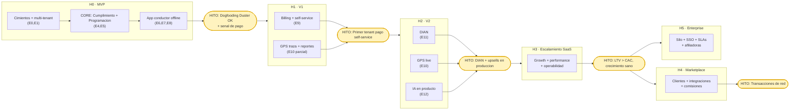
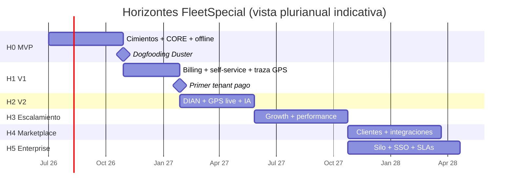

# Fase 10 — Roadmap por Horizontes

> **Objetivo de la fase:** ordenar la construcción en **horizontes de producto** (MVP → V1 → V2 → Escalamiento SaaS → Marketplace → Enterprise), cada uno con una **tesis a validar**, **alcance**, **hitos de salida** y **dependencias**. El roadmap traduce la EDT (Fase 4) y el análisis (Fase 1) en una secuencia que minimiza riesgo y capital, fiel al principio rector: *útil para un vehículo antes que para mil.*

---

## Principios del roadmap

1. **Cada horizonte tiene una pregunta de negocio**, no solo features. No se avanza al siguiente sin responder la del actual.
2. **Construir sobre cimientos correctos, pero diferir lo caro.** Multi-tenant y offline desde el MVP (retrofitearlos es carísimo); DIAN, GPS live y marketplace se difieren hasta que haya ingresos/escala que los justifiquen.
3. **Dogfooding como motor de validación.** El fundador opera su Duster real con cada incremento. Si no le sirve a él, no sale.
4. **Independencia preservada en cada horizonte** (nube, IA, framework) — ningún horizonte introduce lock-in (ADR-0006, 0007).
5. **Anti-sobreingeniería continua.** Cada horizonte añade complejidad solo cuando la demanda real la pide.

---

## Vista de horizontes (resumen)

| Horizonte | Pregunta que responde | Epics (Fase 4) | Estado de negocio al salir |
|---|---|---|---|
| **H0 · MVP** | ¿Esto le ahorra dolor real a UN transportador? | E0, E1, E2, E3, E4, E5, E6, E7, E8, E13 | Dogfooding exitoso con la Duster. |
| **H1 · V1 (comercializable)** | ¿Otros pagarán por esto? | E9, E10 (traza), endurecimiento de E13 | Primeros tenants pagos self-service. |
| **H2 · V2** | ¿Podemos cumplir y diferenciarnos a escala? | E11 (DIAN), E10 (GPS live), E12 (IA) | Producto robusto, cumplimiento fiscal, upsells. |
| **H3 · Escalamiento SaaS** | ¿Crece de forma rentable y operable? | Growth, self-serve, performance, multi-región opcional | Motor de adquisición y retención funcionando. |
| **H4 · Marketplace** | ¿Hay efecto de red entre operadores y terceros? | Módulo de clientes, integraciones de terceros, comisiones | Plataforma, no solo herramienta. |
| **H5 · Enterprise** | ¿Sirve a flotas/afiliadoras grandes? | Aislamiento silo opcional, SSO, SLAs, roles avanzados | Contratos enterprise y afiliadoras como clientes. |

> Las cifras temporales de los primeros 12 meses están en [`docs/01-analisis-negocio.md`](01-analisis-negocio.md) (§6). Aquí el foco es la **secuencia lógica e hitos**, no fechas exactas (que dependen del throughput real del equipo/agentes).

---

## H0 — MVP  ·  *"¿Esto le ahorra dolor real a un transportador?"*

**Tesis:** un transportador pequeño valora (y eventualmente paga) que (a) nunca lo sorprenda un vencimiento, (b) tenga sus servicios y costos ordenados, y (c) su conductor pueda operar sin señal.

**Alcance (de la EDT):** Fundamentos (E0), Identidad + multi-tenant con RLS (E1), Vehículos (E2), Conductores (E3), **Cumplimiento + Semáforo + alertas (E4, CORE)**, **Programación + regla de oro (E5, CORE)**, **App conductor offline-first (E6)**, Combustible (E7), Mantenimiento (E8), y QA/observabilidad arrancando (E13).

**Fuera de alcance (diferido a propósito):** billing/cobro, GPS live, DIAN, marketplace, IA en producto, app del cliente final. *(Ver Fase 1 §5, tabla de diferidos.)*

**Hitos de salida (Definition of Done del horizonte):**
- ✅ El fundador opera **su Duster real ≥ 8 semanas** usando solo FleetSpecial.
- ✅ **Cero vencimientos sorpresa** en el periodo.
- ✅ La app del conductor funciona **sin señal** y sincroniza sin pérdida de datos (probado con cortes de red).
- ✅ 3–5 operadores piloto registran datos reales semanalmente.
- ✅ Suite E2E verde para la **regla de oro** y el **flujo offline** (E13).

**Riesgos foco:** R2 (offline subestimado) y R4 (sobreingeniería). Mitigación: sync por fases (append-only primero), revisión de ADRs antes de añadir complejidad.

**Gate para pasar a H1:** señales claras de disposición a pagar de los pilotos.

---

## H1 — V1 (comercializable)  ·  *"¿Otros pagarán por esto?"*

**Tesis:** el valor probado con la Duster es replicable y empaquetable como SaaS que terceros contratan y pagan solos.

**Alcance:**
- **Suscripciones y billing (E9):** planes, entitlements, suscripción por vehículo activo/mes, pasarela de pagos local (PSE/tarjeta, proveedor abstraído), ciclo trial→activa→morosa, self-service de plan, métricas SaaS (MRR/ARPU/churn). *(Fase 7.)*
- **Onboarding self-service** de nuevos tenants (registro de empresa + primer admin + consentimiento Habeas Data) pulido para conversión.
- **GPS — traza offline (E10 parcial):** captura y visualización de traza por servicio (sin tiempo real aún).
- **Reportes básicos:** costo por km, cumplimiento, servicios.
- **Endurecimiento (E13):** rendimiento, seguridad, backups, soporte básico.

**Hitos de salida:**
- ✅ Un operador externo se registra, configura y paga **sin intervención del fundador**.
- ✅ Primeros ingresos recurrentes (aunque modestos).
- ✅ Churn temprano comprendido y bajo el umbral definido.
- ✅ Tablero de métricas SaaS operativo.

**Dependencias:** E1, E2 (para E9); E6 (para traza GPS).

**Gate para H2:** base de tenants pagos suficiente para justificar inversión en cumplimiento fiscal y diferenciadores.

---

## H2 — V2  ·  *"¿Podemos cumplir y diferenciarnos a escala?"*

**Tesis:** para retener y subir el ticket, el producto debe resolver cumplimiento fiscal (DIAN) y ofrecer diferenciadores de mayor valor (GPS live, IA).

**Alcance:**
- **Facturación electrónica DIAN (E11):** vía proveedor tecnológico autorizado, detrás de interfaz (independencia). Investigación regulatoria → adaptador → emisión/contingencia. *(Fase 1 R3.)*
- **GPS en tiempo real (E10, resto):** ingestión de stream; **extracción del contexto Telemetry** como módulo/servicio propio (la costura ya estaba prevista en Fase 2). Geofencing/alertas de ruta.
- **Capa de IA en producto (E12):** interfaz `AIProvider` + asistente de cumplimiento en lenguaje natural + captura asistida (OCR de documentos → extraer vencimiento). *(ADR-0007.)*
- **Reportería avanzada** (upsell por plan).

**Hitos de salida:**
- ✅ Facturación DIAN en producción para tenants que la requieren.
- ✅ GPS live disponible como upsell con adopción medible.
- ✅ Al menos una capacidad de IA en uso real, **sin lock-in** de proveedor (intercambiable).

**Dependencias:** E9 (para DIAN); E6/E5 (para GPS); E0/E4 (para IA).

**Gate para H3:** unit economics positivos (LTV>CAC) y producto estable.

---

## H3 — Escalamiento SaaS  ·  *"¿Crece de forma rentable y operable?"*

**Tesis:** el negocio puede crecer su base de clientes de forma predecible sin que el costo operativo ni la complejidad se disparen.

**Alcance (no es un epic nuevo, es madurez transversal):**
- **Growth:** embudo de adquisición, canal vía empresas afiliadoras (B2B2C — un canal natural, Fase 1 §2), referidos, plan free como motor viral.
- **Self-serve maduro:** onboarding guiado, in-app help, reducción de fricción y de churn.
- **Rendimiento y costos:** optimización de la arquitectura pool (shared DB + RLS); índices, particionamiento por tenant si hace falta; CDN; autoescalado del backend (contenerizado → portar a Kubernetes **sin reescribir**, ADR-0006).
- **Operabilidad:** runbooks, alertas, on-call ligero, mejora de observabilidad (E13).
- **Internacionalización ligera** (opcional): preparar para otros países de la región (la arquitectura ya es i18n y agnóstica).

**Hitos de salida:**
- ✅ Crecimiento de tenants sostenido con CAC bajo control.
- ✅ Costo de infraestructura por tenant decreciente (economías de escala).
- ✅ Operación soportable por un equipo pequeño + automatización/agentes.

**Dependencias:** H1/H2 estables. **Decisión clave del horizonte:** si algún cliente grande lo exige, activar **aislamiento silo** para ese tenant (la ruta ya está prevista en ADR-0008, sin reescribir el código que ya filtra por tenant).

---

## H4 — Marketplace  ·  *"¿Hay efecto de red entre operadores y terceros?"*

**Tesis:** con masa crítica de operadores, la plataforma puede conectar oferta y demanda de transporte y/o servicios de terceros, capturando valor de red.

**Alcance:**
- **Módulo de clientes / demanda:** el usuario/cliente final entra al modelo (cotizar, contratar, seguir servicios) — la app/portal del cliente diferida desde el MVP.
- **Integraciones de terceros:** talleres (mantenimiento), estaciones de combustible, aseguradoras, proveedores de documentos; vía **Open Host Services** y webhooks (la base de eventos/outbox lo habilita).
- **Monetización de plataforma:** comisiones por transacción, listados destacados, marketplace de integraciones.
- **API pública** documentada (el contrato OpenAPI/AsyncAPI ya existe desde el día 1 por API First).

**Hitos de salida:**
- ✅ Transacciones entre operadores y terceros ocurriendo en la plataforma.
- ✅ Ingreso incremental por comisiones/integraciones.
- ✅ Indicadores de efecto de red (retención mejora con densidad).

**Dependencias:** H3 (masa crítica). **Riesgo:** marketplace prematuro sin densidad fracasa — gate estricto de masa crítica antes de invertir.

---

## H5 — Enterprise  ·  *"¿Sirve a flotas grandes y afiliadoras?"*

**Tesis:** las empresas transportadoras grandes (que afilian a decenas/cientos de propietarios) y flotas medianas pagarán contratos mayores por aislamiento, control y soporte.

**Alcance:**
- **Aislamiento reforzado:** opción **silo** (DB/recursos dedicados) por cliente enterprise; residencia de datos.
- **Identidad enterprise:** SSO/SAML, SCIM, roles y permisos avanzados, jerarquías (afiliadora ↔ propietarios ↔ vehículos).
- **Gobierno y cumplimiento:** auditoría avanzada, reportes regulatorios, retención configurable, DPA y soporte Habeas Data robusto.
- **SLAs y soporte:** niveles de servicio, soporte dedicado, ambientes de QA por cliente.
- **Afiliadora como cliente:** panel para que la transportadora gestione a sus propietarios afiliados (cierra el bucle del modelo de negocio de la Fase 1).

**Hitos de salida:**
- ✅ Primer contrato enterprise firmado y desplegado.
- ✅ SSO y silo en producción para ese cliente.
- ✅ SLAs cumplidos de forma medible.

**Dependencias:** H3 (madurez operativa) + ADR-0008 (la costura silo). **Anti-sobreingeniería:** enterprise se construye **bajo demanda de un cliente concreto que paga**, no especulativamente.

---

## Mapa de dependencias e hitos entre horizontes

---

## Línea de tiempo indicativa (Gantt de alto nivel)

> Fechas relativas al arranque (no comprometidas; dependen del throughput real). El detalle de los primeros 12 meses está en la Fase 1.

---

## Decisiones que el roadmap deja preparadas (seams)

Estas costuras se diseñan desde el MVP pero **solo se activan cuando el horizonte lo pide**, evitando sobreingeniería sin comprometer la evolución:

| Costura (seam) | Preparada en | Se activa en | ADR |
|---|---|---|---|
| Extraer un bounded context a servicio propio (p. ej. Telemetry) | Monolito modular | H2 (GPS live) | ADR-0001 |
| Broker de eventos (NATS/RabbitMQ) en vez de outbox in-process | Outbox pattern | H3 (volumen) | ADR-0004 |
| Aislamiento **silo** por tenant | Filtrado por tenant + RLS | H5 (enterprise) | ADR-0008 |
| Intercambio de proveedor de IA | Interfaz `AIProvider` | H2 (IA) | ADR-0007 |
| Portar a Kubernetes | Contenerización + IaC | H3 (escala) | ADR-0006 |

---

## Trazabilidad

- Los horizontes consumen los **epics** de la [Fase 4 (EDT)](04-edt-wbs.md).
- Las tesis y gates derivan de los **supuestos a validar** y **riesgos** de la [Fase 1](01-analisis-negocio.md).
- Las costuras se justifican en los [ADRs](../adr/).
- La estrategia comercial por horizonte se detalla en la [Fase 7 (SaaS Multi-Tenant)](07-saas-multitenant.md).
